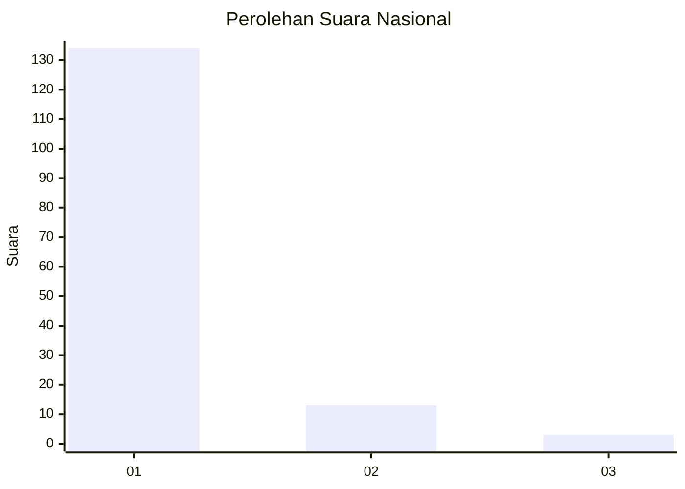
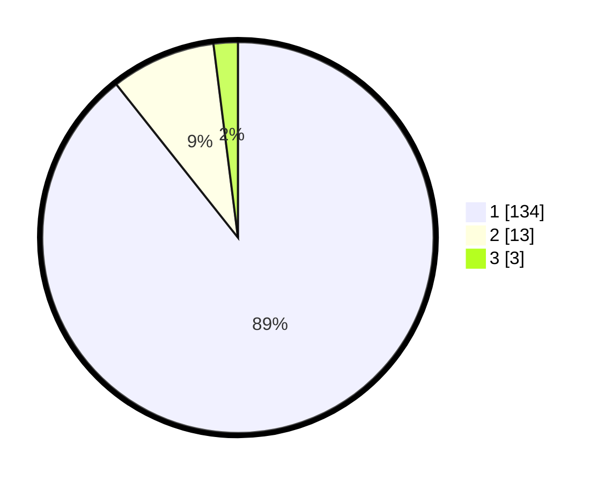

# Hasil

## Grafik

## Tabel

| No. | Nama Paslon    | Suara | Suara (raw) | Persentase |
|:--- |:-------------- | -----:| -----------:| ----------:|
| 1   | ANIES MUHAIMIN | 134   | [134][p-1]  | 89,33      |
| 2   | PRABOWO GIBRAN | 13    | [13][p-2]   | 8,67       |
| 3   | GANJAR MAHFUD  | 3     | [3][p-3]    | 2,00       |

[p-1]: https://github.com/gigit-pemilu/pemilu-2024/blob/main/pilpres/hitung-suara/sub/11-aceh/sub/05-aceh-barat/sub/10-woyla-barat/sub/2005-napai/sub/002-tps/sub/paslon-1.txt
[p-2]: https://github.com/gigit-pemilu/pemilu-2024/blob/main/pilpres/hitung-suara/sub/11-aceh/sub/05-aceh-barat/sub/10-woyla-barat/sub/2005-napai/sub/002-tps/sub/paslon-2.txt
[p-3]: https://github.com/gigit-pemilu/pemilu-2024/blob/main/pilpres/hitung-suara/sub/11-aceh/sub/05-aceh-barat/sub/10-woyla-barat/sub/2005-napai/sub/002-tps/sub/paslon-3.txt

## Foto C Plano

https://sirekap-obj-formc.kpu.go.id/955a/pemilu/ppwp/11/05/10/20/05/1105102005002-20240214-210248--3d029541-0d99-4740-8819-8edaf63695ca.jpg

https://sirekap-obj-formc.kpu.go.id/955a/pemilu/ppwp/11/05/10/20/05/1105102005002-20240214-211229--c00eb49e-ef92-4085-86dd-39cb41a7e0d0.jpg

https://sirekap-obj-formc.kpu.go.id/955a/pemilu/ppwp/11/05/10/20/05/1105102005002-20240214-211401--43cb6699-67fc-4ead-a5be-9fee5b47216c.jpg

## Metadata

| Key        | Value               |
| ---------- | ------------------- |
| Time Stamp | 2024-02-15 00:41:44 |

