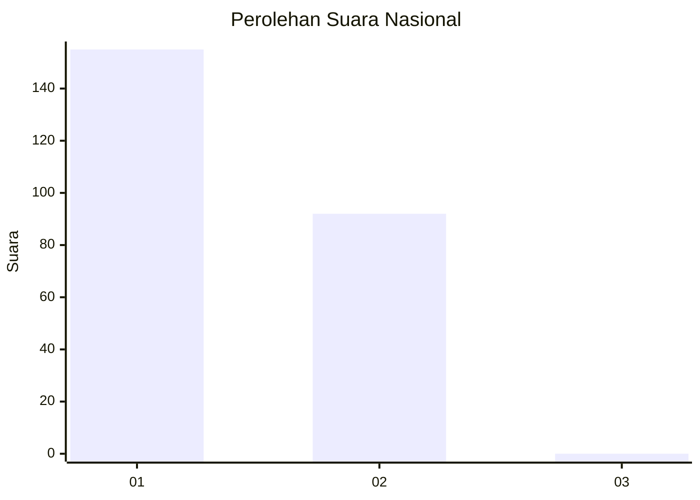
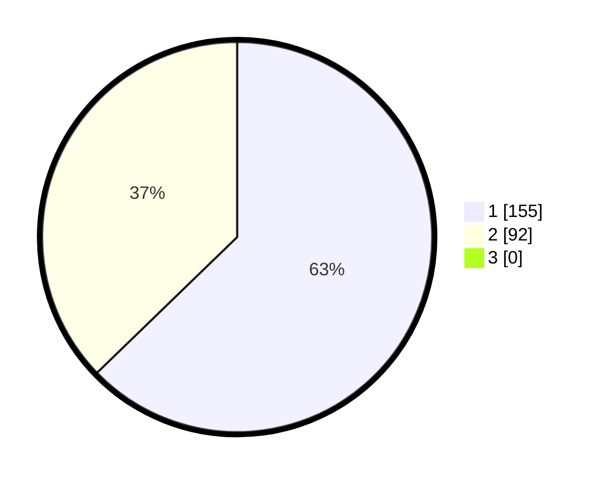

# Hasil

## Grafik

## Tabel

| No. | Nama Paslon    | Suara | Suara (raw) | Persentase |
|:--- |:-------------- | -----:| -----------:| ----------:|
| 1   | ANIES MUHAIMIN | 155   | [155][p-1]  | 62,75      |
| 2   | PRABOWO GIBRAN | 92    | [92][p-2]   | 37,25      |
| 3   | GANJAR MAHFUD  | 0     | [0][p-3]    | 0,00       |

[p-1]: https://github.com/gigit-pemilu/pemilu-2024/blob/main/pilpres/hitung-suara/sub/11-aceh/sub/05-aceh-barat/sub/10-woyla-barat/sub/2012-lueng-baro/sub/001-tps/sub/paslon-1.txt
[p-2]: https://github.com/gigit-pemilu/pemilu-2024/blob/main/pilpres/hitung-suara/sub/11-aceh/sub/05-aceh-barat/sub/10-woyla-barat/sub/2012-lueng-baro/sub/001-tps/sub/paslon-2.txt
[p-3]: https://github.com/gigit-pemilu/pemilu-2024/blob/main/pilpres/hitung-suara/sub/11-aceh/sub/05-aceh-barat/sub/10-woyla-barat/sub/2012-lueng-baro/sub/001-tps/sub/paslon-3.txt

## Foto C Plano

https://sirekap-obj-formc.kpu.go.id/f766/pemilu/ppwp/11/05/10/20/12/1105102012001-20240215-005522--60f2d84e-46b0-468e-90b6-3fcc4deb77dd.jpg

https://sirekap-obj-formc.kpu.go.id/f766/pemilu/ppwp/11/05/10/20/12/1105102012001-20240215-005652--ed2ed41e-0513-4742-bd2b-f81478b963bb.jpg

https://sirekap-obj-formc.kpu.go.id/f766/pemilu/ppwp/11/05/10/20/12/1105102012001-20240215-005744--ed5158e1-7048-4893-8ad0-14901a726e99.jpg

## Metadata

| Key        | Value               |
| ---------- | ------------------- |
| Time Stamp | 2024-02-17 11:30:03 |

