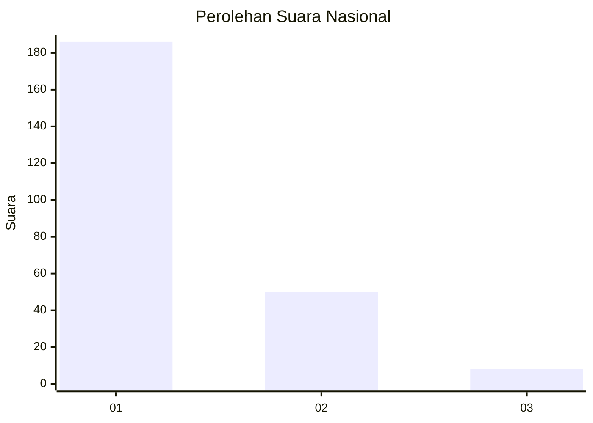
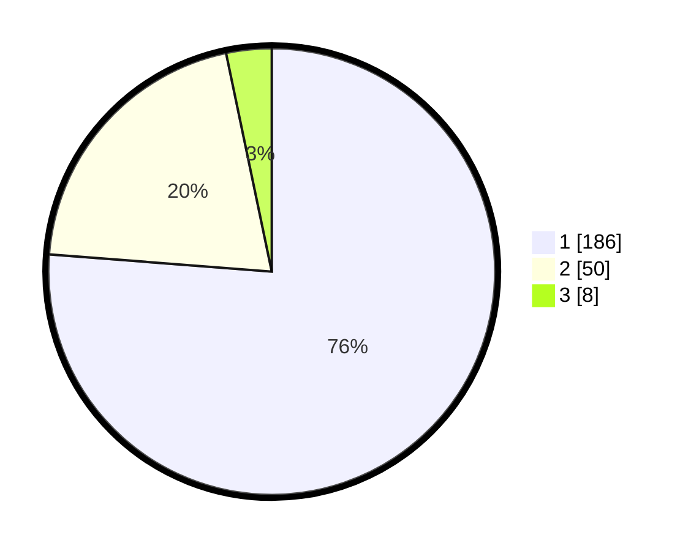

# Hasil

## Grafik

## Tabel

| No. | Nama Paslon    | Suara | Suara (raw) | Persentase |
|:--- |:-------------- | -----:| -----------:| ----------:|
| 1   | ANIES MUHAIMIN | 186   | [186][p-1]  | 76,23      |
| 2   | PRABOWO GIBRAN | 50    | [50][p-2]   | 20,49      |
| 3   | GANJAR MAHFUD  | 8     | [8][p-3]    | 3,28       |

[p-1]: https://github.com/gigit-pemilu/pemilu-2024/blob/main/pilpres/hitung-suara/sub/11-aceh/sub/05-aceh-barat/sub/10-woyla-barat/sub/2018-pasi-mali/sub/001-tps/sub/paslon-1.txt
[p-2]: https://github.com/gigit-pemilu/pemilu-2024/blob/main/pilpres/hitung-suara/sub/11-aceh/sub/05-aceh-barat/sub/10-woyla-barat/sub/2018-pasi-mali/sub/001-tps/sub/paslon-2.txt
[p-3]: https://github.com/gigit-pemilu/pemilu-2024/blob/main/pilpres/hitung-suara/sub/11-aceh/sub/05-aceh-barat/sub/10-woyla-barat/sub/2018-pasi-mali/sub/001-tps/sub/paslon-3.txt

## Foto C Plano

https://sirekap-obj-formc.kpu.go.id/5b66/pemilu/ppwp/11/05/10/20/18/1105102018001-20240215-110142--a94daf40-6d73-45b7-8b98-ad513ec87f78.jpg

https://sirekap-obj-formc.kpu.go.id/5b66/pemilu/ppwp/11/05/10/20/18/1105102018001-20240215-110608--e9a27e69-eff5-4b80-a0f0-45141531ea3e.jpg

https://sirekap-obj-formc.kpu.go.id/5b66/pemilu/ppwp/11/05/10/20/18/1105102018001-20240220-150431--6f90a230-813b-4357-b445-344f3e97054d.jpg

## Metadata

| Key        | Value               |
| ---------- | ------------------- |
| Time Stamp | 2024-02-20 16:00:00 |

