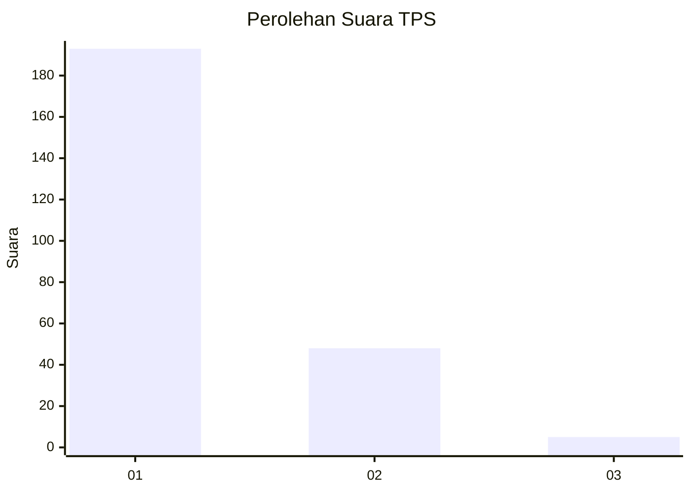
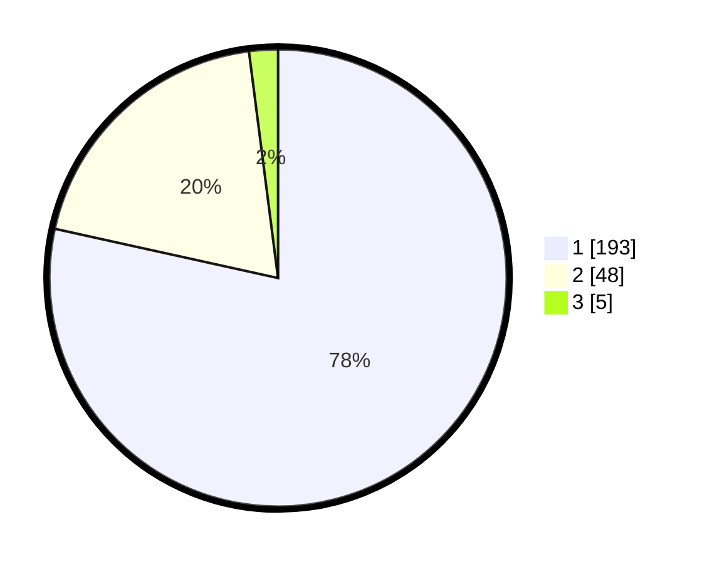

# Hasil

## Grafik

## Tabel

| No. | Nama Paslon    | Suara | Suara (raw) | Persentase |
|:--- |:-------------- | -----:| -----------:| ----------:|
| 1   | ANIES MUHAIMIN | 193   | [193][p-1]  | 78,46      |
| 2   | PRABOWO GIBRAN | 48    | [48][p-2]   | 19,51      |
| 3   | GANJAR MAHFUD  | 5     | [5][p-3]    | 2,03       |

[p-1]: https://github.com/gigit-pemilu/pemilu-2024-11-aceh/blob/main/pilpres/hitung-suara/sub/11-aceh/sub/05-aceh-barat/sub/10-woyla-barat/sub/2019-karak/sub/001-tps/sub/paslon-1.txt
[p-2]: https://github.com/gigit-pemilu/pemilu-2024-11-aceh/blob/main/pilpres/hitung-suara/sub/11-aceh/sub/05-aceh-barat/sub/10-woyla-barat/sub/2019-karak/sub/001-tps/sub/paslon-2.txt
[p-3]: https://github.com/gigit-pemilu/pemilu-2024-11-aceh/blob/main/pilpres/hitung-suara/sub/11-aceh/sub/05-aceh-barat/sub/10-woyla-barat/sub/2019-karak/sub/001-tps/sub/paslon-3.txt

## Foto C Plano

https://sirekap-obj-formc.kpu.go.id/8eb7/pemilu/ppwp/11/05/10/20/19/1105102019001-20240215-065630--e43d2e77-86f0-4f35-95a4-7d04bfd8652e.jpg

https://sirekap-obj-formc.kpu.go.id/8eb7/pemilu/ppwp/11/05/10/20/19/1105102019001-20240215-065441--e45f5f74-a8fd-4a63-af6d-b22248200413.jpg

https://sirekap-obj-formc.kpu.go.id/8eb7/pemilu/ppwp/11/05/10/20/19/1105102019001-20240215-065545--9a09c0e3-4ca1-4e60-ba42-bb717558d901.jpg

## Metadata

| Key        | Value               |
| ---------- | ------------------- |
| Time Stamp | 2024-02-15 21:01:18 |

