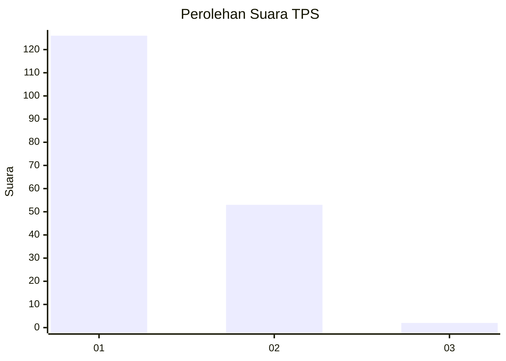
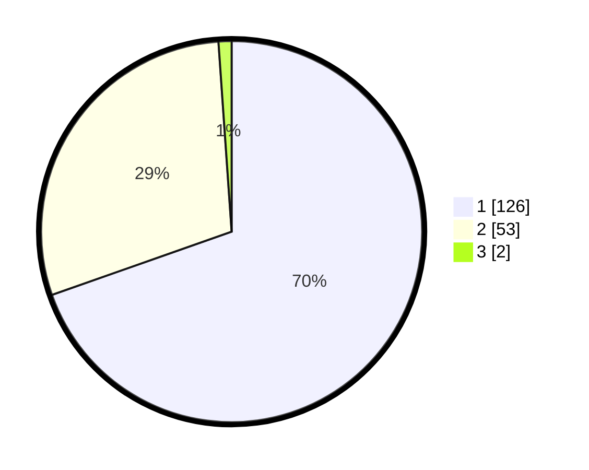

# Hasil

## Grafik

## Tabel

| No. | Nama Paslon    | Suara | Suara (raw) | Persentase |
|:--- |:-------------- | -----:| -----------:| ----------:|
| 1   | ANIES MUHAIMIN | 126   | [126][p-1]  | 69,61      |
| 2   | PRABOWO GIBRAN | 53    | [53][p-2]   | 29,28      |
| 3   | GANJAR MAHFUD  | 2     | [2][p-3]    | 1,10       |

[p-1]: https://github.com/gigit-pemilu/pemilu-2024-11-aceh/blob/main/pilpres/hitung-suara/sub/11-aceh/sub/05-aceh-barat/sub/10-woyla-barat/sub/2021-ulee-pulo/sub/001-tps/sub/paslon-1.txt
[p-2]: https://github.com/gigit-pemilu/pemilu-2024-11-aceh/blob/main/pilpres/hitung-suara/sub/11-aceh/sub/05-aceh-barat/sub/10-woyla-barat/sub/2021-ulee-pulo/sub/001-tps/sub/paslon-2.txt
[p-3]: https://github.com/gigit-pemilu/pemilu-2024-11-aceh/blob/main/pilpres/hitung-suara/sub/11-aceh/sub/05-aceh-barat/sub/10-woyla-barat/sub/2021-ulee-pulo/sub/001-tps/sub/paslon-3.txt

## Foto C Plano

https://sirekap-obj-formc.kpu.go.id/008a/pemilu/ppwp/11/05/10/20/21/1105102021001-20240215-014450--636ed53e-4781-496a-a540-79d9538e36c8.jpg

https://sirekap-obj-formc.kpu.go.id/008a/pemilu/ppwp/11/05/10/20/21/1105102021001-20240215-014516--b7223148-76bb-4395-91e7-7d7379e45553.jpg

https://sirekap-obj-formc.kpu.go.id/008a/pemilu/ppwp/11/05/10/20/21/1105102021001-20240215-014549--c99b31e9-985a-4ce5-b097-bfa20a8a79a2.jpg

## Metadata

| Key        | Value               |
| ---------- | ------------------- |
| Time Stamp | 2024-02-15 19:00:26 |

