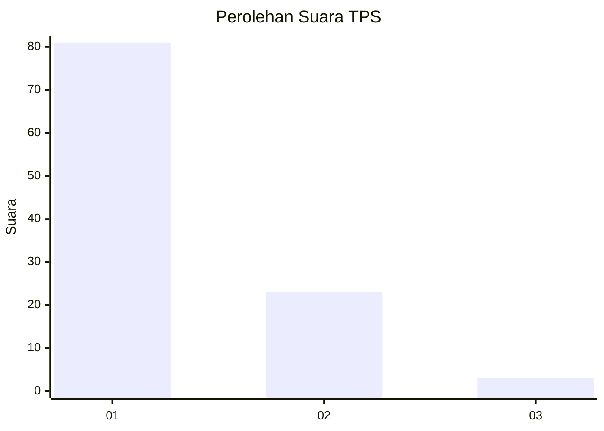
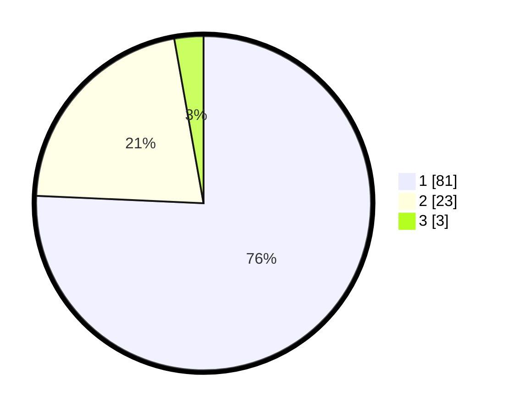

# Hasil

## Grafik

## Tabel

| No. | Nama Paslon    | Suara | Suara (raw) | Persentase |
|:--- |:-------------- | -----:| -----------:| ----------:|
| 1   | ANIES MUHAIMIN | 81    | [81][p-1]   | 75,70      |
| 2   | PRABOWO GIBRAN | 23    | [23][p-2]   | 21,50      |
| 3   | GANJAR MAHFUD  | 3     | [3][p-3]    | 2,80       |

[p-1]: https://github.com/gigit-pemilu/pemilu-2024-11-aceh/blob/main/pilpres/hitung-suara/sub/11-aceh/sub/05-aceh-barat/sub/10-woyla-barat/sub/2024-simpang-teumarom/sub/001-tps/sub/paslon-1.txt
[p-2]: https://github.com/gigit-pemilu/pemilu-2024-11-aceh/blob/main/pilpres/hitung-suara/sub/11-aceh/sub/05-aceh-barat/sub/10-woyla-barat/sub/2024-simpang-teumarom/sub/001-tps/sub/paslon-2.txt
[p-3]: https://github.com/gigit-pemilu/pemilu-2024-11-aceh/blob/main/pilpres/hitung-suara/sub/11-aceh/sub/05-aceh-barat/sub/10-woyla-barat/sub/2024-simpang-teumarom/sub/001-tps/sub/paslon-3.txt

## Foto C Plano

https://sirekap-obj-formc.kpu.go.id/87db/pemilu/ppwp/11/05/10/20/24/1105102024001-20240215-011328--e18feb6a-f20c-44e9-9c00-294d824bb82e.jpg

https://sirekap-obj-formc.kpu.go.id/87db/pemilu/ppwp/11/05/10/20/24/1105102024001-20240215-011338--855b4077-8b8e-425c-b394-7b06655cc59f.jpg

https://sirekap-obj-formc.kpu.go.id/87db/pemilu/ppwp/11/05/10/20/24/1105102024001-20240216-140615--187e2c9b-cf79-42a5-a91e-0c99232734a6.jpg

## Metadata

| Key        | Value               |
| ---------- | ------------------- |
| Time Stamp | 2024-02-16 14:30:33 |

## DATA PEMILIH TETAP

Jumlah pemilih dalam DPT: **113**.
 * L: **58**.
 * P: **55**.

## DATA PENGGUNA HAK PILIH

Jumlah pengguna hak pilih dalam DPT: **104**.
 * L: **53**.
 * P: **51**.

Jumlah pengguna hak pilih dalam DPTb: **5**.
 * L: **4**.
 * P: **1**.

Jumlah pengguna hak pilih dalam DPK: **0**.
 * L: **0**.
 * P: **0**.

Jumlah pengguna hak pilih: **109**.
 * L: **57**.
 * P: **52**.

## JUMLAH SUARA SAH DAN TIDAK SAH

JUMLAH SELURUH SUARA SAH: **107**.

JUMLAH SUARA TIDAK SAH: **2**.

JUMLAH SELURUH SUARA SAH DAN SUARA TIDAK SAH: **109**.

