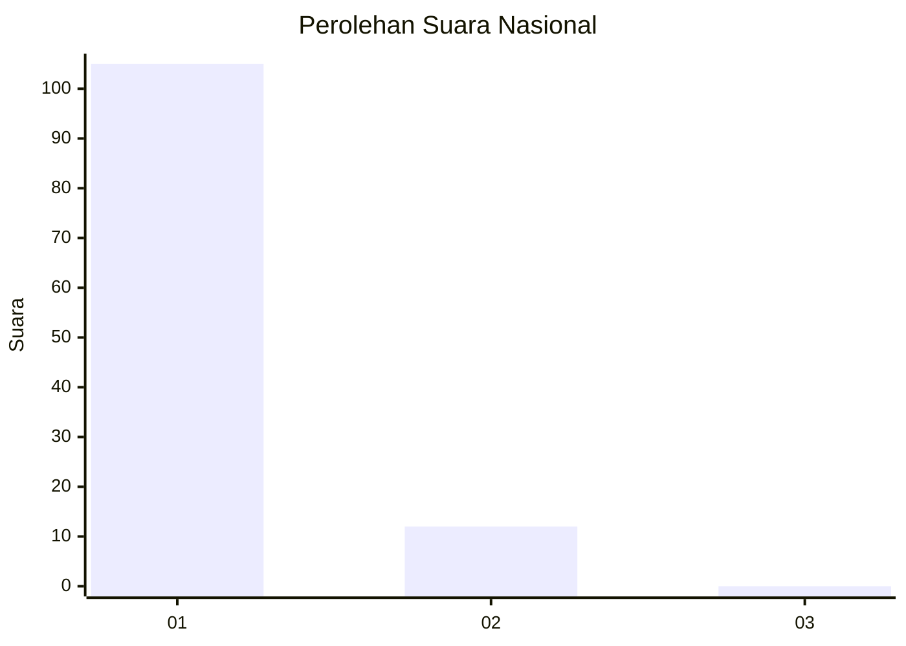
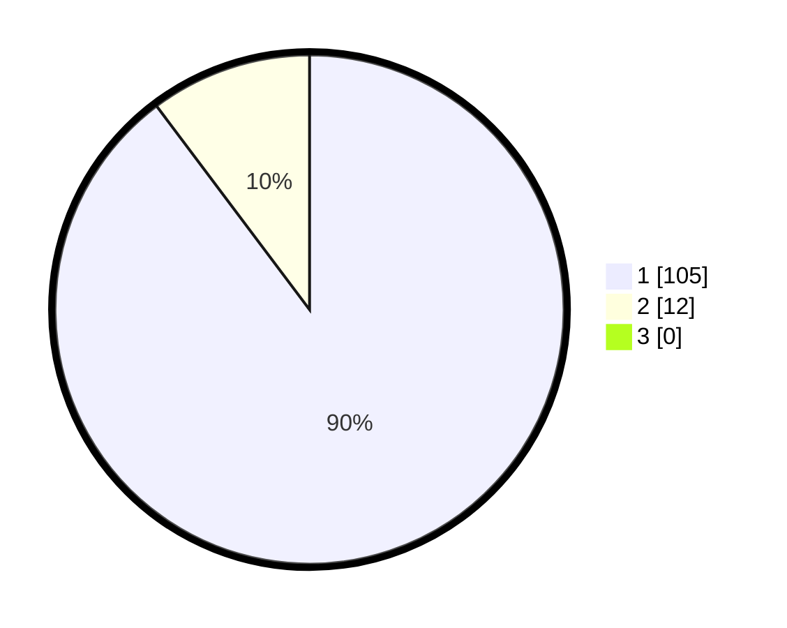

# Hasil

## Grafik

## Tabel

| No. | Nama Paslon    | Suara | Suara (raw) | Persentase |
|:--- |:-------------- | -----:| -----------:| ----------:|
| 1   | ANIES MUHAIMIN | 105   | [105][p-1]  | 89,74      |
| 2   | PRABOWO GIBRAN | 12    | [12][p-2]   | 10,26      |
| 3   | GANJAR MAHFUD  | 0     | [0][p-3]    | 0,00       |

[p-1]: https://github.com/gigit-pemilu/pemilu-2024/blob/main/pilpres/hitung-suara/sub/11-aceh/sub/05-aceh-barat/sub/11-woyla-timur/sub/2002-lubuk-panyang/sub/001-tps/sub/paslon-1.txt
[p-2]: https://github.com/gigit-pemilu/pemilu-2024/blob/main/pilpres/hitung-suara/sub/11-aceh/sub/05-aceh-barat/sub/11-woyla-timur/sub/2002-lubuk-panyang/sub/001-tps/sub/paslon-2.txt
[p-3]: https://github.com/gigit-pemilu/pemilu-2024/blob/main/pilpres/hitung-suara/sub/11-aceh/sub/05-aceh-barat/sub/11-woyla-timur/sub/2002-lubuk-panyang/sub/001-tps/sub/paslon-3.txt

## Foto C Plano

https://sirekap-obj-formc.kpu.go.id/5742/pemilu/ppwp/11/05/11/20/02/1105112002001-20240215-225601--01314b00-1fa2-454d-adf3-7acbaa8d32cf.jpg

https://sirekap-obj-formc.kpu.go.id/5742/pemilu/ppwp/11/05/11/20/02/1105112002001-20240215-225604--ad2a90ed-89b4-4353-b481-7b0dbc21f6a2.jpg

https://sirekap-obj-formc.kpu.go.id/5742/pemilu/ppwp/11/05/11/20/02/1105112002001-20240215-225602--671efdbe-80b2-44c1-9c8d-a0bb9044bb76.jpg

## Metadata

| Key        | Value               |
| ---------- | ------------------- |
| Time Stamp | 2024-02-16 22:01:00 |

## DATA PEMILIH TETAP

Jumlah pemilih dalam DPT: **119**.
 * L: **62**.
 * P: **57**.

## DATA PENGGUNA HAK PILIH

Jumlah pengguna hak pilih dalam DPT: **119**.
 * L: **62**.
 * P: **57**.

Jumlah pengguna hak pilih dalam DPTb: **1**.
 * L: **1**.
 * P: **0**.

Jumlah pengguna hak pilih dalam DPK: **1**.
 * L: **0**.
 * P: **1**.

Jumlah pengguna hak pilih: **121**.
 * L: **63**.
 * P: **58**.

## JUMLAH SUARA SAH DAN TIDAK SAH

JUMLAH SELURUH SUARA SAH: **117**.

JUMLAH SUARA TIDAK SAH: **1**.

JUMLAH SELURUH SUARA SAH DAN SUARA TIDAK SAH: **118**.

