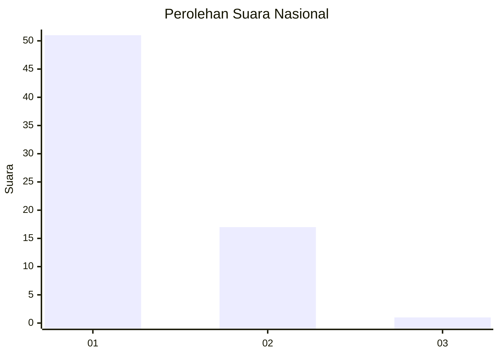
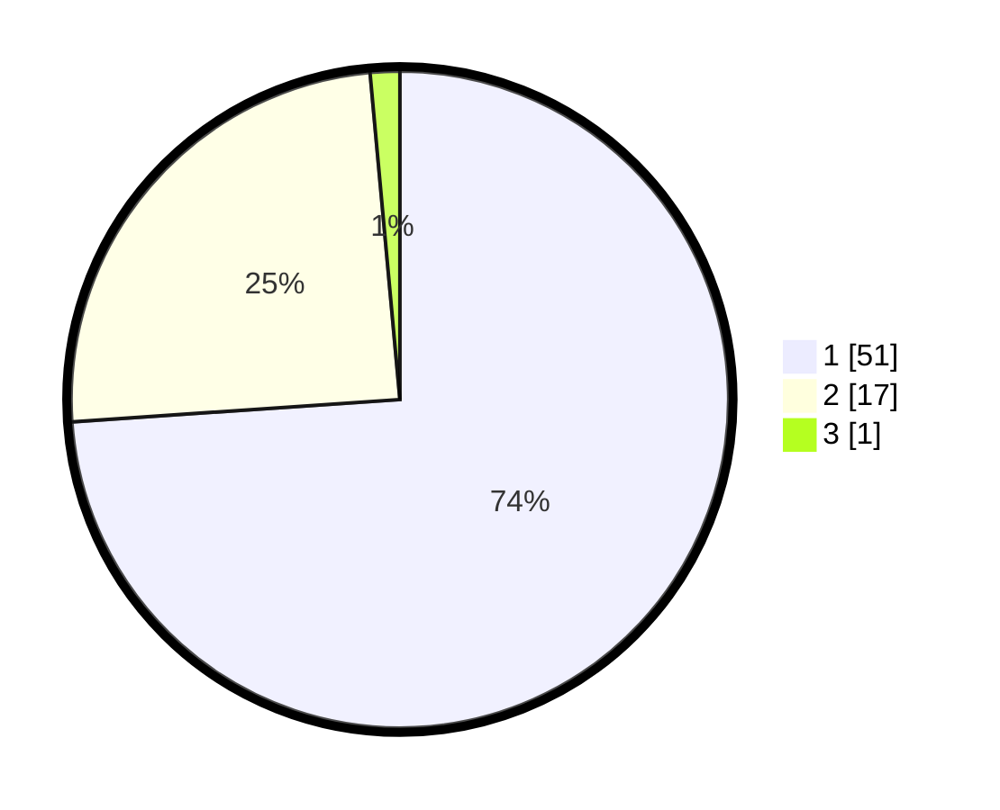

# Hasil

## Grafik

## Tabel

| No. | Nama Paslon    | Suara | Suara (raw) | Persentase |
|:--- |:-------------- | -----:| -----------:| ----------:|
| 1   | ANIES MUHAIMIN | 51    | [51][p-1]   | 73,91      |
| 2   | PRABOWO GIBRAN | 17    | [17][p-2]   | 24,64      |
| 3   | GANJAR MAHFUD  | 1     | [1][p-3]    | 1,45       |

[p-1]: https://github.com/gigit-pemilu/pemilu-2024/blob/main/pilpres/hitung-suara/sub/11-aceh/sub/05-aceh-barat/sub/11-woyla-timur/sub/2009-alue-eumpeuk/sub/001-tps/sub/paslon-1.txt
[p-2]: https://github.com/gigit-pemilu/pemilu-2024/blob/main/pilpres/hitung-suara/sub/11-aceh/sub/05-aceh-barat/sub/11-woyla-timur/sub/2009-alue-eumpeuk/sub/001-tps/sub/paslon-2.txt
[p-3]: https://github.com/gigit-pemilu/pemilu-2024/blob/main/pilpres/hitung-suara/sub/11-aceh/sub/05-aceh-barat/sub/11-woyla-timur/sub/2009-alue-eumpeuk/sub/001-tps/sub/paslon-3.txt

## Foto C Plano

https://sirekap-obj-formc.kpu.go.id/ab49/pemilu/ppwp/11/05/11/20/09/1105112009001-20240216-000901--7853167b-9734-4493-b867-ac97902aadf5.jpg

https://sirekap-obj-formc.kpu.go.id/ab49/pemilu/ppwp/11/05/11/20/09/1105112009001-20240216-000905--7616ed45-95f3-471a-a5de-9773a5c27ea0.jpg

https://sirekap-obj-formc.kpu.go.id/ab49/pemilu/ppwp/11/05/11/20/09/1105112009001-20240216-000904--4d1dfc10-37be-4a2b-a6fb-23a2c6f9a0cb.jpg

## Metadata

| Key        | Value               |
| ---------- | ------------------- |
| Time Stamp | 2024-02-16 22:01:00 |

## DATA PEMILIH TETAP

Jumlah pemilih dalam DPT: **71**.
 * L: **38**.
 * P: **33**.

## DATA PENGGUNA HAK PILIH

Jumlah pengguna hak pilih dalam DPT: **68**.
 * L: **37**.
 * P: **31**.

Jumlah pengguna hak pilih dalam DPTb: **1**.
 * L: **0**.
 * P: **1**.

Jumlah pengguna hak pilih dalam DPK: **0**.
 * L: **0**.
 * P: **0**.

Jumlah pengguna hak pilih: **69**.
 * L: **37**.
 * P: **32**.

## JUMLAH SUARA SAH DAN TIDAK SAH

JUMLAH SELURUH SUARA SAH: **69**.

JUMLAH SUARA TIDAK SAH: **0**.

JUMLAH SELURUH SUARA SAH DAN SUARA TIDAK SAH: **69**.

