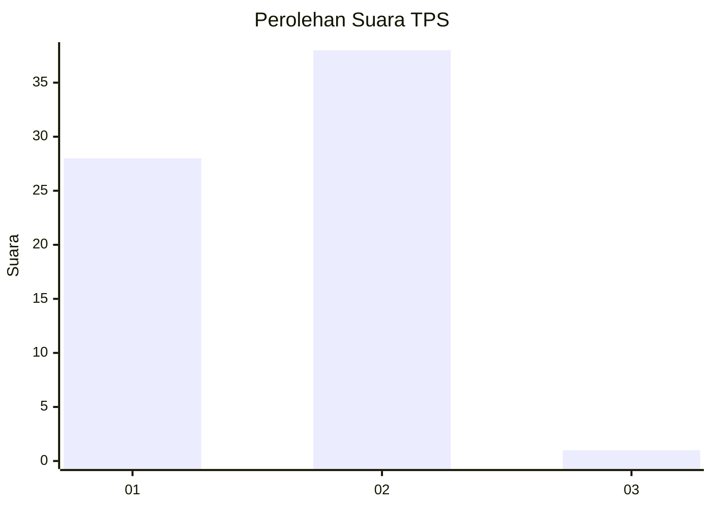
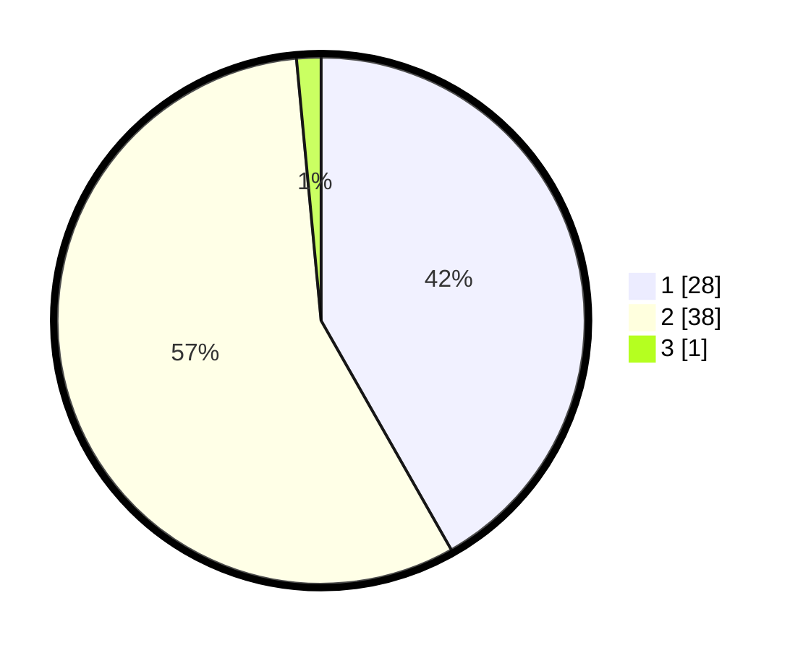

# Hasil

## Grafik

## Tabel

| No. | Nama Paslon    | Suara | Suara (raw) | Persentase |
|:--- |:-------------- | -----:| -----------:| ----------:|
| 1   | ANIES MUHAIMIN | 28    | [28][p-1]   | 41,79      |
| 2   | PRABOWO GIBRAN | 38    | [38][p-2]   | 56,72      |
| 3   | GANJAR MAHFUD  | 1     | [1][p-3]    | 1,49       |

[p-1]: https://github.com/gigit-pemilu/pemilu-2024-11-aceh/blob/main/pilpres/hitung-suara/sub/11-aceh/sub/05-aceh-barat/sub/11-woyla-timur/sub/2010-alue-bilie/sub/001-tps/sub/paslon-1.txt
[p-2]: https://github.com/gigit-pemilu/pemilu-2024-11-aceh/blob/main/pilpres/hitung-suara/sub/11-aceh/sub/05-aceh-barat/sub/11-woyla-timur/sub/2010-alue-bilie/sub/001-tps/sub/paslon-2.txt
[p-3]: https://github.com/gigit-pemilu/pemilu-2024-11-aceh/blob/main/pilpres/hitung-suara/sub/11-aceh/sub/05-aceh-barat/sub/11-woyla-timur/sub/2010-alue-bilie/sub/001-tps/sub/paslon-3.txt

## Foto C Plano

https://sirekap-obj-formc.kpu.go.id/a521/pemilu/ppwp/11/05/11/20/10/1105112010001-20240218-132016--d2af24de-44fa-4ce0-ae91-1ae16f862285.jpg

https://sirekap-obj-formc.kpu.go.id/a521/pemilu/ppwp/11/05/11/20/10/1105112010001-20240218-132018--4a15ddec-4100-4d90-b403-6564c789d555.jpg

https://sirekap-obj-formc.kpu.go.id/a521/pemilu/ppwp/11/05/11/20/10/1105112010001-20240218-132017--45a2aa14-d29a-40ba-94cb-2a7bebc86622.jpg

## Metadata

| Key        | Value               |
| ---------- | ------------------- |
| Time Stamp | 2024-02-21 17:00:00 |

## DATA PEMILIH TETAP

Jumlah pemilih dalam DPT: **71**.
 * L: **38**.
 * P: **33**.

## DATA PENGGUNA HAK PILIH

Jumlah pengguna hak pilih dalam DPT: **67**.
 * L: **35**.
 * P: **32**.

Jumlah pengguna hak pilih dalam DPTb: **0**.
 * L: **0**.
 * P: **0**.

Jumlah pengguna hak pilih dalam DPK: **0**.
 * L: **0**.
 * P: **0**.

Jumlah pengguna hak pilih: **67**.
 * L: **35**.
 * P: **32**.

## JUMLAH SUARA SAH DAN TIDAK SAH

JUMLAH SELURUH SUARA SAH: **67**.

JUMLAH SUARA TIDAK SAH: **0**.

JUMLAH SELURUH SUARA SAH DAN SUARA TIDAK SAH: **67**.

