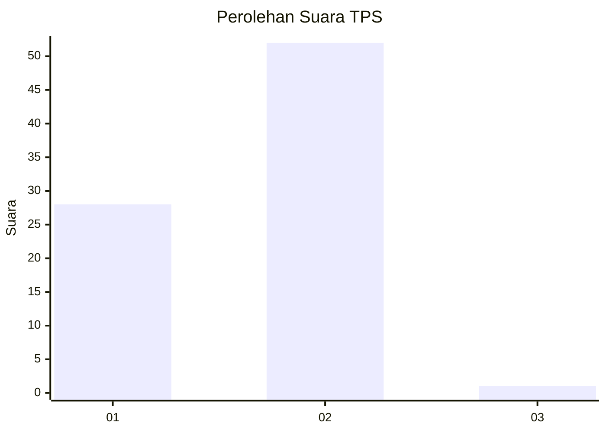
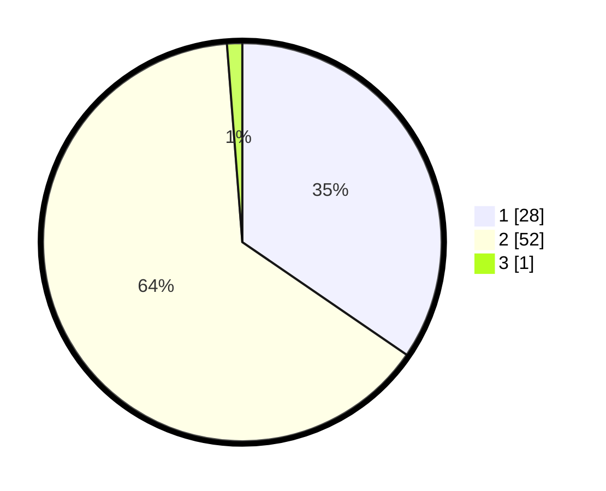

# Hasil

## Grafik

## Tabel

| No. | Nama Paslon    | Suara | Suara (raw) | Persentase |
|:--- |:-------------- | -----:| -----------:| ----------:|
| 1   | ANIES MUHAIMIN | 28    | [28][p-1]   | 34,57      |
| 2   | PRABOWO GIBRAN | 52    | [52][p-2]   | 64,20      |
| 3   | GANJAR MAHFUD  | 1     | [1][p-3]    | 1,23       |

[p-1]: https://github.com/gigit-pemilu/pemilu-2024-11-aceh/blob/main/pilpres/hitung-suara/sub/11-aceh/sub/05-aceh-barat/sub/11-woyla-timur/sub/2017-blang-makmue/sub/001-tps/sub/paslon-1.txt
[p-2]: https://github.com/gigit-pemilu/pemilu-2024-11-aceh/blob/main/pilpres/hitung-suara/sub/11-aceh/sub/05-aceh-barat/sub/11-woyla-timur/sub/2017-blang-makmue/sub/001-tps/sub/paslon-2.txt
[p-3]: https://github.com/gigit-pemilu/pemilu-2024-11-aceh/blob/main/pilpres/hitung-suara/sub/11-aceh/sub/05-aceh-barat/sub/11-woyla-timur/sub/2017-blang-makmue/sub/001-tps/sub/paslon-3.txt

## Foto C Plano

https://sirekap-obj-formc.kpu.go.id/8af7/pemilu/ppwp/11/05/11/20/17/1105112017001-20240216-124652--ee4648be-fd5b-43d7-860c-b61259070729.jpg

https://sirekap-obj-formc.kpu.go.id/8af7/pemilu/ppwp/11/05/11/20/17/1105112017001-20240216-124654--ec27d43f-635d-4cc2-a0fb-03c14791e9a5.jpg

https://sirekap-obj-formc.kpu.go.id/8af7/pemilu/ppwp/11/05/11/20/17/1105112017001-20240216-124652--08c13904-89a3-47b0-9834-aa6c89e712f7.jpg

## Metadata

| Key        | Value               |
| ---------- | ------------------- |
| Time Stamp | 2024-02-16 22:01:00 |

## DATA PEMILIH TETAP

Jumlah pemilih dalam DPT: **82**.
 * L: **42**.
 * P: **40**.

## DATA PENGGUNA HAK PILIH

Jumlah pengguna hak pilih dalam DPT: **82**.
 * L: **42**.
 * P: **40**.

Jumlah pengguna hak pilih dalam DPTb: **2**.
 * L: **1**.
 * P: **1**.

Jumlah pengguna hak pilih dalam DPK: **0**.
 * L: **0**.
 * P: **0**.

Jumlah pengguna hak pilih: **84**.
 * L: **43**.
 * P: **41**.

## JUMLAH SUARA SAH DAN TIDAK SAH

JUMLAH SELURUH SUARA SAH: **81**.

JUMLAH SUARA TIDAK SAH: **1**.

JUMLAH SELURUH SUARA SAH DAN SUARA TIDAK SAH: **82**.

