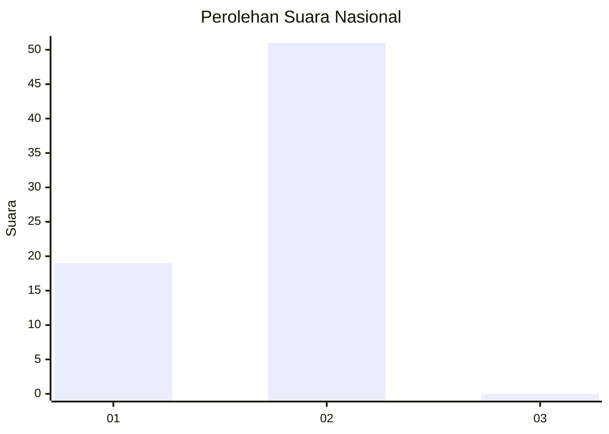
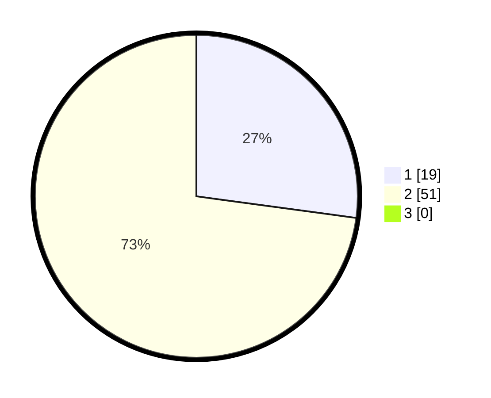

# Hasil

## Grafik

## Tabel

| No. | Nama Paslon    | Suara | Suara (raw) | Persentase |
|:--- |:-------------- | -----:| -----------:| ----------:|
| 1   | ANIES MUHAIMIN | 19    | [19][p-1]   | 27,14      |
| 2   | PRABOWO GIBRAN | 51    | [51][p-2]   | 72,86      |
| 3   | GANJAR MAHFUD  | 0     | [0][p-3]    | 0,00       |

[p-1]: https://github.com/gigit-pemilu/pemilu-2024/blob/main/pilpres/hitung-suara/sub/11-aceh/sub/05-aceh-barat/sub/11-woyla-timur/sub/2018-gampong-baro-kb/sub/001-tps/sub/paslon-1.txt
[p-2]: https://github.com/gigit-pemilu/pemilu-2024/blob/main/pilpres/hitung-suara/sub/11-aceh/sub/05-aceh-barat/sub/11-woyla-timur/sub/2018-gampong-baro-kb/sub/001-tps/sub/paslon-2.txt
[p-3]: https://github.com/gigit-pemilu/pemilu-2024/blob/main/pilpres/hitung-suara/sub/11-aceh/sub/05-aceh-barat/sub/11-woyla-timur/sub/2018-gampong-baro-kb/sub/001-tps/sub/paslon-3.txt

## Foto C Plano

https://sirekap-obj-formc.kpu.go.id/6d05/pemilu/ppwp/11/05/11/20/18/1105112018001-20240215-225856--70f47bac-a2a9-4393-b887-f1c92c8b6e45.jpg

https://sirekap-obj-formc.kpu.go.id/6d05/pemilu/ppwp/11/05/11/20/18/1105112018001-20240215-225858--77e85b80-7336-4f32-b66d-5e7a066be997.jpg

https://sirekap-obj-formc.kpu.go.id/6d05/pemilu/ppwp/11/05/11/20/18/1105112018001-20240215-225857--58fc56b0-52dc-49b1-938b-e9cb7a5ee6a6.jpg

## Metadata

| Key        | Value               |
| ---------- | ------------------- |
| Time Stamp | 2024-02-16 22:01:00 |

## DATA PEMILIH TETAP

Jumlah pemilih dalam DPT: **73**.
 * L: **36**.
 * P: **37**.

## DATA PENGGUNA HAK PILIH

Jumlah pengguna hak pilih dalam DPT: **71**.
 * L: **35**.
 * P: **36**.

Jumlah pengguna hak pilih dalam DPTb: **0**.
 * L: **0**.
 * P: **0**.

Jumlah pengguna hak pilih dalam DPK: **0**.
 * L: **0**.
 * P: **0**.

Jumlah pengguna hak pilih: **71**.
 * L: **35**.
 * P: **36**.

## JUMLAH SUARA SAH DAN TIDAK SAH

JUMLAH SELURUH SUARA SAH: **70**.

JUMLAH SUARA TIDAK SAH: **1**.

JUMLAH SELURUH SUARA SAH DAN SUARA TIDAK SAH: **71**.

