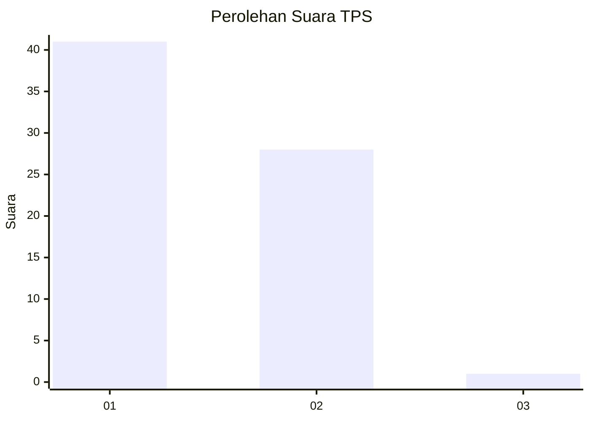
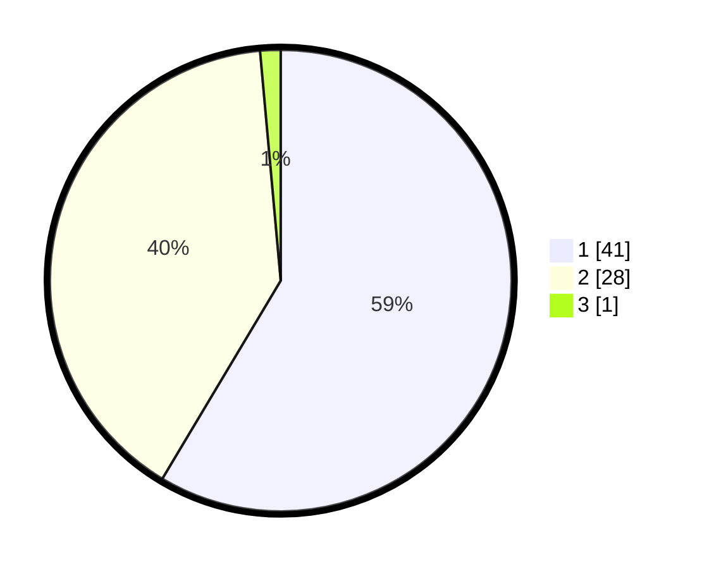

# Hasil

## Grafik

## Tabel

| No. | Nama Paslon    | Suara | Suara (raw) | Persentase |
|:--- |:-------------- | -----:| -----------:| ----------:|
| 1   | ANIES MUHAIMIN | 41    | [41][p-1]   | 58,57      |
| 2   | PRABOWO GIBRAN | 28    | [28][p-2]   | 40,00      |
| 3   | GANJAR MAHFUD  | 1     | [1][p-3]    | 1,43       |

[p-1]: https://github.com/gigit-pemilu/pemilu-2024-11-aceh/blob/main/pilpres/hitung-suara/sub/11-aceh/sub/05-aceh-barat/sub/11-woyla-timur/sub/2019-alue-meuganda/sub/001-tps/sub/paslon-1.txt
[p-2]: https://github.com/gigit-pemilu/pemilu-2024-11-aceh/blob/main/pilpres/hitung-suara/sub/11-aceh/sub/05-aceh-barat/sub/11-woyla-timur/sub/2019-alue-meuganda/sub/001-tps/sub/paslon-2.txt
[p-3]: https://github.com/gigit-pemilu/pemilu-2024-11-aceh/blob/main/pilpres/hitung-suara/sub/11-aceh/sub/05-aceh-barat/sub/11-woyla-timur/sub/2019-alue-meuganda/sub/001-tps/sub/paslon-3.txt

## Foto C Plano

https://sirekap-obj-formc.kpu.go.id/22bf/pemilu/ppwp/11/05/11/20/19/1105112019001-20240215-214119--e749f570-777e-45cb-bced-b8096092408b.jpg

https://sirekap-obj-formc.kpu.go.id/22bf/pemilu/ppwp/11/05/11/20/19/1105112019001-20240215-214122--9b79d8f5-0dd7-44bd-9b98-4def3ca3fa22.jpg

https://sirekap-obj-formc.kpu.go.id/22bf/pemilu/ppwp/11/05/11/20/19/1105112019001-20240215-214120--31ddd4dc-daa3-4cc1-bbc4-8e9d23043453.jpg

## Metadata

| Key        | Value               |
| ---------- | ------------------- |
| Time Stamp | 2024-02-15 22:40:13 |

## DATA PEMILIH TETAP

Jumlah pemilih dalam DPT: **70**.
 * L: **36**.
 * P: **34**.

## DATA PENGGUNA HAK PILIH

Jumlah pengguna hak pilih dalam DPT: **70**.
 * L: **36**.
 * P: **34**.

Jumlah pengguna hak pilih dalam DPTb: **3**.
 * L: **1**.
 * P: **2**.

Jumlah pengguna hak pilih dalam DPK: **0**.
 * L: **0**.
 * P: **0**.

Jumlah pengguna hak pilih: **73**.
 * L: **37**.
 * P: **36**.

## JUMLAH SUARA SAH DAN TIDAK SAH

JUMLAH SELURUH SUARA SAH: **70**.

JUMLAH SUARA TIDAK SAH: **2**.

JUMLAH SELURUH SUARA SAH DAN SUARA TIDAK SAH: **72**.

