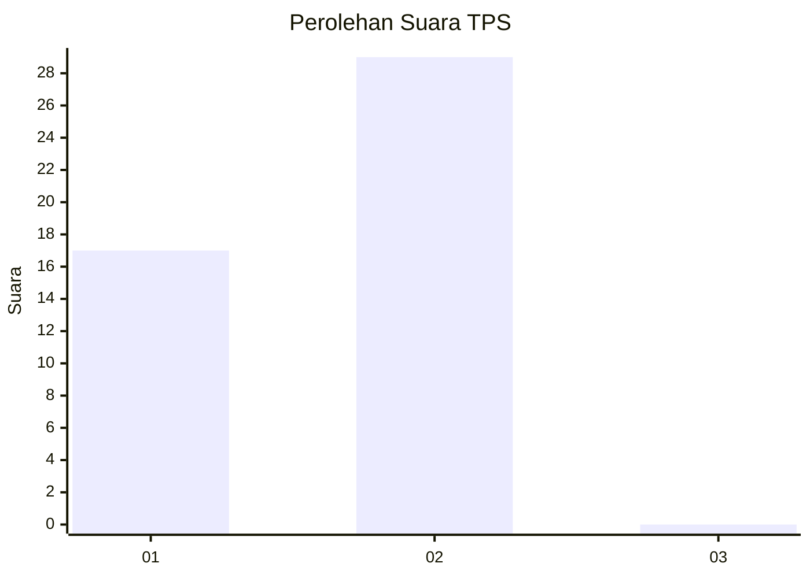
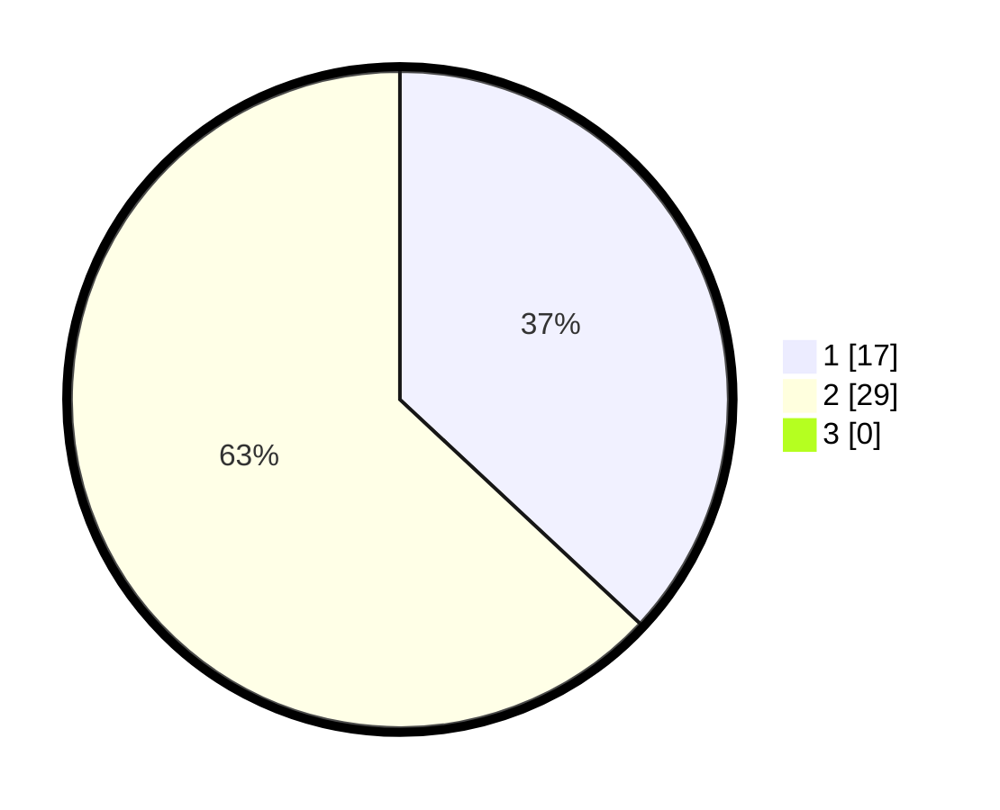

# Hasil

## Grafik

## Tabel

| No. | Nama Paslon    | Suara | Suara (raw) | Persentase |
|:--- |:-------------- | -----:| -----------:| ----------:|
| 1   | ANIES MUHAIMIN | 17    | [17][p-1]   | 36,96      |
| 2   | PRABOWO GIBRAN | 29    | [29][p-2]   | 63,04      |
| 3   | GANJAR MAHFUD  | 0     | [0][p-3]    | 0,00       |

[p-1]: https://github.com/gigit-pemilu/pemilu-2024-11-aceh/blob/main/pilpres/hitung-suara/sub/11-aceh/sub/05-aceh-barat/sub/11-woyla-timur/sub/2020-alue-seuralen/sub/001-tps/sub/paslon-1.txt
[p-2]: https://github.com/gigit-pemilu/pemilu-2024-11-aceh/blob/main/pilpres/hitung-suara/sub/11-aceh/sub/05-aceh-barat/sub/11-woyla-timur/sub/2020-alue-seuralen/sub/001-tps/sub/paslon-2.txt
[p-3]: https://github.com/gigit-pemilu/pemilu-2024-11-aceh/blob/main/pilpres/hitung-suara/sub/11-aceh/sub/05-aceh-barat/sub/11-woyla-timur/sub/2020-alue-seuralen/sub/001-tps/sub/paslon-3.txt

## Foto C Plano

https://sirekap-obj-formc.kpu.go.id/fe71/pemilu/ppwp/11/05/11/20/20/1105112020001-20240216-190407--a4c1784e-6f87-4ce6-b320-8a63a54f4765.jpg

https://sirekap-obj-formc.kpu.go.id/fe71/pemilu/ppwp/11/05/11/20/20/1105112020001-20240216-190409--b18694cb-77f4-4101-bbb5-9576363f43ac.jpg

https://sirekap-obj-formc.kpu.go.id/fe71/pemilu/ppwp/11/05/11/20/20/1105112020001-20240216-190408--1cef402b-9192-4725-aa5b-1efd0ef502ca.jpg

## Metadata

| Key        | Value               |
| ---------- | ------------------- |
| Time Stamp | 2024-02-16 22:01:00 |

## DATA PEMILIH TETAP

Jumlah pemilih dalam DPT: **48**.
 * L: **25**.
 * P: **23**.

## DATA PENGGUNA HAK PILIH

Jumlah pengguna hak pilih dalam DPT: **46**.
 * L: **23**.
 * P: **23**.

Jumlah pengguna hak pilih dalam DPTb: **0**.
 * L: **0**.
 * P: **0**.

Jumlah pengguna hak pilih dalam DPK: **0**.
 * L: **0**.
 * P: **0**.

Jumlah pengguna hak pilih: **46**.
 * L: **23**.
 * P: **23**.

## JUMLAH SUARA SAH DAN TIDAK SAH

JUMLAH SELURUH SUARA SAH: **46**.

JUMLAH SUARA TIDAK SAH: **0**.

JUMLAH SELURUH SUARA SAH DAN SUARA TIDAK SAH: **46**.

