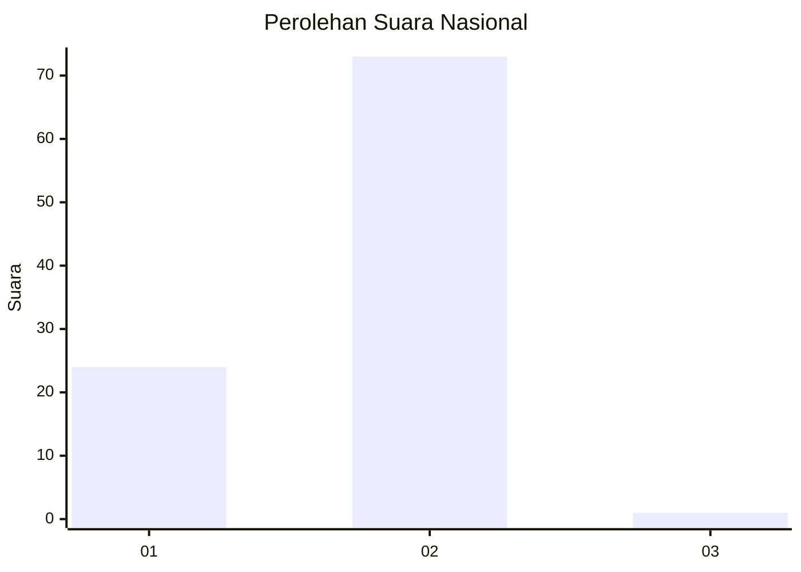
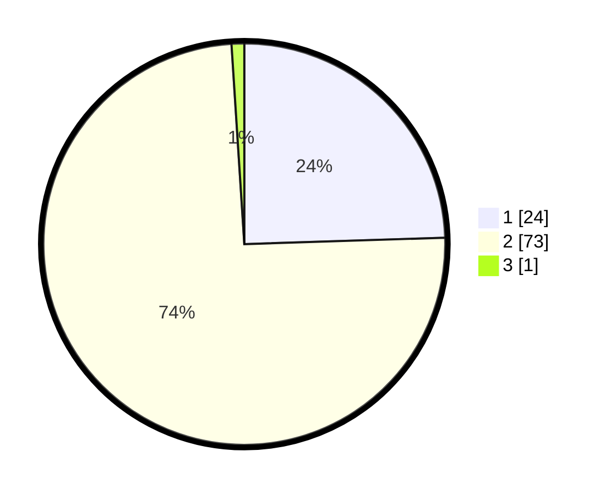

# Hasil

## Grafik

## Tabel

| No. | Nama Paslon    | Suara | Suara (raw) | Persentase |
|:--- |:-------------- | -----:| -----------:| ----------:|
| 1   | ANIES MUHAIMIN | 24    | [24][p-1]   | 24,49      |
| 2   | PRABOWO GIBRAN | 73    | [73][p-2]   | 74,49      |
| 3   | GANJAR MAHFUD  | 1     | [1][p-3]    | 1,02       |

[p-1]: https://github.com/gigit-pemilu/pemilu-2024/blob/main/pilpres/hitung-suara/sub/11-aceh/sub/05-aceh-barat/sub/11-woyla-timur/sub/2022-tuwi-eumpeuk/sub/001-tps/sub/paslon-1.txt
[p-2]: https://github.com/gigit-pemilu/pemilu-2024/blob/main/pilpres/hitung-suara/sub/11-aceh/sub/05-aceh-barat/sub/11-woyla-timur/sub/2022-tuwi-eumpeuk/sub/001-tps/sub/paslon-2.txt
[p-3]: https://github.com/gigit-pemilu/pemilu-2024/blob/main/pilpres/hitung-suara/sub/11-aceh/sub/05-aceh-barat/sub/11-woyla-timur/sub/2022-tuwi-eumpeuk/sub/001-tps/sub/paslon-3.txt

## Foto C Plano

https://sirekap-obj-formc.kpu.go.id/0857/pemilu/ppwp/11/05/11/20/22/1105112022001-20240226-142016--15428cd4-79a3-482b-9b82-2d38da1925ad.jpg

https://sirekap-obj-formc.kpu.go.id/0857/pemilu/ppwp/11/05/11/20/22/1105112022001-20240226-142018--c5d36a6b-d6c4-4358-91f1-eee85fc9165c.jpg

https://sirekap-obj-formc.kpu.go.id/0857/pemilu/ppwp/11/05/11/20/22/1105112022001-20240226-142017--dfb9e63c-62b8-497e-8ebe-1323ec717450.jpg

## Metadata

| Key        | Value               |
| ---------- | ------------------- |
| Time Stamp | 2024-02-26 21:00:00 |

## DATA PEMILIH TETAP

Jumlah pemilih dalam DPT: **101**.
 * L: **50**.
 * P: **51**.

## DATA PENGGUNA HAK PILIH

Jumlah pengguna hak pilih dalam DPT: **100**.
 * L: **49**.
 * P: **51**.

Jumlah pengguna hak pilih dalam DPTb: **0**.
 * L: **0**.
 * P: **0**.

Jumlah pengguna hak pilih dalam DPK: **0**.
 * L: **0**.
 * P: **0**.

Jumlah pengguna hak pilih: **100**.
 * L: **49**.
 * P: **51**.

## JUMLAH SUARA SAH DAN TIDAK SAH

JUMLAH SELURUH SUARA SAH: **98**.

JUMLAH SUARA TIDAK SAH: **2**.

JUMLAH SELURUH SUARA SAH DAN SUARA TIDAK SAH: **100**.

