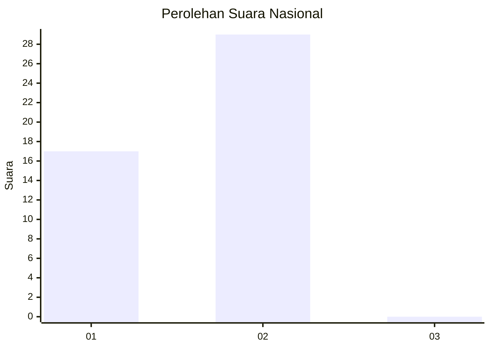
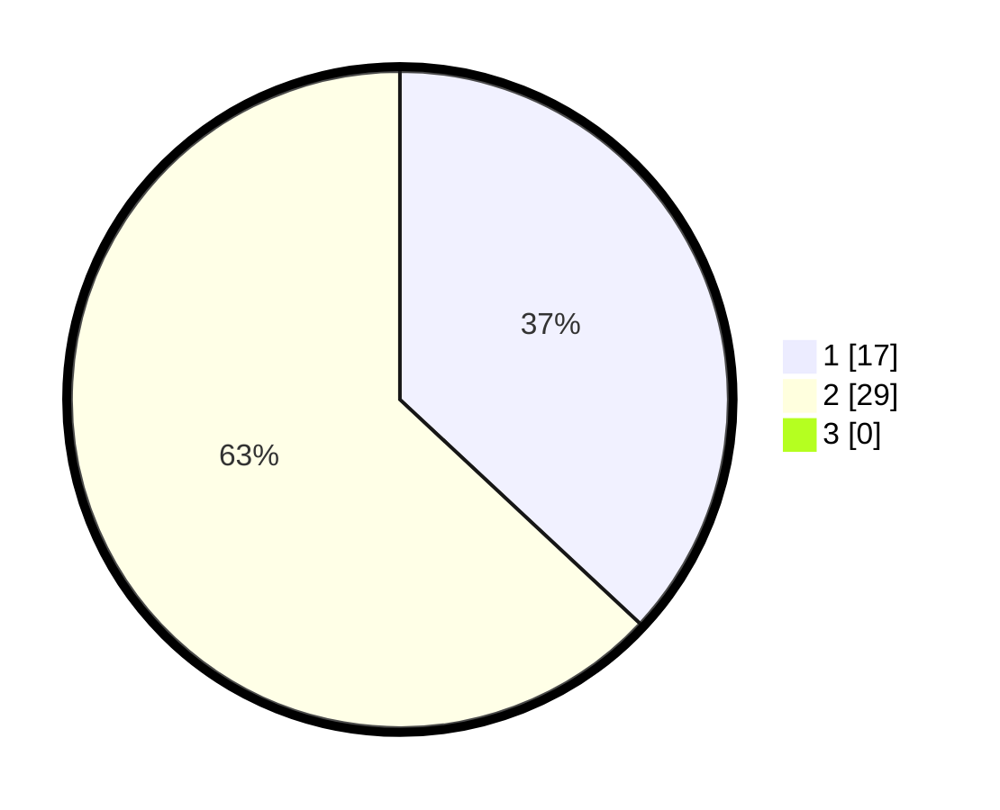

# Hasil

## Grafik

## Tabel

| No. | Nama Paslon    | Suara | Suara (raw) | Persentase |
|:--- |:-------------- | -----:| -----------:| ----------:|
| 1   | ANIES MUHAIMIN | 17    | [17][p-1]   | 36,96      |
| 2   | PRABOWO GIBRAN | 29    | [29][p-2]   | 63,04      |
| 3   | GANJAR MAHFUD  | 0     | [0][p-3]    | 0,00       |

[p-1]: https://github.com/gigit-pemilu/pemilu-2024/blob/main/pilpres/hitung-suara/sub/11-aceh/sub/05-aceh-barat/sub/11-woyla-timur/sub/2024-seuneubok-dalam/sub/001-tps/sub/paslon-1.txt
[p-2]: https://github.com/gigit-pemilu/pemilu-2024/blob/main/pilpres/hitung-suara/sub/11-aceh/sub/05-aceh-barat/sub/11-woyla-timur/sub/2024-seuneubok-dalam/sub/001-tps/sub/paslon-2.txt
[p-3]: https://github.com/gigit-pemilu/pemilu-2024/blob/main/pilpres/hitung-suara/sub/11-aceh/sub/05-aceh-barat/sub/11-woyla-timur/sub/2024-seuneubok-dalam/sub/001-tps/sub/paslon-3.txt

## Foto C Plano

https://sirekap-obj-formc.kpu.go.id/604c/pemilu/ppwp/11/05/11/20/24/1105112024001-20240216-120221--19e23c95-a3fb-4961-b121-b959dca02d39.jpg

https://sirekap-obj-formc.kpu.go.id/604c/pemilu/ppwp/11/05/11/20/24/1105112024001-20240216-120224--1e891685-9e8a-497d-8932-315944bbdfb7.jpg

https://sirekap-obj-formc.kpu.go.id/604c/pemilu/ppwp/11/05/11/20/24/1105112024001-20240216-120222--a881fcfd-2913-4b10-a416-bc0da23c5aaf.jpg

## Metadata

| Key        | Value               |
| ---------- | ------------------- |
| Time Stamp | 2024-02-16 22:01:00 |

## DATA PEMILIH TETAP

Jumlah pemilih dalam DPT: **46**.
 * L: **22**.
 * P: **24**.

## DATA PENGGUNA HAK PILIH

Jumlah pengguna hak pilih dalam DPT: **46**.
 * L: **22**.
 * P: **24**.

Jumlah pengguna hak pilih dalam DPTb: **0**.
 * L: **0**.
 * P: **0**.

Jumlah pengguna hak pilih dalam DPK: **46**.
 * L: **22**.
 * P: **24**.

Jumlah pengguna hak pilih: **46**.
 * L: **22**.
 * P: **24**.

## JUMLAH SUARA SAH DAN TIDAK SAH

JUMLAH SELURUH SUARA SAH: **46**.

JUMLAH SUARA TIDAK SAH: **0**.

JUMLAH SELURUH SUARA SAH DAN SUARA TIDAK SAH: **46**.

