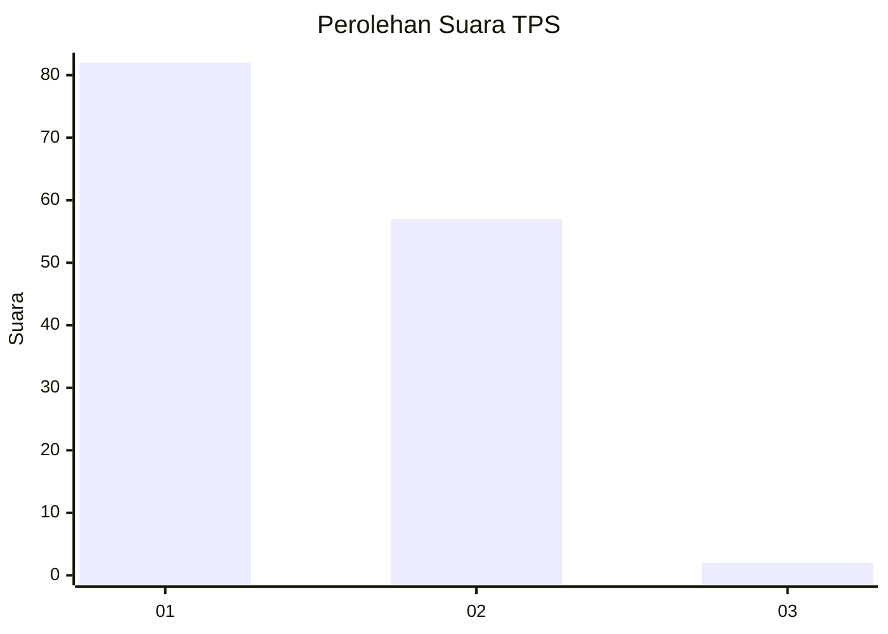
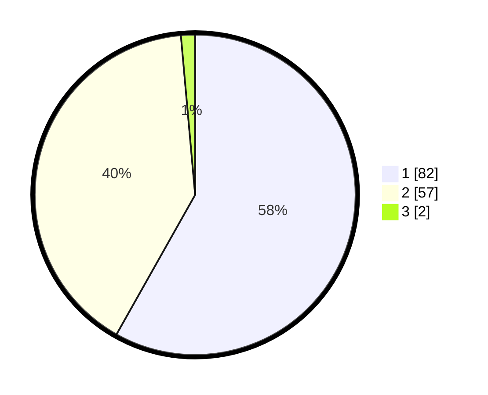

# Hasil

## Grafik

## Tabel

| No. | Nama Paslon    | Suara | Suara (raw) | Persentase |
|:--- |:-------------- | -----:| -----------:| ----------:|
| 1   | ANIES MUHAIMIN | 82    | [82][p-1]   | 58,16      |
| 2   | PRABOWO GIBRAN | 57    | [57][p-2]   | 40,43      |
| 3   | GANJAR MAHFUD  | 2     | [2][p-3]    | 1,42       |

[p-1]: https://github.com/gigit-pemilu/pemilu-2024-11-aceh/blob/main/pilpres/hitung-suara/sub/11-aceh/sub/05-aceh-barat/sub/11-woyla-timur/sub/2025-paya-meugendrang/sub/001-tps/sub/paslon-1.txt
[p-2]: https://github.com/gigit-pemilu/pemilu-2024-11-aceh/blob/main/pilpres/hitung-suara/sub/11-aceh/sub/05-aceh-barat/sub/11-woyla-timur/sub/2025-paya-meugendrang/sub/001-tps/sub/paslon-2.txt
[p-3]: https://github.com/gigit-pemilu/pemilu-2024-11-aceh/blob/main/pilpres/hitung-suara/sub/11-aceh/sub/05-aceh-barat/sub/11-woyla-timur/sub/2025-paya-meugendrang/sub/001-tps/sub/paslon-3.txt

## Foto C Plano

https://sirekap-obj-formc.kpu.go.id/c3e1/pemilu/ppwp/11/05/11/20/25/1105112025001-20240214-220450--ff5c372d-fa9b-4c36-8cff-9633e9aa6fff.jpg

https://sirekap-obj-formc.kpu.go.id/c3e1/pemilu/ppwp/11/05/11/20/25/1105112025001-20240214-220451--8dfa1b58-a816-4660-886a-bc8ce6a5f475.jpg

https://sirekap-obj-formc.kpu.go.id/c3e1/pemilu/ppwp/11/05/11/20/25/1105112025001-20240214-220450--0a5853ba-bfa7-498b-886a-9b83603fc758.jpg

## Metadata

| Key        | Value               |
| ---------- | ------------------- |
| Time Stamp | 2024-02-15 00:41:44 |

## DATA PEMILIH TETAP

Jumlah pemilih dalam DPT: **135**.
 * L: **68**.
 * P: **67**.

## DATA PENGGUNA HAK PILIH

Jumlah pengguna hak pilih dalam DPT: **134**.
 * L: **67**.
 * P: **67**.

Jumlah pengguna hak pilih dalam DPTb: **4**.
 * L: **2**.
 * P: **2**.

Jumlah pengguna hak pilih dalam DPK: **3**.
 * L: **1**.
 * P: **2**.

Jumlah pengguna hak pilih: **141**.
 * L: **70**.
 * P: **71**.

## JUMLAH SUARA SAH DAN TIDAK SAH

JUMLAH SELURUH SUARA SAH: **141**.

JUMLAH SUARA TIDAK SAH: **0**.

JUMLAH SELURUH SUARA SAH DAN SUARA TIDAK SAH: **141**.

