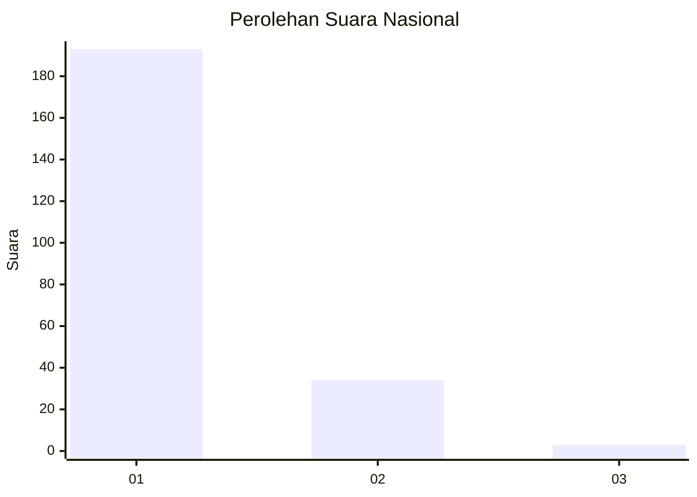
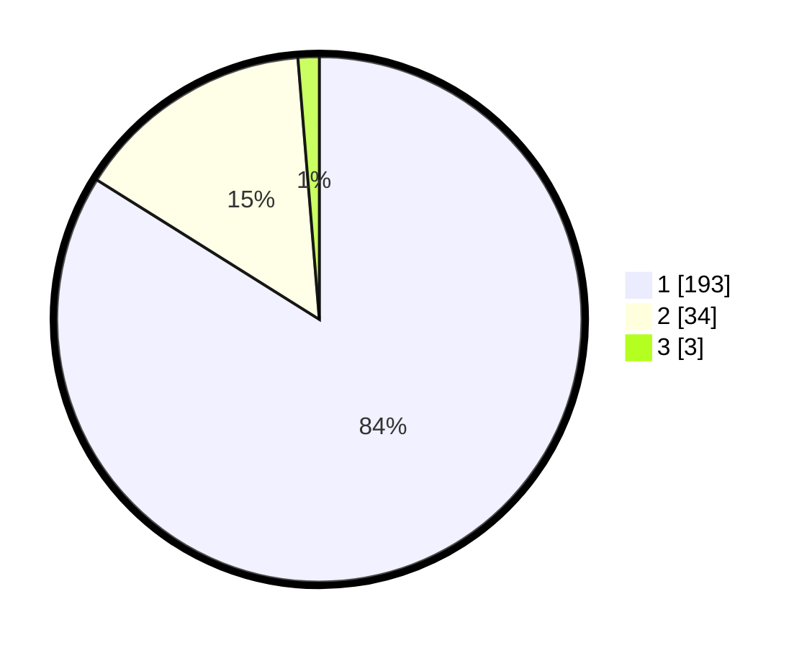

# Hasil

## Grafik

## Tabel

| No. | Nama Paslon    | Suara | Suara (raw) | Persentase |
|:--- |:-------------- | -----:| -----------:| ----------:|
| 1   | ANIES MUHAIMIN | 193   | [193][p-1]  | 83,91      |
| 2   | PRABOWO GIBRAN | 34    | [34][p-2]   | 14,78      |
| 3   | GANJAR MAHFUD  | 3     | [3][p-3]    | 1,30       |

[p-1]: https://github.com/gigit-pemilu/pemilu-2024/blob/main/pilpres/hitung-suara/sub/11-aceh/sub/05-aceh-barat/sub/12-panton-reu/sub/2001-meutulang/sub/001-tps/sub/paslon-1.txt
[p-2]: https://github.com/gigit-pemilu/pemilu-2024/blob/main/pilpres/hitung-suara/sub/11-aceh/sub/05-aceh-barat/sub/12-panton-reu/sub/2001-meutulang/sub/001-tps/sub/paslon-2.txt
[p-3]: https://github.com/gigit-pemilu/pemilu-2024/blob/main/pilpres/hitung-suara/sub/11-aceh/sub/05-aceh-barat/sub/12-panton-reu/sub/2001-meutulang/sub/001-tps/sub/paslon-3.txt

## Foto C Plano

https://sirekap-obj-formc.kpu.go.id/b1ea/pemilu/ppwp/11/05/12/20/01/1105122001001-20240214-202454--aa847db7-3a05-46ff-abc5-861a794ecf97.jpg

https://sirekap-obj-formc.kpu.go.id/b1ea/pemilu/ppwp/11/05/12/20/01/1105122001001-20240214-195203--16fb4df9-b73c-4df9-b78a-df432bfd2371.jpg

https://sirekap-obj-formc.kpu.go.id/b1ea/pemilu/ppwp/11/05/12/20/01/1105122001001-20240214-195310--9d9f7750-f70d-4f03-b113-69fe20e67448.jpg

## Metadata

| Key        | Value               |
| ---------- | ------------------- |
| Time Stamp | 2024-02-14 21:46:01 |

## DATA PEMILIH TETAP

Jumlah pemilih dalam DPT: **262**.
 * L: **131**.
 * P: **131**.

## DATA PENGGUNA HAK PILIH

Jumlah pengguna hak pilih dalam DPT: **232**.
 * L: **111**.
 * P: **121**.

Jumlah pengguna hak pilih dalam DPTb: **0**.
 * L: **0**.
 * P: **0**.

Jumlah pengguna hak pilih dalam DPK: **0**.
 * L: **0**.
 * P: **0**.

Jumlah pengguna hak pilih: **232**.
 * L: **111**.
 * P: **121**.

## JUMLAH SUARA SAH DAN TIDAK SAH

JUMLAH SELURUH SUARA SAH: **230**.

JUMLAH SUARA TIDAK SAH: **2**.

JUMLAH SELURUH SUARA SAH DAN SUARA TIDAK SAH: **232**.

