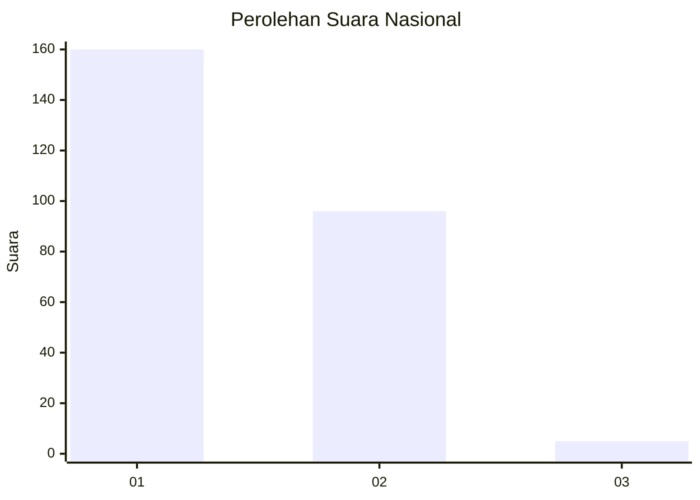
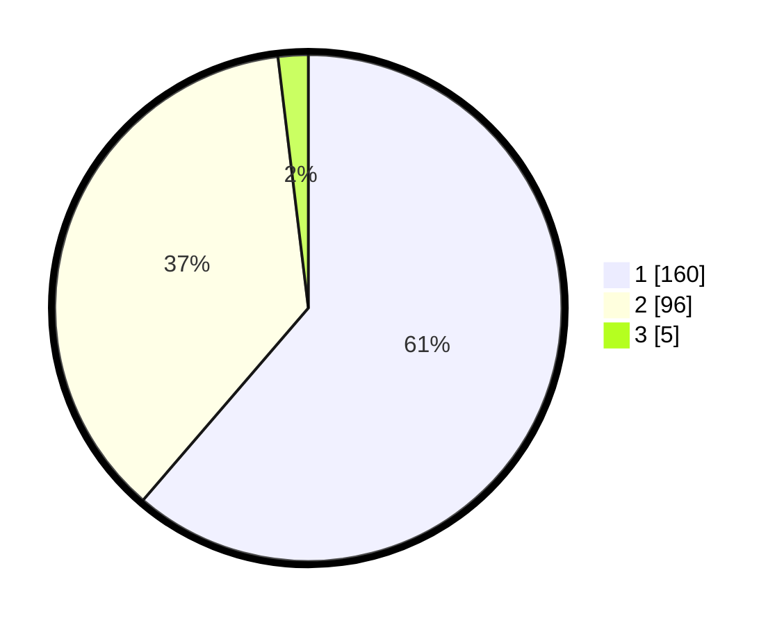

# Hasil

## Grafik

## Tabel

| No. | Nama Paslon    | Suara | Suara (raw) | Persentase |
|:--- |:-------------- | -----:| -----------:| ----------:|
| 1   | ANIES MUHAIMIN | 160   | [160][p-1]  | 61,30      |
| 2   | PRABOWO GIBRAN | 96    | [96][p-2]   | 36,78      |
| 3   | GANJAR MAHFUD  | 5     | [5][p-3]    | 1,92       |

[p-1]: https://github.com/gigit-pemilu/pemilu-2024/blob/main/pilpres/hitung-suara/sub/11-aceh/sub/05-aceh-barat/sub/12-panton-reu/sub/2002-mugo-cut/sub/001-tps/sub/paslon-1.txt
[p-2]: https://github.com/gigit-pemilu/pemilu-2024/blob/main/pilpres/hitung-suara/sub/11-aceh/sub/05-aceh-barat/sub/12-panton-reu/sub/2002-mugo-cut/sub/001-tps/sub/paslon-2.txt
[p-3]: https://github.com/gigit-pemilu/pemilu-2024/blob/main/pilpres/hitung-suara/sub/11-aceh/sub/05-aceh-barat/sub/12-panton-reu/sub/2002-mugo-cut/sub/001-tps/sub/paslon-3.txt

## Foto C Plano

https://sirekap-obj-formc.kpu.go.id/874f/pemilu/ppwp/11/05/12/20/02/1105122002001-20240215-103510--6b7c8d7a-f254-4ebc-9621-f1ff61682d2a.jpg

https://sirekap-obj-formc.kpu.go.id/874f/pemilu/ppwp/11/05/12/20/02/1105122002001-20240215-103811--5f142855-9508-4e7d-b61b-6ecad8c0481e.jpg

https://sirekap-obj-formc.kpu.go.id/874f/pemilu/ppwp/11/05/12/20/02/1105122002001-20240215-104122--c4e1a947-9cd2-4b2a-8559-46ac3dde1721.jpg

## Metadata

| Key        | Value               |
| ---------- | ------------------- |
| Time Stamp | 2024-02-15 22:30:27 |

## DATA PEMILIH TETAP

Jumlah pemilih dalam DPT: **271**.
 * L: **137**.
 * P: **134**.

## DATA PENGGUNA HAK PILIH

Jumlah pengguna hak pilih dalam DPT: **257**.
 * L: **131**.
 * P: **126**.

Jumlah pengguna hak pilih dalam DPTb: **0**.
 * L: **0**.
 * P: **0**.

Jumlah pengguna hak pilih dalam DPK: **5**.
 * L: **2**.
 * P: **3**.

Jumlah pengguna hak pilih: **262**.
 * L: **133**.
 * P: **129**.

## JUMLAH SUARA SAH DAN TIDAK SAH

JUMLAH SELURUH SUARA SAH: **261**.

JUMLAH SUARA TIDAK SAH: **1**.

JUMLAH SELURUH SUARA SAH DAN SUARA TIDAK SAH: **262**.

