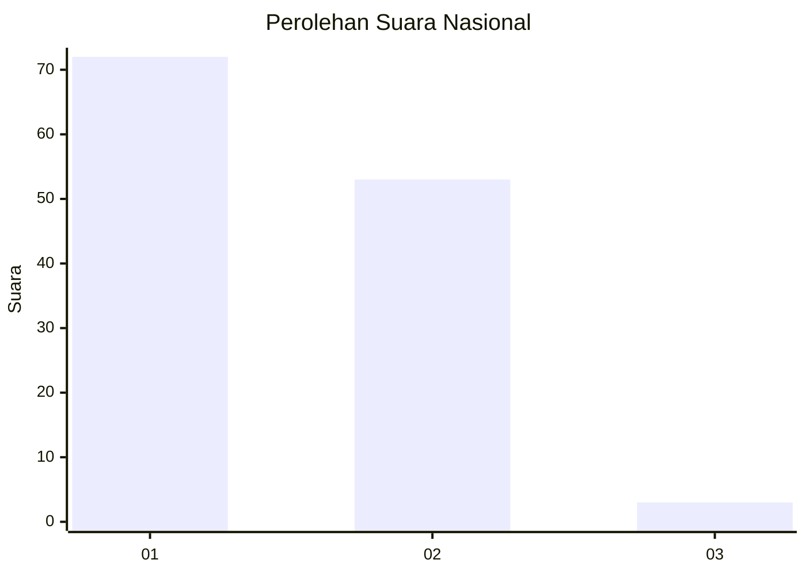
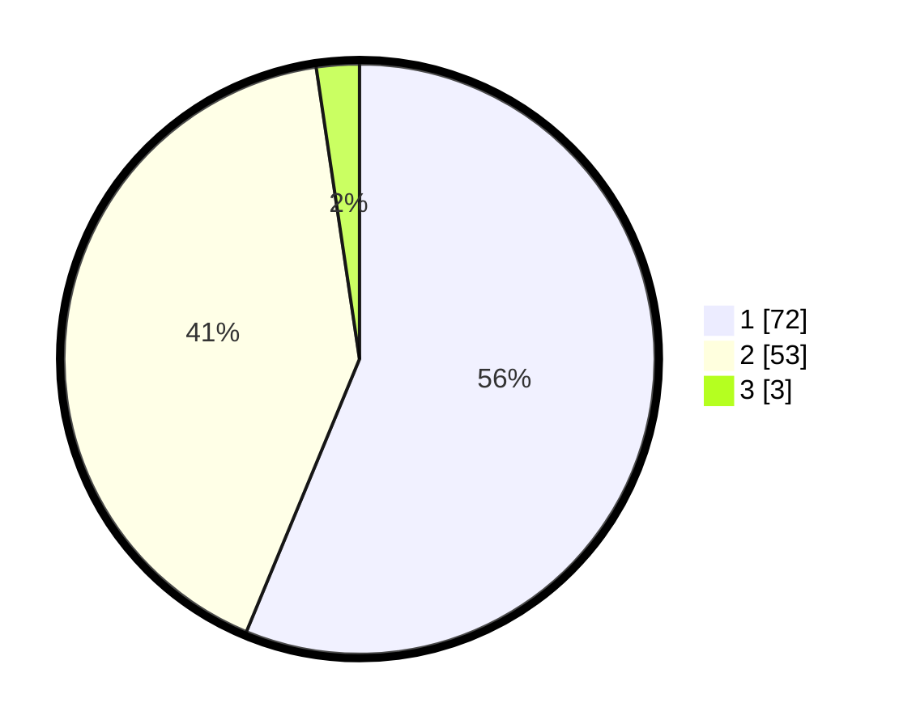

# Hasil

## Grafik

## Tabel

| No. | Nama Paslon    | Suara | Suara (raw) | Persentase |
|:--- |:-------------- | -----:| -----------:| ----------:|
| 1   | ANIES MUHAIMIN | 72    | [72][p-1]   | 56,25      |
| 2   | PRABOWO GIBRAN | 53    | [53][p-2]   | 41,41      |
| 3   | GANJAR MAHFUD  | 3     | [3][p-3]    | 2,34       |

[p-1]: https://github.com/gigit-pemilu/pemilu-2024/blob/main/pilpres/hitung-suara/sub/11-aceh/sub/05-aceh-barat/sub/12-panton-reu/sub/2009-paya-baro-meuko/sub/001-tps/sub/paslon-1.txt
[p-2]: https://github.com/gigit-pemilu/pemilu-2024/blob/main/pilpres/hitung-suara/sub/11-aceh/sub/05-aceh-barat/sub/12-panton-reu/sub/2009-paya-baro-meuko/sub/001-tps/sub/paslon-2.txt
[p-3]: https://github.com/gigit-pemilu/pemilu-2024/blob/main/pilpres/hitung-suara/sub/11-aceh/sub/05-aceh-barat/sub/12-panton-reu/sub/2009-paya-baro-meuko/sub/001-tps/sub/paslon-3.txt

## Foto C Plano

https://sirekap-obj-formc.kpu.go.id/12a0/pemilu/ppwp/11/05/12/20/09/1105122009001-20240215-020836--b2cd523e-55a5-435c-9b33-2b82c13a0ae0.jpg

https://sirekap-obj-formc.kpu.go.id/12a0/pemilu/ppwp/11/05/12/20/09/1105122009001-20240215-021005--b1ef781d-3afe-4314-9ba4-17bc0ceb0d4b.jpg

https://sirekap-obj-formc.kpu.go.id/12a0/pemilu/ppwp/11/05/12/20/09/1105122009001-20240215-021055--7ea30250-7355-4b70-99a7-558efe102589.jpg

## Metadata

| Key        | Value               |
| ---------- | ------------------- |
| Time Stamp | 2024-02-15 12:00:28 |

## DATA PEMILIH TETAP

Jumlah pemilih dalam DPT: **136**.
 * L: **66**.
 * P: **70**.

## DATA PENGGUNA HAK PILIH

Jumlah pengguna hak pilih dalam DPT: **128**.
 * L: **60**.
 * P: **68**.

Jumlah pengguna hak pilih dalam DPTb: **0**.
 * L: **0**.
 * P: **0**.

Jumlah pengguna hak pilih dalam DPK: **0**.
 * L: **0**.
 * P: **0**.

Jumlah pengguna hak pilih: **128**.
 * L: **60**.
 * P: **68**.

## JUMLAH SUARA SAH DAN TIDAK SAH

JUMLAH SELURUH SUARA SAH: **128**.

JUMLAH SUARA TIDAK SAH: **0**.

JUMLAH SELURUH SUARA SAH DAN SUARA TIDAK SAH: **128**.

