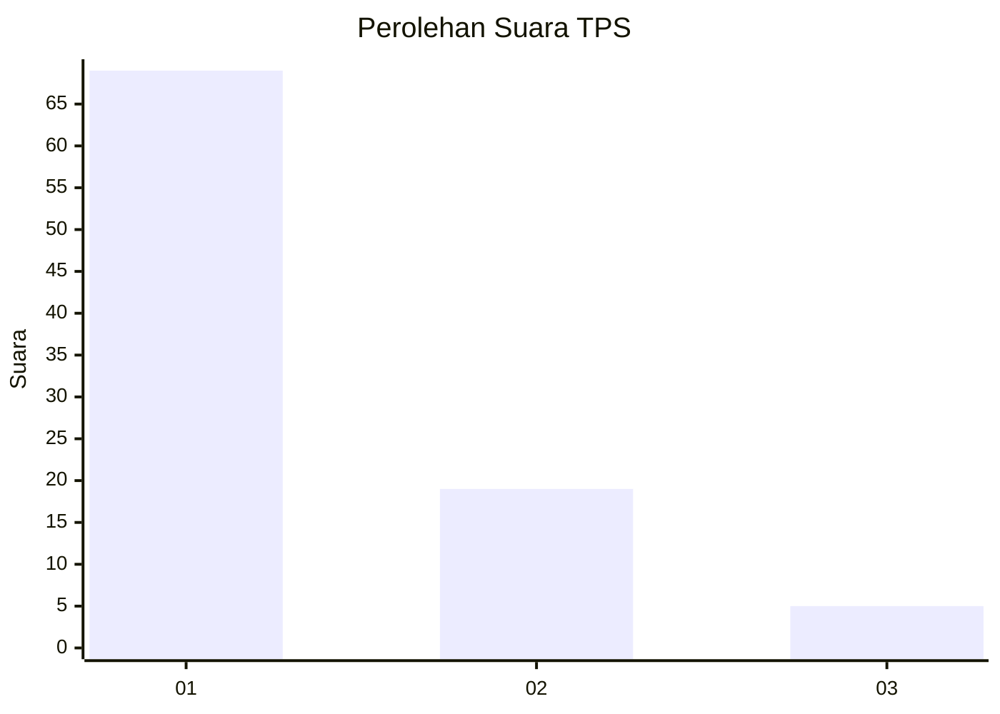
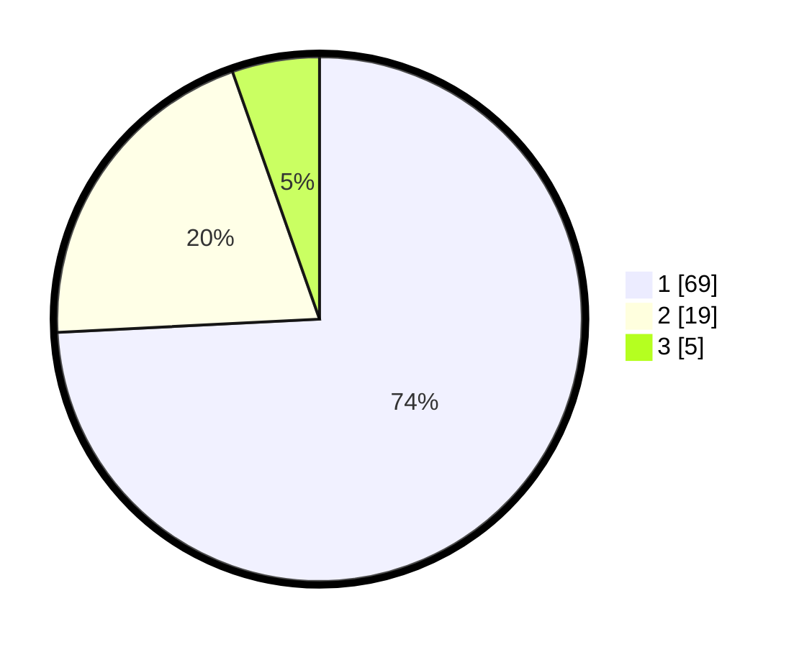

# Hasil

## Grafik

## Tabel

| No. | Nama Paslon    | Suara | Suara (raw) | Persentase |
|:--- |:-------------- | -----:| -----------:| ----------:|
| 1   | ANIES MUHAIMIN | 69    | [69][p-1]   | 74,19      |
| 2   | PRABOWO GIBRAN | 19    | [19][p-2]   | 20,43      |
| 3   | GANJAR MAHFUD  | 5     | [5][p-3]    | 5,38       |

[p-1]: https://github.com/gigit-pemilu/pemilu-2024-11-aceh/blob/main/pilpres/hitung-suara/sub/11-aceh/sub/05-aceh-barat/sub/12-panton-reu/sub/2015-cot-manggie/sub/001-tps/sub/paslon-1.txt
[p-2]: https://github.com/gigit-pemilu/pemilu-2024-11-aceh/blob/main/pilpres/hitung-suara/sub/11-aceh/sub/05-aceh-barat/sub/12-panton-reu/sub/2015-cot-manggie/sub/001-tps/sub/paslon-2.txt
[p-3]: https://github.com/gigit-pemilu/pemilu-2024-11-aceh/blob/main/pilpres/hitung-suara/sub/11-aceh/sub/05-aceh-barat/sub/12-panton-reu/sub/2015-cot-manggie/sub/001-tps/sub/paslon-3.txt

## Foto C Plano

https://sirekap-obj-formc.kpu.go.id/da78/pemilu/ppwp/11/05/12/20/15/1105122015001-20240215-185141--1d26aa9c-f820-42da-a6ec-115af306209e.jpg

https://sirekap-obj-formc.kpu.go.id/da78/pemilu/ppwp/11/05/12/20/15/1105122015001-20240214-200326--e18ddd0b-38c2-4a83-afcf-a044d05de7ae.jpg

https://sirekap-obj-formc.kpu.go.id/da78/pemilu/ppwp/11/05/12/20/15/1105122015001-20240215-185152--ed23abe7-db5d-47b2-bfc9-2c0a8e689a58.jpg

## Metadata

| Key        | Value               |
| ---------- | ------------------- |
| Time Stamp | 2024-02-15 19:00:26 |

## DATA PEMILIH TETAP

Jumlah pemilih dalam DPT: **101**.
 * L: **51**.
 * P: **50**.

## DATA PENGGUNA HAK PILIH

Jumlah pengguna hak pilih dalam DPT: **94**.
 * L: **48**.
 * P: **46**.

Jumlah pengguna hak pilih dalam DPTb: **2**.
 * L: **0**.
 * P: **2**.

Jumlah pengguna hak pilih dalam DPK: **0**.
 * L: **0**.
 * P: **0**.

Jumlah pengguna hak pilih: **96**.
 * L: **48**.
 * P: **48**.

## JUMLAH SUARA SAH DAN TIDAK SAH

JUMLAH SELURUH SUARA SAH: **93**.

JUMLAH SUARA TIDAK SAH: **3**.

JUMLAH SELURUH SUARA SAH DAN SUARA TIDAK SAH: **96**.

