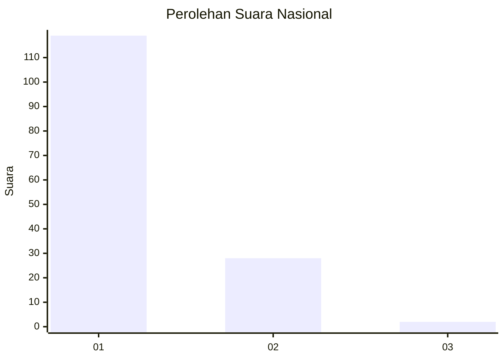
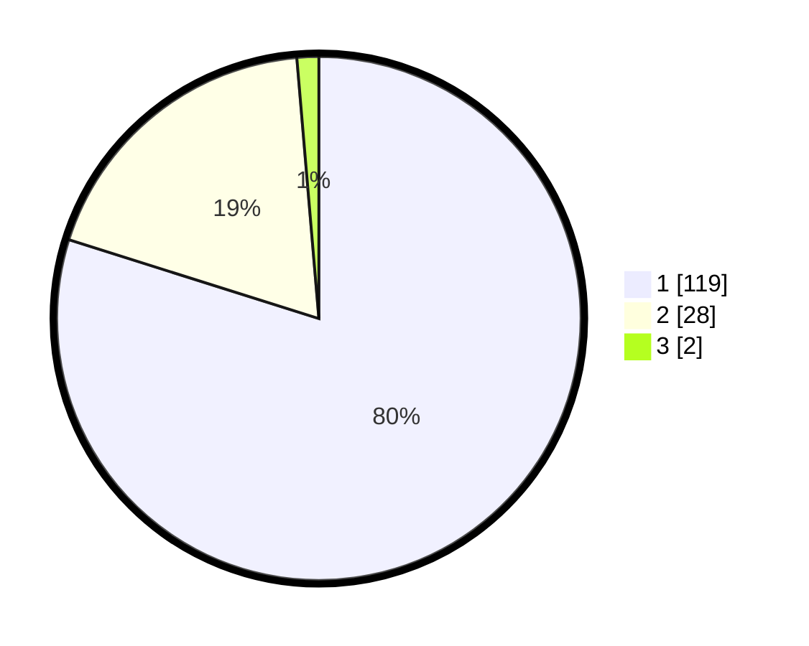

# Hasil

## Grafik

## Tabel

| No. | Nama Paslon    | Suara | Suara (raw) | Persentase |
|:--- |:-------------- | -----:| -----------:| ----------:|
| 1   | ANIES MUHAIMIN | 119   | [119][p-1]  | 79,87      |
| 2   | PRABOWO GIBRAN | 28    | [28][p-2]   | 18,79      |
| 3   | GANJAR MAHFUD  | 2     | [2][p-3]    | 1,34       |

[p-1]: https://github.com/gigit-pemilu/pemilu-2024/blob/main/pilpres/hitung-suara/sub/11-aceh/sub/05-aceh-barat/sub/12-panton-reu/sub/2019-lek-lek/sub/002-tps/sub/paslon-1.txt
[p-2]: https://github.com/gigit-pemilu/pemilu-2024/blob/main/pilpres/hitung-suara/sub/11-aceh/sub/05-aceh-barat/sub/12-panton-reu/sub/2019-lek-lek/sub/002-tps/sub/paslon-2.txt
[p-3]: https://github.com/gigit-pemilu/pemilu-2024/blob/main/pilpres/hitung-suara/sub/11-aceh/sub/05-aceh-barat/sub/12-panton-reu/sub/2019-lek-lek/sub/002-tps/sub/paslon-3.txt

## Foto C Plano

https://sirekap-obj-formc.kpu.go.id/da97/pemilu/ppwp/11/05/12/20/19/1105122019002-20240214-221925--88795e02-dedd-4bb7-8733-364dab06eb7e.jpg

https://sirekap-obj-formc.kpu.go.id/da97/pemilu/ppwp/11/05/12/20/19/1105122019002-20240214-222241--1f2c3963-e4e8-4e3a-9e75-15b631c91c93.jpg

https://sirekap-obj-formc.kpu.go.id/da97/pemilu/ppwp/11/05/12/20/19/1105122019002-20240214-222410--1314fb4c-c37e-4988-8bd2-36ec68807c83.jpg

## Metadata

| Key        | Value               |
| ---------- | ------------------- |
| Time Stamp | 2024-02-16 22:01:00 |

