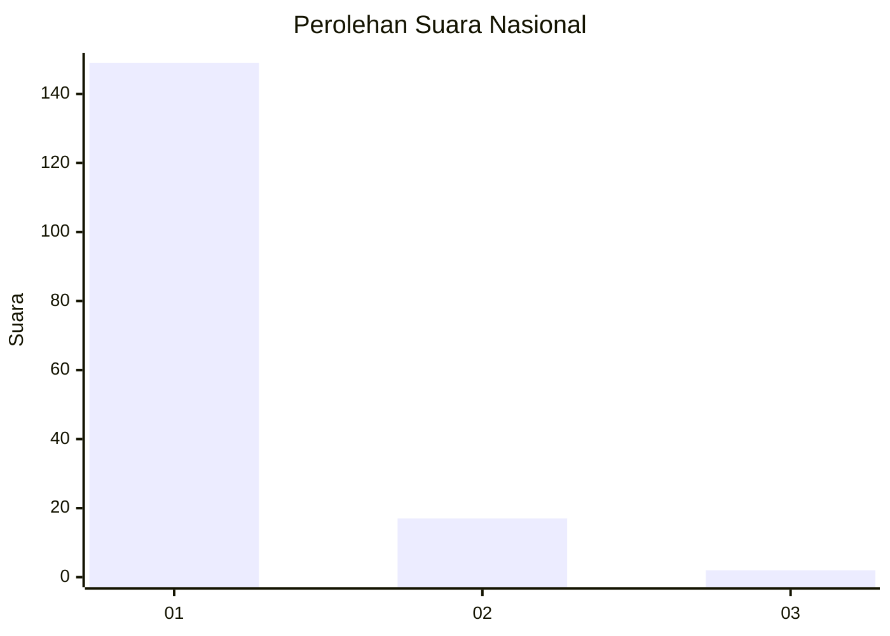
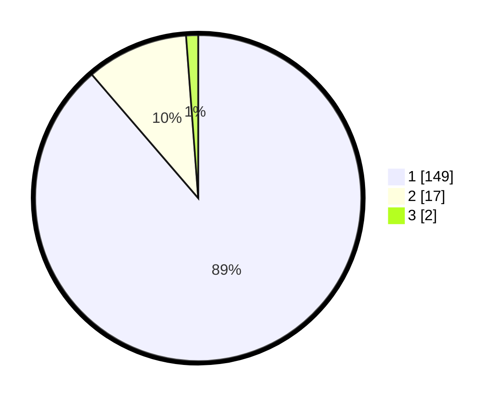

# Hasil

## Grafik

## Tabel

| No. | Nama Paslon    | Suara | Suara (raw) | Persentase |
|:--- |:-------------- | -----:| -----------:| ----------:|
| 1   | ANIES MUHAIMIN | 149   | [149][p-1]  | 88,69      |
| 2   | PRABOWO GIBRAN | 17    | [17][p-2]   | 10,12      |
| 3   | GANJAR MAHFUD  | 2     | [2][p-3]    | 1,19       |

[p-1]: https://github.com/gigit-pemilu/pemilu-2024/blob/main/pilpres/hitung-suara/sub/11-aceh/sub/06-aceh-besar/sub/01-lhoong/sub/2001-meunasah-krueng-kala/sub/001-tps/sub/paslon-1.txt
[p-2]: https://github.com/gigit-pemilu/pemilu-2024/blob/main/pilpres/hitung-suara/sub/11-aceh/sub/06-aceh-besar/sub/01-lhoong/sub/2001-meunasah-krueng-kala/sub/001-tps/sub/paslon-2.txt
[p-3]: https://github.com/gigit-pemilu/pemilu-2024/blob/main/pilpres/hitung-suara/sub/11-aceh/sub/06-aceh-besar/sub/01-lhoong/sub/2001-meunasah-krueng-kala/sub/001-tps/sub/paslon-3.txt

## Foto C Plano

https://sirekap-obj-formc.kpu.go.id/91a3/pemilu/ppwp/11/06/01/20/01/1106012001001-20240215-013917--a930d88b-6e86-4db6-abe7-d8ddd8b43b62.jpg

https://sirekap-obj-formc.kpu.go.id/91a3/pemilu/ppwp/11/06/01/20/01/1106012001001-20240215-014131--c2f9a4e6-0252-4210-82ad-6150b3413efc.jpg

https://sirekap-obj-formc.kpu.go.id/91a3/pemilu/ppwp/11/06/01/20/01/1106012001001-20240215-103857--16eb36cb-9660-479a-a55d-45864d538fcc.jpg

## Metadata

| Key        | Value               |
| ---------- | ------------------- |
| Time Stamp | 2024-02-15 17:00:25 |

## DATA PEMILIH TETAP

Jumlah pemilih dalam DPT: **166**.
 * L: **85**.
 * P: **81**.

## DATA PENGGUNA HAK PILIH

Jumlah pengguna hak pilih dalam DPT: **166**.
 * L: **85**.
 * P: **81**.

Jumlah pengguna hak pilih dalam DPTb: **2**.
 * L: **2**.
 * P: **0**.

Jumlah pengguna hak pilih dalam DPK: **0**.
 * L: **0**.
 * P: **0**.

Jumlah pengguna hak pilih: **168**.
 * L: **87**.
 * P: **81**.

## JUMLAH SUARA SAH DAN TIDAK SAH

JUMLAH SELURUH SUARA SAH: **168**.

JUMLAH SUARA TIDAK SAH: **0**.

JUMLAH SELURUH SUARA SAH DAN SUARA TIDAK SAH: **168**.

