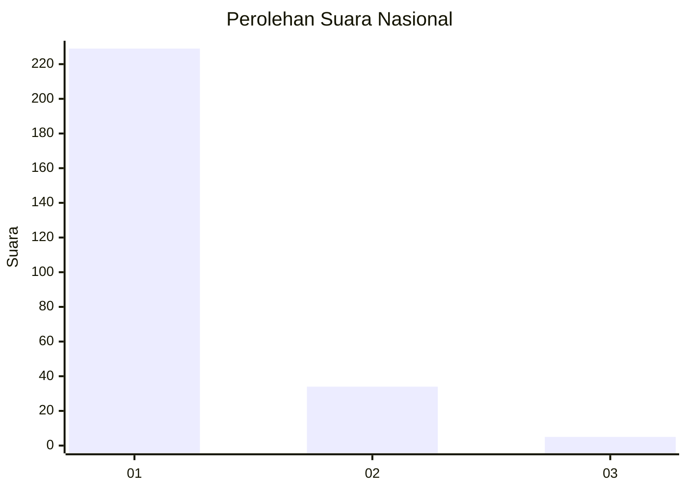
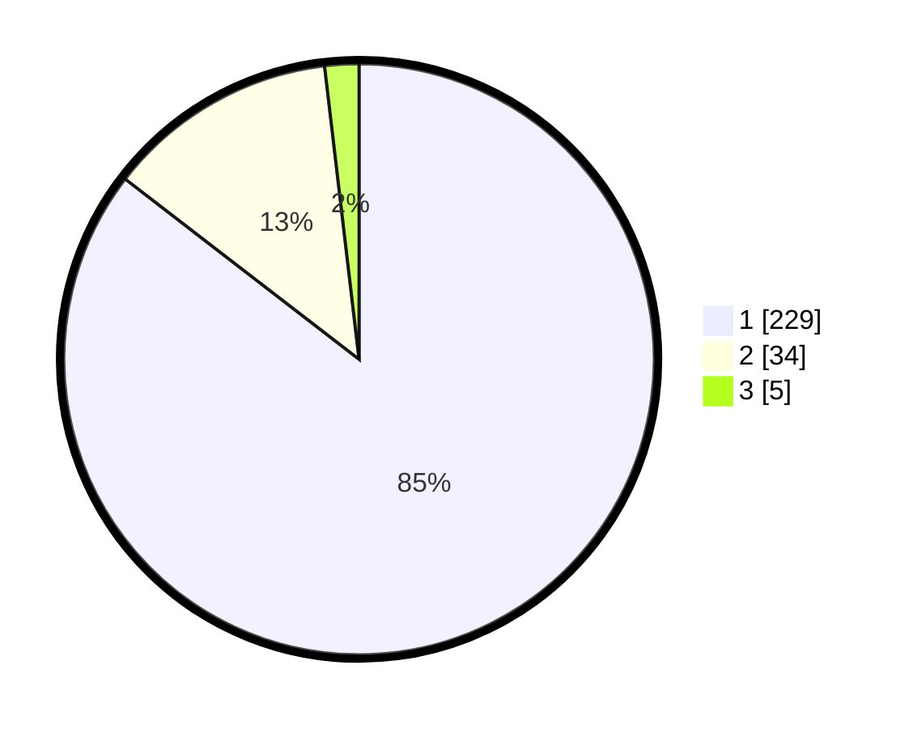

# Hasil

## Grafik

## Tabel

| No. | Nama Paslon    | Suara | Suara (raw) | Persentase |
|:--- |:-------------- | -----:| -----------:| ----------:|
| 1   | ANIES MUHAIMIN | 229   | [229][p-1]  | 85,45      |
| 2   | PRABOWO GIBRAN | 34    | [34][p-2]   | 12,69      |
| 3   | GANJAR MAHFUD  | 5     | [5][p-3]    | 1,87       |

[p-1]: https://github.com/gigit-pemilu/pemilu-2024/blob/main/pilpres/hitung-suara/sub/11-aceh/sub/06-aceh-besar/sub/01-lhoong/sub/2002-jantang/sub/001-tps/sub/paslon-1.txt
[p-2]: https://github.com/gigit-pemilu/pemilu-2024/blob/main/pilpres/hitung-suara/sub/11-aceh/sub/06-aceh-besar/sub/01-lhoong/sub/2002-jantang/sub/001-tps/sub/paslon-2.txt
[p-3]: https://github.com/gigit-pemilu/pemilu-2024/blob/main/pilpres/hitung-suara/sub/11-aceh/sub/06-aceh-besar/sub/01-lhoong/sub/2002-jantang/sub/001-tps/sub/paslon-3.txt

## Foto C Plano

https://sirekap-obj-formc.kpu.go.id/5683/pemilu/ppwp/11/06/01/20/02/1106012002001-20240215-090034--6669b675-ac07-4d37-9114-1ddc64428c3b.jpg

https://sirekap-obj-formc.kpu.go.id/5683/pemilu/ppwp/11/06/01/20/02/1106012002001-20240215-112753--191f0c95-3e2f-4409-a8fd-dc91cf93225d.jpg

https://sirekap-obj-formc.kpu.go.id/5683/pemilu/ppwp/11/06/01/20/02/1106012002001-20240215-090634--21dfac51-5e5c-4681-915f-569ad27c9101.jpg

## Metadata

| Key        | Value               |
| ---------- | ------------------- |
| Time Stamp | 2024-02-19 16:00:00 |

## DATA PEMILIH TETAP

Jumlah pemilih dalam DPT: **270**.
 * L: **146**.
 * P: **124**.

## DATA PENGGUNA HAK PILIH

Jumlah pengguna hak pilih dalam DPT: **270**.
 * L: **146**.
 * P: **124**.

Jumlah pengguna hak pilih dalam DPTb: **0**.
 * L: **0**.
 * P: **0**.

Jumlah pengguna hak pilih dalam DPK: **0**.
 * L: **0**.
 * P: **0**.

Jumlah pengguna hak pilih: **270**.
 * L: **146**.
 * P: **124**.

## JUMLAH SUARA SAH DAN TIDAK SAH

JUMLAH SELURUH SUARA SAH: **268**.

JUMLAH SUARA TIDAK SAH: **2**.

JUMLAH SELURUH SUARA SAH DAN SUARA TIDAK SAH: **270**.

