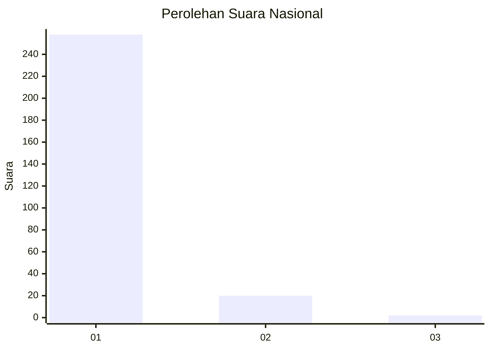
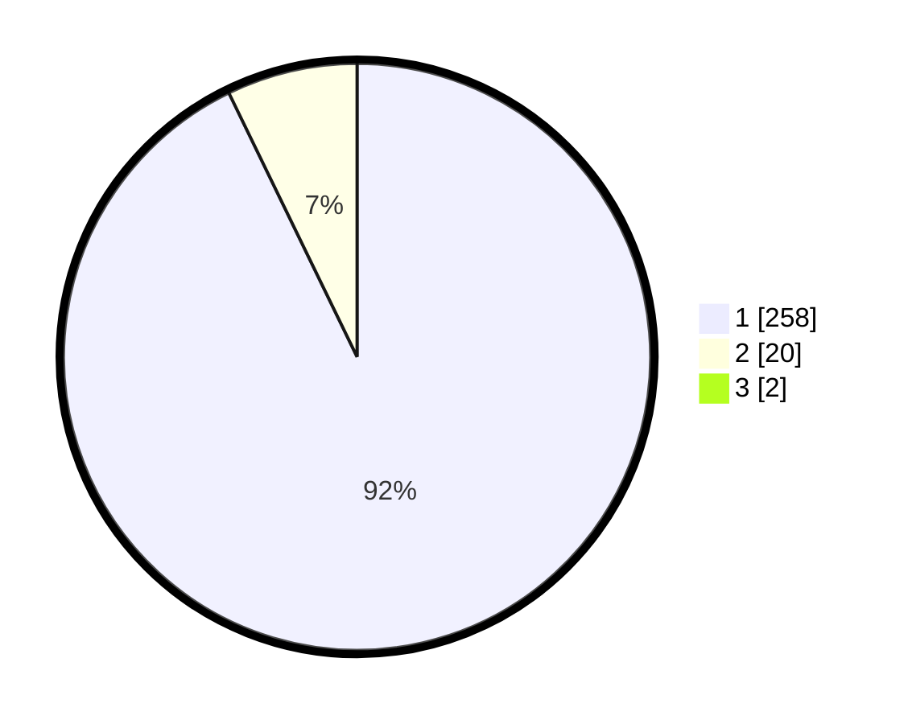

# Hasil

## Grafik

## Tabel

| No. | Nama Paslon    | Suara | Suara (raw) | Persentase |
|:--- |:-------------- | -----:| -----------:| ----------:|
| 1   | ANIES MUHAIMIN | 258   | [258][p-1]  | 92,14      |
| 2   | PRABOWO GIBRAN | 20    | [20][p-2]   | 7,14       |
| 3   | GANJAR MAHFUD  | 2     | [2][p-3]    | 0,71       |

[p-1]: https://github.com/gigit-pemilu/pemilu-2024/blob/main/pilpres/hitung-suara/sub/11-aceh/sub/06-aceh-besar/sub/01-lhoong/sub/2003-baroh-krueng-kala/sub/001-tps/sub/paslon-1.txt
[p-2]: https://github.com/gigit-pemilu/pemilu-2024/blob/main/pilpres/hitung-suara/sub/11-aceh/sub/06-aceh-besar/sub/01-lhoong/sub/2003-baroh-krueng-kala/sub/001-tps/sub/paslon-2.txt
[p-3]: https://github.com/gigit-pemilu/pemilu-2024/blob/main/pilpres/hitung-suara/sub/11-aceh/sub/06-aceh-besar/sub/01-lhoong/sub/2003-baroh-krueng-kala/sub/001-tps/sub/paslon-3.txt

## Foto C Plano

https://sirekap-obj-formc.kpu.go.id/3723/pemilu/ppwp/11/06/01/20/03/1106012003001-20240216-141721--c4511ba2-bd6a-4cd5-818a-450fe79ddc84.jpg

https://sirekap-obj-formc.kpu.go.id/3723/pemilu/ppwp/11/06/01/20/03/1106012003001-20240216-141722--e057f879-4984-404c-99a4-22b8c71d3195.jpg

https://sirekap-obj-formc.kpu.go.id/3723/pemilu/ppwp/11/06/01/20/03/1106012003001-20240216-141721--0b457395-9b21-4845-9e31-e7fa4a3381a4.jpg

## Metadata

| Key        | Value               |
| ---------- | ------------------- |
| Time Stamp | 2024-02-16 21:01:00 |

## DATA PEMILIH TETAP

Jumlah pemilih dalam DPT: **282**.
 * L: **146**.
 * P: **136**.

## DATA PENGGUNA HAK PILIH

Jumlah pengguna hak pilih dalam DPT: **274**.
 * L: **139**.
 * P: **135**.

Jumlah pengguna hak pilih dalam DPTb: **0**.
 * L: **0**.
 * P: **0**.

Jumlah pengguna hak pilih dalam DPK: **6**.
 * L: **4**.
 * P: **2**.

Jumlah pengguna hak pilih: **280**.
 * L: **143**.
 * P: **137**.

## JUMLAH SUARA SAH DAN TIDAK SAH

JUMLAH SELURUH SUARA SAH: **280**.

JUMLAH SUARA TIDAK SAH: **0**.

JUMLAH SELURUH SUARA SAH DAN SUARA TIDAK SAH: **280**.

