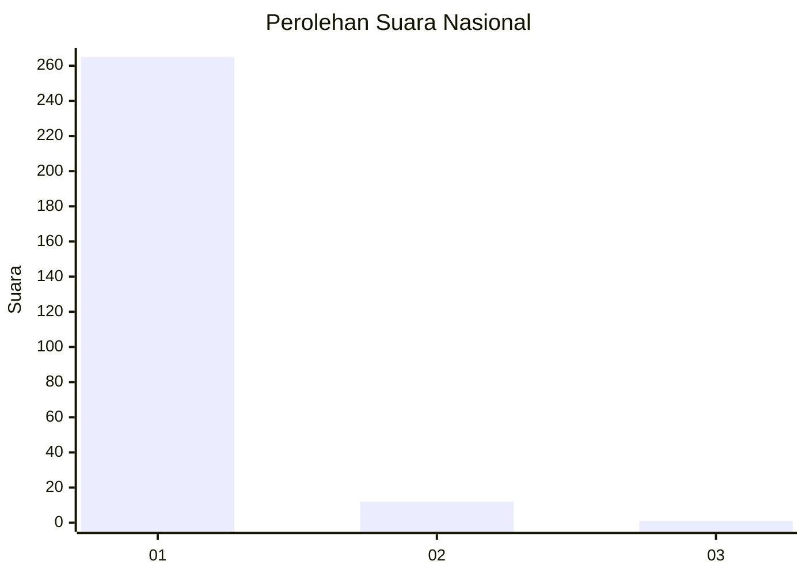
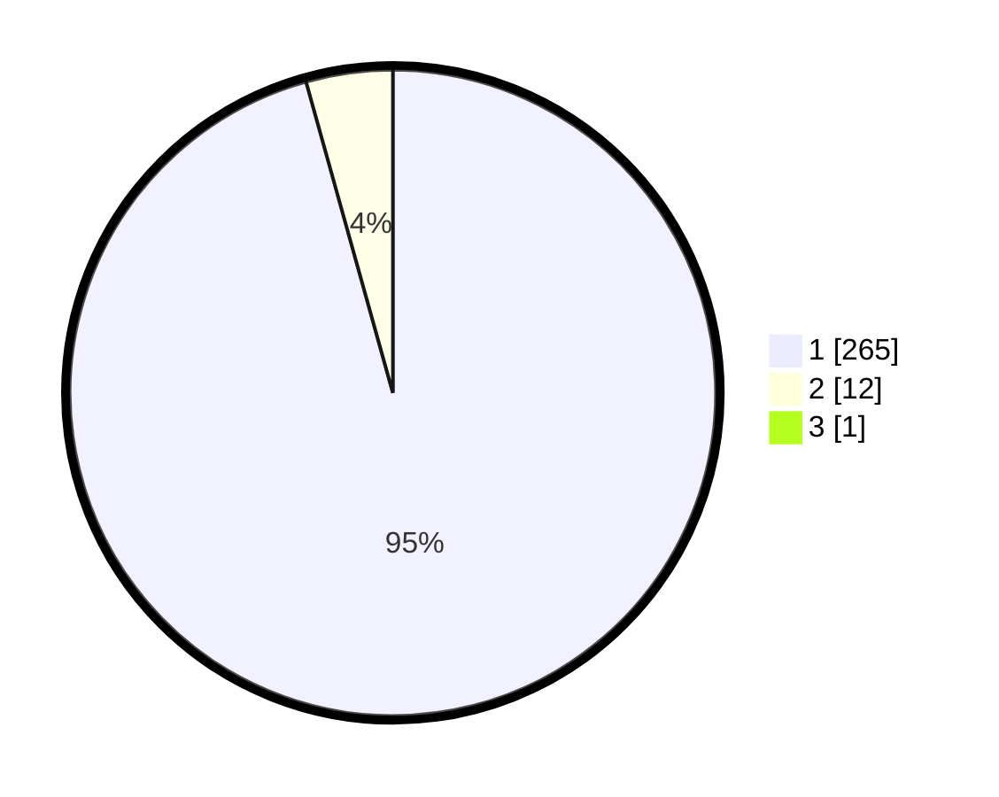

# Hasil

## Grafik

## Tabel

| No. | Nama Paslon    | Suara | Suara (raw) | Persentase |
|:--- |:-------------- | -----:| -----------:| ----------:|
| 1   | ANIES MUHAIMIN | 265   | [265][p-1]  | 95,32      |
| 2   | PRABOWO GIBRAN | 12    | [12][p-2]   | 4,32       |
| 3   | GANJAR MAHFUD  | 1     | [1][p-3]    | 0,36       |

[p-1]: https://github.com/gigit-pemilu/pemilu-2024/blob/main/pilpres/hitung-suara/sub/11-aceh/sub/06-aceh-besar/sub/01-lhoong/sub/2005-sungko-mulat/sub/001-tps/sub/paslon-1.txt
[p-2]: https://github.com/gigit-pemilu/pemilu-2024/blob/main/pilpres/hitung-suara/sub/11-aceh/sub/06-aceh-besar/sub/01-lhoong/sub/2005-sungko-mulat/sub/001-tps/sub/paslon-2.txt
[p-3]: https://github.com/gigit-pemilu/pemilu-2024/blob/main/pilpres/hitung-suara/sub/11-aceh/sub/06-aceh-besar/sub/01-lhoong/sub/2005-sungko-mulat/sub/001-tps/sub/paslon-3.txt

## Foto C Plano

https://sirekap-obj-formc.kpu.go.id/7b4c/pemilu/ppwp/11/06/01/20/05/1106012005001-20240216-115839--77dc5bb2-cbe2-40ec-9f8b-dba72f92178c.jpg

https://sirekap-obj-formc.kpu.go.id/7b4c/pemilu/ppwp/11/06/01/20/05/1106012005001-20240216-003926--561b26ff-e5c5-44e8-88a5-9c4c5c9d2c99.jpg

https://sirekap-obj-formc.kpu.go.id/7b4c/pemilu/ppwp/11/06/01/20/05/1106012005001-20240216-003922--21a20064-9614-4638-afbf-b8189d29fe74.jpg

## Metadata

| Key        | Value               |
| ---------- | ------------------- |
| Time Stamp | 2024-02-16 12:51:22 |

## DATA PEMILIH TETAP

Jumlah pemilih dalam DPT: **287**.
 * L: **148**.
 * P: **139**.

## DATA PENGGUNA HAK PILIH

Jumlah pengguna hak pilih dalam DPT: **278**.
 * L: **142**.
 * P: **136**.

Jumlah pengguna hak pilih dalam DPTb: **0**.
 * L: **0**.
 * P: **0**.

Jumlah pengguna hak pilih dalam DPK: **0**.
 * L: **0**.
 * P: **0**.

Jumlah pengguna hak pilih: **278**.
 * L: **142**.
 * P: **136**.

## JUMLAH SUARA SAH DAN TIDAK SAH

JUMLAH SELURUH SUARA SAH: **278**.

JUMLAH SUARA TIDAK SAH: **0**.

JUMLAH SELURUH SUARA SAH DAN SUARA TIDAK SAH: **278**.

