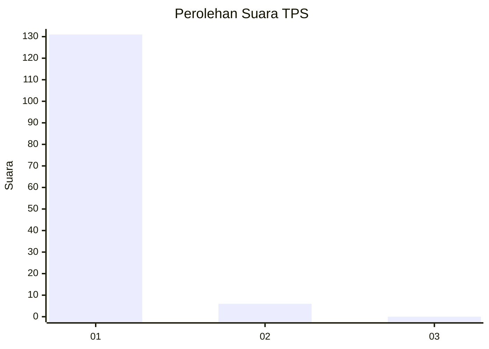
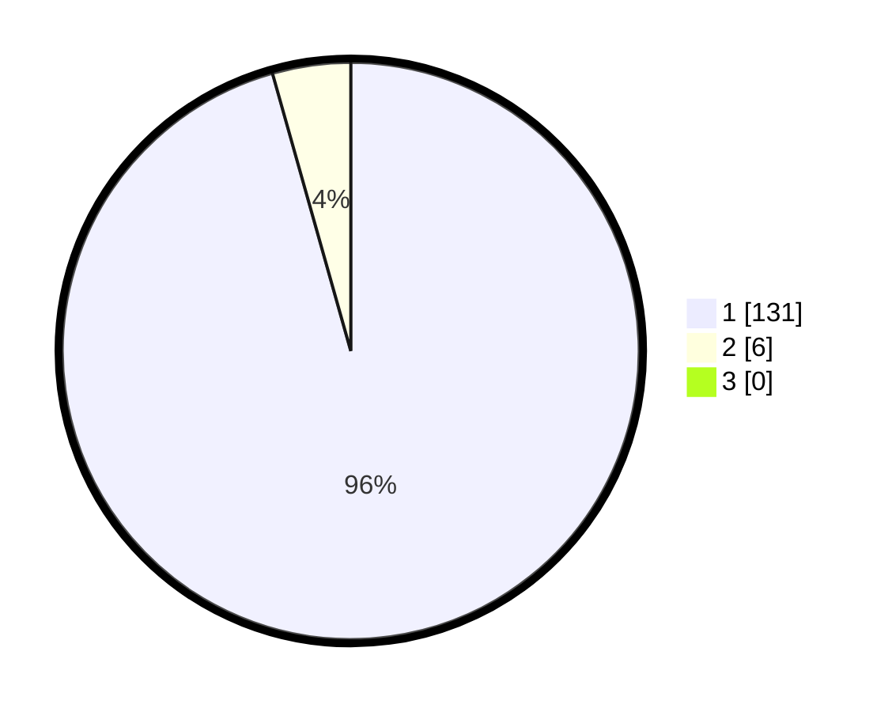

# Hasil

## Grafik

## Tabel

| No. | Nama Paslon    | Suara | Suara (raw) | Persentase |
|:--- |:-------------- | -----:| -----------:| ----------:|
| 1   | ANIES MUHAIMIN | 131   | [131][p-1]  | 95,62      |
| 2   | PRABOWO GIBRAN | 6     | [6][p-2]    | 4,38       |
| 3   | GANJAR MAHFUD  | 0     | [0][p-3]    | 0,00       |

[p-1]: https://github.com/gigit-pemilu/pemilu-2024-11-aceh/blob/main/pilpres/hitung-suara/sub/11-aceh/sub/06-aceh-besar/sub/01-lhoong/sub/2006-birek/sub/001-tps/sub/paslon-1.txt
[p-2]: https://github.com/gigit-pemilu/pemilu-2024-11-aceh/blob/main/pilpres/hitung-suara/sub/11-aceh/sub/06-aceh-besar/sub/01-lhoong/sub/2006-birek/sub/001-tps/sub/paslon-2.txt
[p-3]: https://github.com/gigit-pemilu/pemilu-2024-11-aceh/blob/main/pilpres/hitung-suara/sub/11-aceh/sub/06-aceh-besar/sub/01-lhoong/sub/2006-birek/sub/001-tps/sub/paslon-3.txt

## Foto C Plano

https://sirekap-obj-formc.kpu.go.id/ce5d/pemilu/ppwp/11/06/01/20/06/1106012006001-20240215-004553--39e43115-819c-46e0-9bc1-f8b250a2e96b.jpg

https://sirekap-obj-formc.kpu.go.id/ce5d/pemilu/ppwp/11/06/01/20/06/1106012006001-20240214-191720--a8a7f63f-b5ca-407e-b7fe-cfbaaf364b0a.jpg

https://sirekap-obj-formc.kpu.go.id/ce5d/pemilu/ppwp/11/06/01/20/06/1106012006001-20240214-192013--ee95c6af-c8d9-4242-b3f8-5a3c7868b1b1.jpg

## Metadata

| Key        | Value               |
| ---------- | ------------------- |
| Time Stamp | 2024-02-19 16:00:00 |

## DATA PEMILIH TETAP

Jumlah pemilih dalam DPT: **151**.
 * L: **68**.
 * P: **83**.

## DATA PENGGUNA HAK PILIH

Jumlah pengguna hak pilih dalam DPT: **139**.
 * L: **59**.
 * P: **80**.

Jumlah pengguna hak pilih dalam DPTb: **0**.
 * L: **0**.
 * P: **0**.

Jumlah pengguna hak pilih dalam DPK: **0**.
 * L: **0**.
 * P: **0**.

Jumlah pengguna hak pilih: **139**.
 * L: **59**.
 * P: **80**.

## JUMLAH SUARA SAH DAN TIDAK SAH

JUMLAH SELURUH SUARA SAH: **137**.

JUMLAH SUARA TIDAK SAH: **2**.

JUMLAH SELURUH SUARA SAH DAN SUARA TIDAK SAH: **139**.

