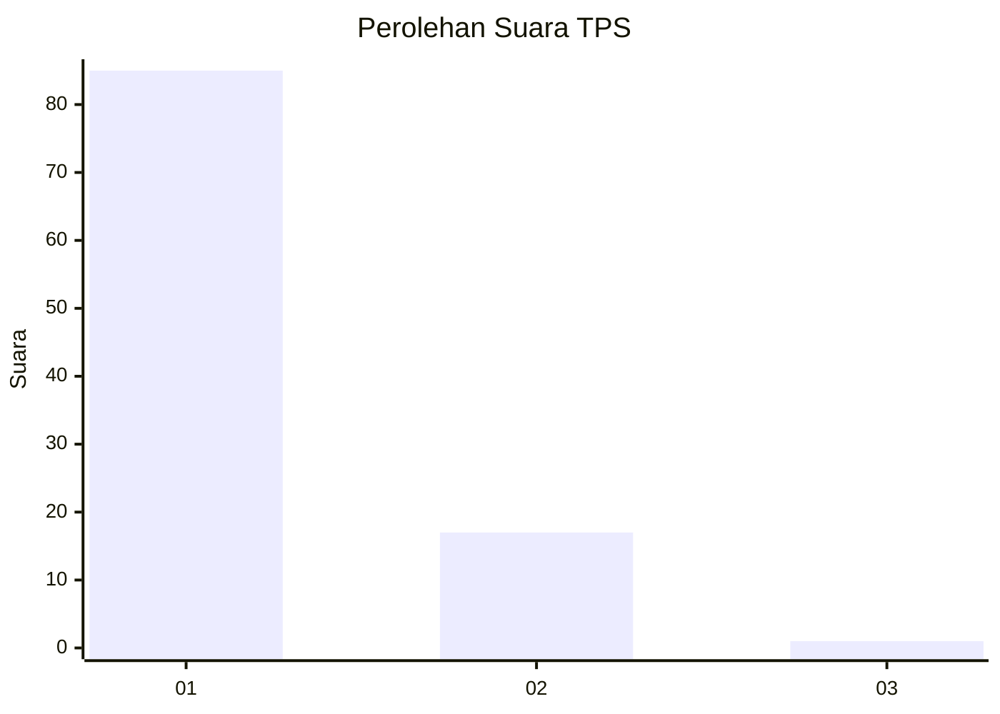
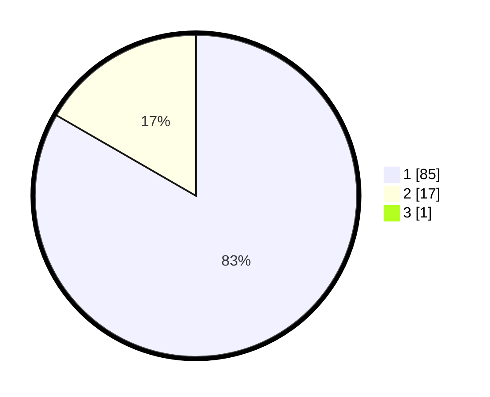

# Hasil

## Grafik

## Tabel

| No. | Nama Paslon    | Suara | Suara (raw) | Persentase |
|:--- |:-------------- | -----:| -----------:| ----------:|
| 1   | ANIES MUHAIMIN | 85    | [85][p-1]   | 82,52      |
| 2   | PRABOWO GIBRAN | 17    | [17][p-2]   | 16,50      |
| 3   | GANJAR MAHFUD  | 1     | [1][p-3]    | 0,97       |

[p-1]: https://github.com/gigit-pemilu/pemilu-2024-11-aceh/blob/main/pilpres/hitung-suara/sub/11-aceh/sub/06-aceh-besar/sub/01-lhoong/sub/2011-baroh-blang-mee/sub/001-tps/sub/paslon-1.txt
[p-2]: https://github.com/gigit-pemilu/pemilu-2024-11-aceh/blob/main/pilpres/hitung-suara/sub/11-aceh/sub/06-aceh-besar/sub/01-lhoong/sub/2011-baroh-blang-mee/sub/001-tps/sub/paslon-2.txt
[p-3]: https://github.com/gigit-pemilu/pemilu-2024-11-aceh/blob/main/pilpres/hitung-suara/sub/11-aceh/sub/06-aceh-besar/sub/01-lhoong/sub/2011-baroh-blang-mee/sub/001-tps/sub/paslon-3.txt

## Foto C Plano

https://sirekap-obj-formc.kpu.go.id/582b/pemilu/ppwp/11/06/01/20/11/1106012011001-20240214-185041--4ffd9ba3-bca0-49c9-a219-a4a832c1a428.jpg

https://sirekap-obj-formc.kpu.go.id/582b/pemilu/ppwp/11/06/01/20/11/1106012011001-20240214-185544--37855f1d-3754-4893-8d27-c4c5e013ab3a.jpg

https://sirekap-obj-formc.kpu.go.id/582b/pemilu/ppwp/11/06/01/20/11/1106012011001-20240214-185531--8ac22e99-7f49-425c-9dee-ba970d2ccdf5.jpg

## Metadata

| Key        | Value               |
| ---------- | ------------------- |
| Time Stamp | 2024-02-14 21:46:01 |

## DATA PEMILIH TETAP

Jumlah pemilih dalam DPT: **107**.
 * L: **52**.
 * P: **55**.

## DATA PENGGUNA HAK PILIH

Jumlah pengguna hak pilih dalam DPT: **103**.
 * L: **49**.
 * P: **54**.

Jumlah pengguna hak pilih dalam DPTb: **0**.
 * L: **0**.
 * P: **0**.

Jumlah pengguna hak pilih dalam DPK: **0**.
 * L: **0**.
 * P: **0**.

Jumlah pengguna hak pilih: **103**.
 * L: **49**.
 * P: **54**.

## JUMLAH SUARA SAH DAN TIDAK SAH

JUMLAH SELURUH SUARA SAH: **103**.

JUMLAH SUARA TIDAK SAH: **0**.

JUMLAH SELURUH SUARA SAH DAN SUARA TIDAK SAH: **103**.

