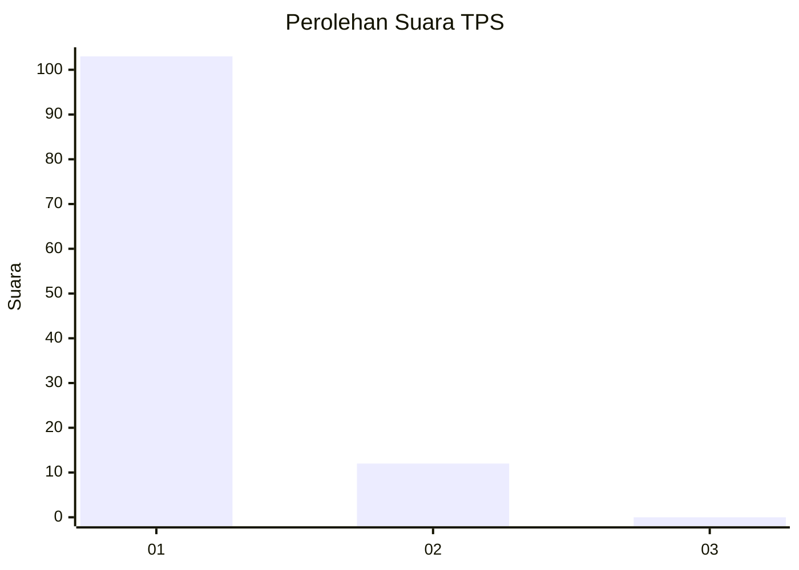
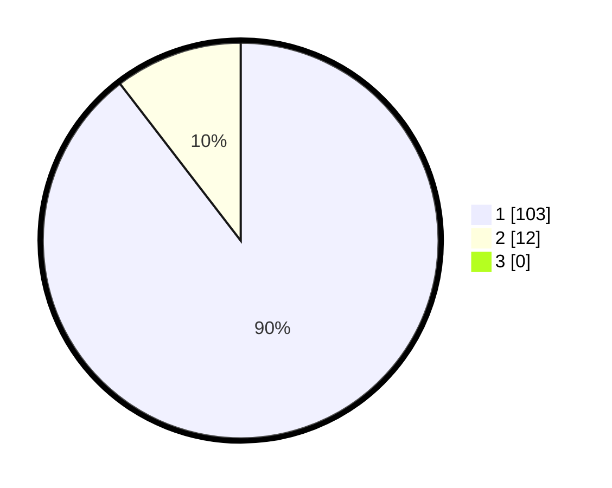

# Hasil

## Grafik

## Tabel

| No. | Nama Paslon    | Suara | Suara (raw) | Persentase |
|:--- |:-------------- | -----:| -----------:| ----------:|
| 1   | ANIES MUHAIMIN | 103   | [103][p-1]  | 89,57      |
| 2   | PRABOWO GIBRAN | 12    | [12][p-2]   | 10,43      |
| 3   | GANJAR MAHFUD  | 0     | [0][p-3]    | 0,00       |

[p-1]: https://github.com/gigit-pemilu/pemilu-2024-11-aceh/blob/main/pilpres/hitung-suara/sub/11-aceh/sub/06-aceh-besar/sub/01-lhoong/sub/2022-saney/sub/001-tps/sub/paslon-1.txt
[p-2]: https://github.com/gigit-pemilu/pemilu-2024-11-aceh/blob/main/pilpres/hitung-suara/sub/11-aceh/sub/06-aceh-besar/sub/01-lhoong/sub/2022-saney/sub/001-tps/sub/paslon-2.txt
[p-3]: https://github.com/gigit-pemilu/pemilu-2024-11-aceh/blob/main/pilpres/hitung-suara/sub/11-aceh/sub/06-aceh-besar/sub/01-lhoong/sub/2022-saney/sub/001-tps/sub/paslon-3.txt

## Foto C Plano

https://sirekap-obj-formc.kpu.go.id/9ae3/pemilu/ppwp/11/06/01/20/22/1106012022001-20240215-170548--66d7e6a8-18ae-4d1a-a48a-f115165864e5.jpg

https://sirekap-obj-formc.kpu.go.id/9ae3/pemilu/ppwp/11/06/01/20/22/1106012022001-20240215-103236--8fd2f515-ca89-47a1-97dc-c20cc533ca21.jpg

https://sirekap-obj-formc.kpu.go.id/9ae3/pemilu/ppwp/11/06/01/20/22/1106012022001-20240215-103640--80cd96d7-6579-4d03-bdce-47983345f4e1.jpg

## Metadata

| Key        | Value               |
| ---------- | ------------------- |
| Time Stamp | 2024-02-15 19:00:26 |

