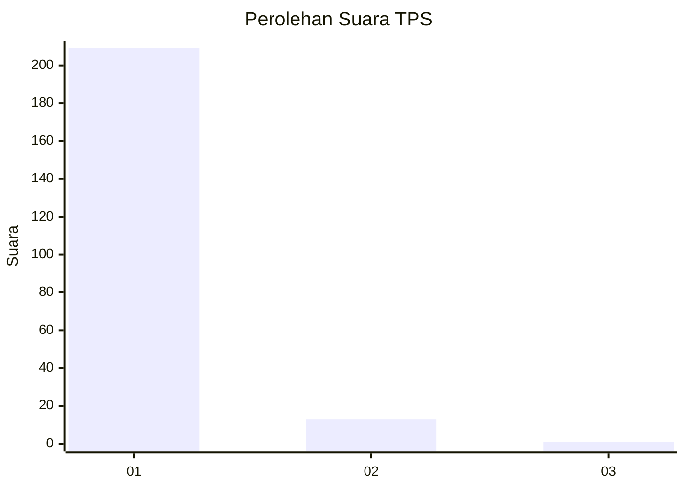
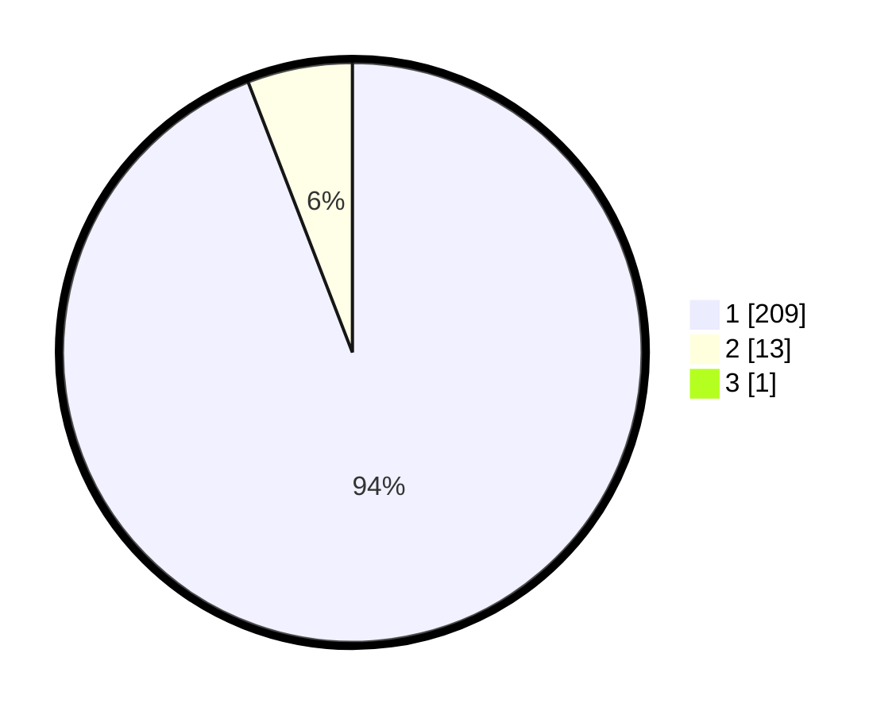

# Hasil

## Grafik

## Tabel

| No. | Nama Paslon    | Suara | Suara (raw) | Persentase |
|:--- |:-------------- | -----:| -----------:| ----------:|
| 1   | ANIES MUHAIMIN | 209   | [209][p-1]  | 93,72      |
| 2   | PRABOWO GIBRAN | 13    | [13][p-2]   | 5,83       |
| 3   | GANJAR MAHFUD  | 1     | [1][p-3]    | 0,45       |

[p-1]: https://github.com/gigit-pemilu/pemilu-2024-11-aceh/blob/main/pilpres/hitung-suara/sub/11-aceh/sub/06-aceh-besar/sub/01-lhoong/sub/2023-cundien/sub/001-tps/sub/paslon-1.txt
[p-2]: https://github.com/gigit-pemilu/pemilu-2024-11-aceh/blob/main/pilpres/hitung-suara/sub/11-aceh/sub/06-aceh-besar/sub/01-lhoong/sub/2023-cundien/sub/001-tps/sub/paslon-2.txt
[p-3]: https://github.com/gigit-pemilu/pemilu-2024-11-aceh/blob/main/pilpres/hitung-suara/sub/11-aceh/sub/06-aceh-besar/sub/01-lhoong/sub/2023-cundien/sub/001-tps/sub/paslon-3.txt

## Foto C Plano

https://sirekap-obj-formc.kpu.go.id/8a58/pemilu/ppwp/11/06/01/20/23/1106012023001-20240214-200308--d76a7228-cc84-4cc3-a087-b4c158c4ebfa.jpg

https://sirekap-obj-formc.kpu.go.id/8a58/pemilu/ppwp/11/06/01/20/23/1106012023001-20240214-200830--b603bab8-aec0-4158-81c5-1faad2ec380d.jpg

https://sirekap-obj-formc.kpu.go.id/8a58/pemilu/ppwp/11/06/01/20/23/1106012023001-20240214-201240--7a4e6357-43ec-483f-90fe-3963d11c0214.jpg

## Metadata

| Key        | Value               |
| ---------- | ------------------- |
| Time Stamp | 2024-02-20 12:00:00 |

