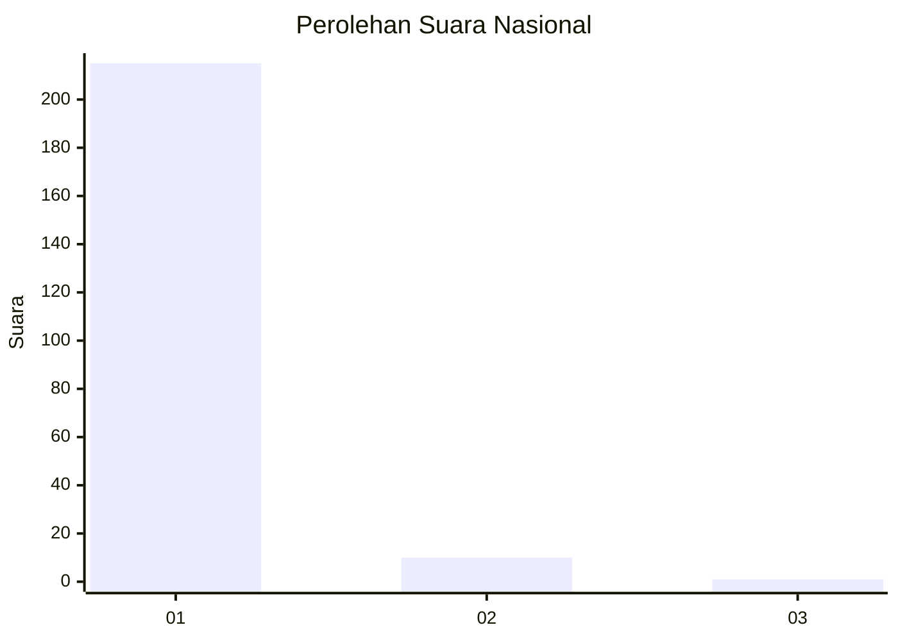
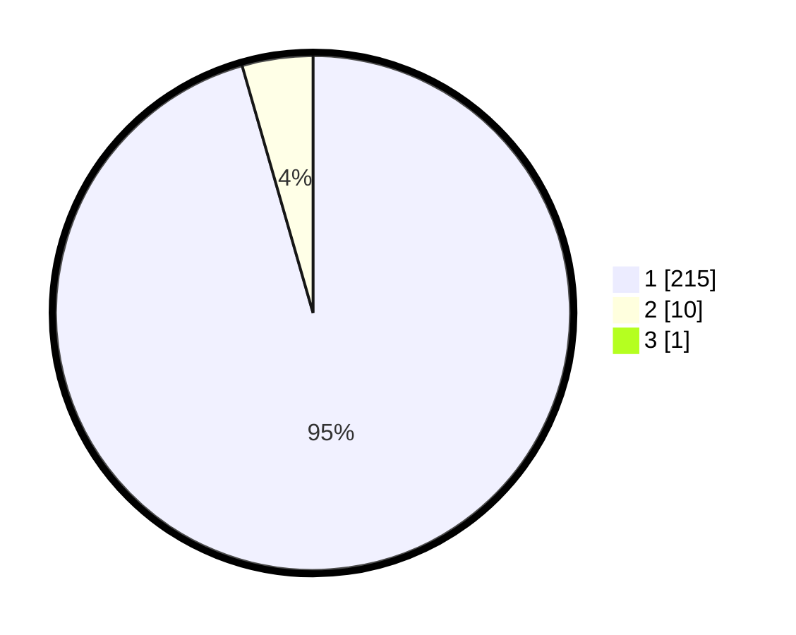

# Hasil

## Grafik

## Tabel

| No. | Nama Paslon    | Suara | Suara (raw) | Persentase |
|:--- |:-------------- | -----:| -----------:| ----------:|
| 1   | ANIES MUHAIMIN | 215   | [215][p-1]  | 95,13      |
| 2   | PRABOWO GIBRAN | 10    | [10][p-2]   | 4,42       |
| 3   | GANJAR MAHFUD  | 1     | [1][p-3]    | 0,44       |

[p-1]: https://github.com/gigit-pemilu/pemilu-2024/blob/main/pilpres/hitung-suara/sub/11-aceh/sub/06-aceh-besar/sub/01-lhoong/sub/2026-pudeng/sub/001-tps/sub/paslon-1.txt
[p-2]: https://github.com/gigit-pemilu/pemilu-2024/blob/main/pilpres/hitung-suara/sub/11-aceh/sub/06-aceh-besar/sub/01-lhoong/sub/2026-pudeng/sub/001-tps/sub/paslon-2.txt
[p-3]: https://github.com/gigit-pemilu/pemilu-2024/blob/main/pilpres/hitung-suara/sub/11-aceh/sub/06-aceh-besar/sub/01-lhoong/sub/2026-pudeng/sub/001-tps/sub/paslon-3.txt

## Foto C Plano

https://sirekap-obj-formc.kpu.go.id/ca18/pemilu/ppwp/11/06/01/20/26/1106012026001-20240215-094237--e4164c96-07c2-435e-81f5-6d305a94db16.jpg

https://sirekap-obj-formc.kpu.go.id/ca18/pemilu/ppwp/11/06/01/20/26/1106012026001-20240214-214801--9aeebbff-e87b-4f86-9683-40598a9c6953.jpg

https://sirekap-obj-formc.kpu.go.id/ca18/pemilu/ppwp/11/06/01/20/26/1106012026001-20240215-094446--ef13a5fc-535b-49da-9d4a-1bb1cd70fe39.jpg

## Metadata

| Key        | Value               |
| ---------- | ------------------- |
| Time Stamp | 2024-02-20 12:00:00 |

