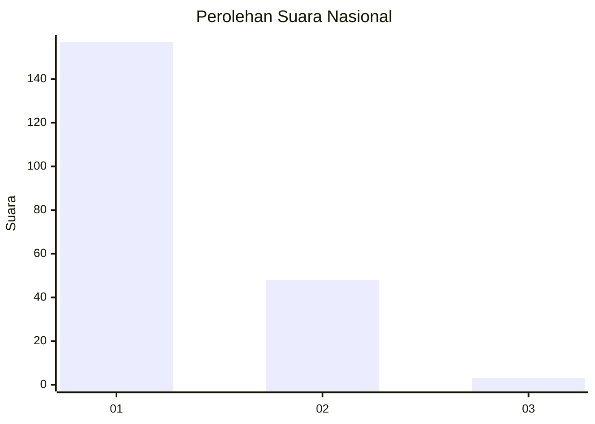
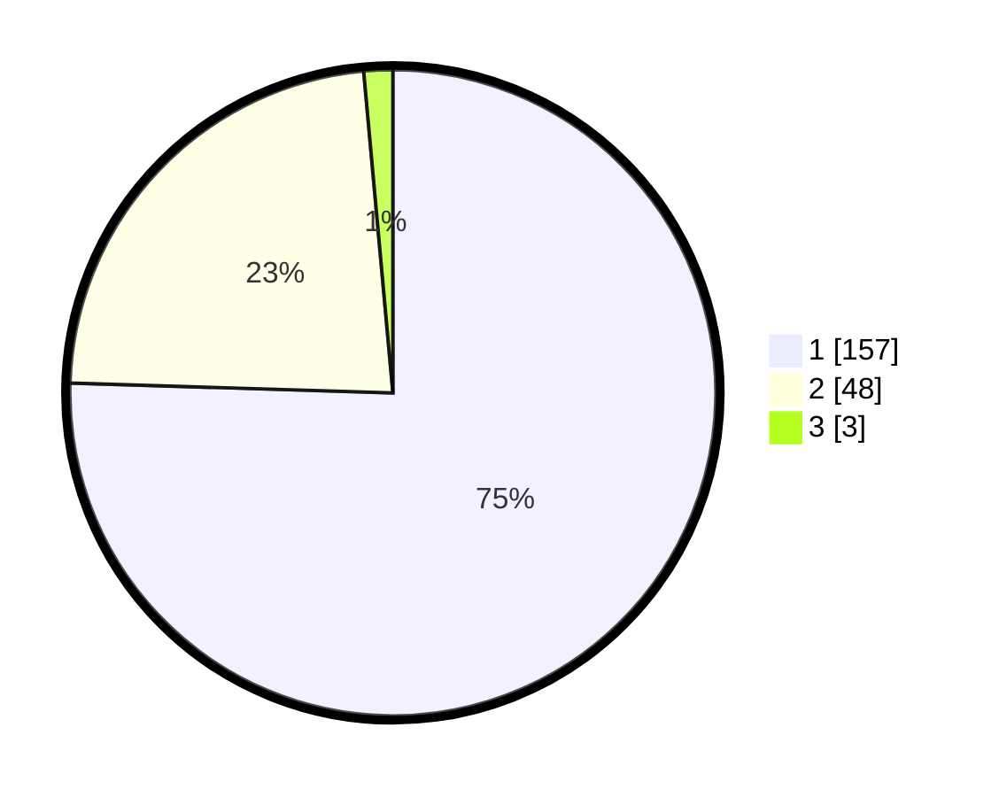

# Hasil

## Grafik

## Tabel

| No. | Nama Paslon    | Suara | Suara (raw) | Persentase |
|:--- |:-------------- | -----:| -----------:| ----------:|
| 1   | ANIES MUHAIMIN | 157   | [157][p-1]  | 75,48      |
| 2   | PRABOWO GIBRAN | 48    | [48][p-2]   | 23,08      |
| 3   | GANJAR MAHFUD  | 3     | [3][p-3]    | 1,44       |

[p-1]: https://github.com/gigit-pemilu/pemilu-2024/blob/main/pilpres/hitung-suara/sub/11-aceh/sub/06-aceh-besar/sub/02-lhoknga/sub/2001-mon-ikeun/sub/001-tps/sub/paslon-1.txt
[p-2]: https://github.com/gigit-pemilu/pemilu-2024/blob/main/pilpres/hitung-suara/sub/11-aceh/sub/06-aceh-besar/sub/02-lhoknga/sub/2001-mon-ikeun/sub/001-tps/sub/paslon-2.txt
[p-3]: https://github.com/gigit-pemilu/pemilu-2024/blob/main/pilpres/hitung-suara/sub/11-aceh/sub/06-aceh-besar/sub/02-lhoknga/sub/2001-mon-ikeun/sub/001-tps/sub/paslon-3.txt

## Foto C Plano

https://sirekap-obj-formc.kpu.go.id/a2d3/pemilu/ppwp/11/06/02/20/01/1106022001001-20240223-114306--17d5b04f-7326-498c-ade9-29f28abbf3f9.jpg

https://sirekap-obj-formc.kpu.go.id/a2d3/pemilu/ppwp/11/06/02/20/01/1106022001001-20240223-114349--0c0c98ef-5096-4efd-974a-5888d62d0aca.jpg

https://sirekap-obj-formc.kpu.go.id/a2d3/pemilu/ppwp/11/06/02/20/01/1106022001001-20240223-114609--4bb72657-1424-4b30-80c0-65cab12228ab.jpg

## Metadata

| Key        | Value               |
| ---------- | ------------------- |
| Time Stamp | 2024-02-24 22:31:28 |

