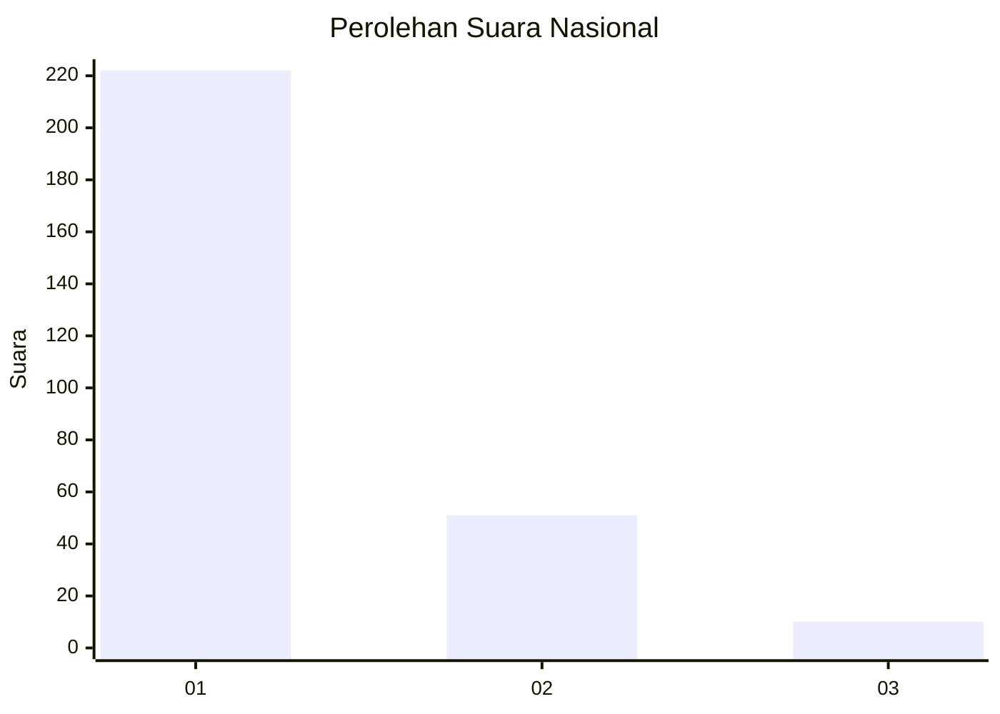
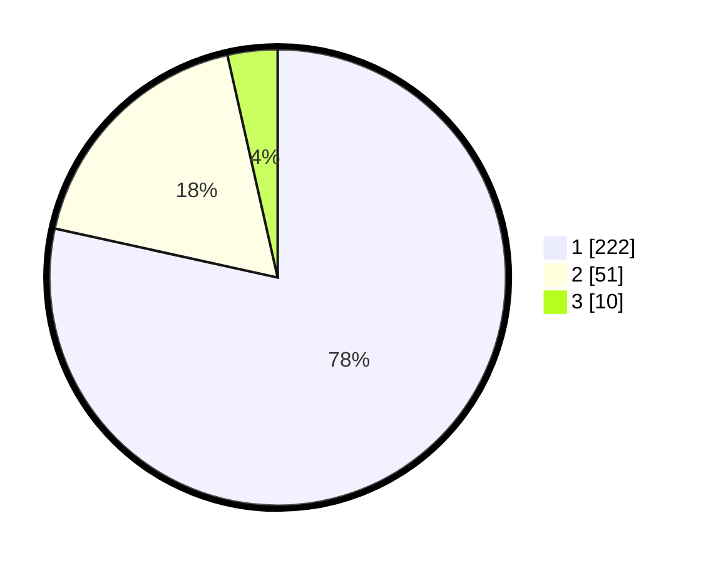

# Hasil

## Grafik

## Tabel

| No. | Nama Paslon    | Suara | Suara (raw) | Persentase |
|:--- |:-------------- | -----:| -----------:| ----------:|
| 1   | ANIES MUHAIMIN | 222   | [222][p-1]  | 78,45      |
| 2   | PRABOWO GIBRAN | 51    | [51][p-2]   | 18,02      |
| 3   | GANJAR MAHFUD  | 10    | [10][p-3]   | 3,53       |

[p-1]: https://github.com/gigit-pemilu/pemilu-2024/blob/main/pilpres/hitung-suara/sub/11-aceh/sub/06-aceh-besar/sub/02-lhoknga/sub/2001-mon-ikeun/sub/002-tps/sub/paslon-1.txt
[p-2]: https://github.com/gigit-pemilu/pemilu-2024/blob/main/pilpres/hitung-suara/sub/11-aceh/sub/06-aceh-besar/sub/02-lhoknga/sub/2001-mon-ikeun/sub/002-tps/sub/paslon-2.txt
[p-3]: https://github.com/gigit-pemilu/pemilu-2024/blob/main/pilpres/hitung-suara/sub/11-aceh/sub/06-aceh-besar/sub/02-lhoknga/sub/2001-mon-ikeun/sub/002-tps/sub/paslon-3.txt

## Foto C Plano

https://sirekap-obj-formc.kpu.go.id/f8b1/pemilu/ppwp/11/06/02/20/01/1106022001002-20240215-004238--cdd2d924-5779-4b6a-887e-62692ffff7aa.jpg

https://sirekap-obj-formc.kpu.go.id/f8b1/pemilu/ppwp/11/06/02/20/01/1106022001002-20240215-004315--0a95c6cb-02f6-4d10-858f-53ca1d087427.jpg

https://sirekap-obj-formc.kpu.go.id/f8b1/pemilu/ppwp/11/06/02/20/01/1106022001002-20240215-004352--2540967b-657a-4e6c-8a2a-391d9b73933f.jpg

## Metadata

| Key        | Value               |
| ---------- | ------------------- |
| Time Stamp | 2024-02-20 12:00:00 |

## DATA PEMILIH TETAP

Jumlah pemilih dalam DPT: **281**.
 * L: **135**.
 * P: **146**.

## DATA PENGGUNA HAK PILIH

Jumlah pengguna hak pilih dalam DPT: **245**.
 * L: **112**.
 * P: **133**.

Jumlah pengguna hak pilih dalam DPTb: **0**.
 * L: **0**.
 * P: **0**.

Jumlah pengguna hak pilih dalam DPK: **44**.
 * L: **19**.
 * P: **25**.

Jumlah pengguna hak pilih: **289**.
 * L: **131**.
 * P: **158**.

## JUMLAH SUARA SAH DAN TIDAK SAH

JUMLAH SELURUH SUARA SAH: **283**.

JUMLAH SUARA TIDAK SAH: **6**.

JUMLAH SELURUH SUARA SAH DAN SUARA TIDAK SAH: **289**.

