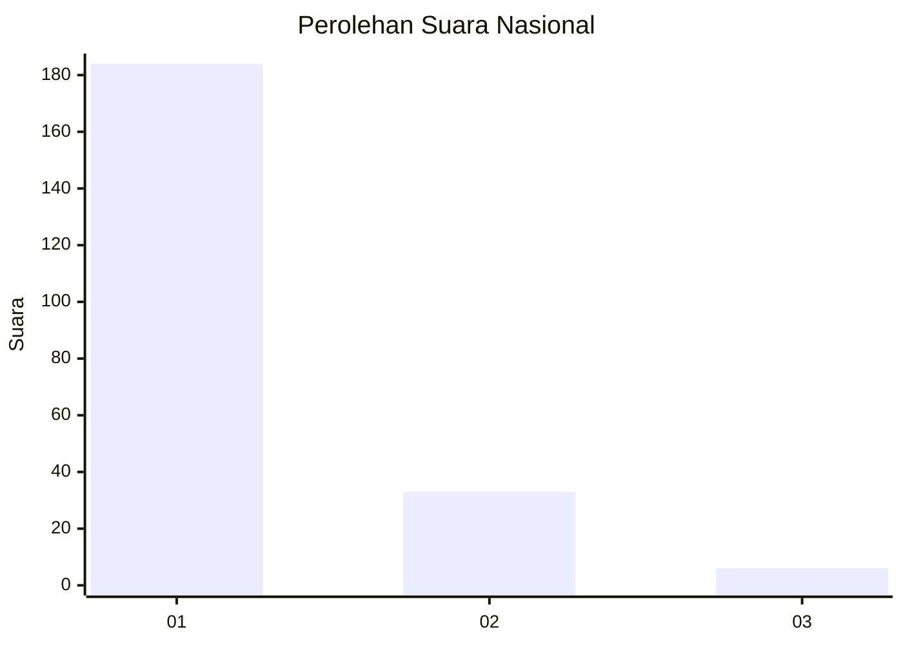
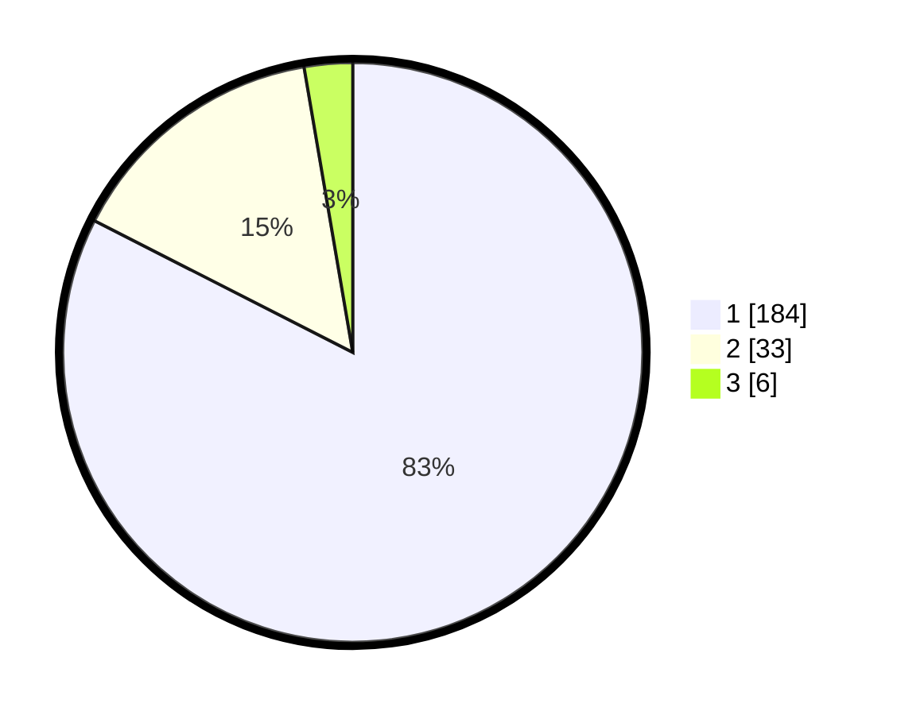

# Hasil

## Grafik

## Tabel

| No. | Nama Paslon    | Suara | Suara (raw) | Persentase |
|:--- |:-------------- | -----:| -----------:| ----------:|
| 1   | ANIES MUHAIMIN | 184   | [184][p-1]  | 82,51      |
| 2   | PRABOWO GIBRAN | 33    | [33][p-2]   | 14,80      |
| 3   | GANJAR MAHFUD  | 6     | [6][p-3]    | 2,69       |

[p-1]: https://github.com/gigit-pemilu/pemilu-2024/blob/main/pilpres/hitung-suara/sub/11-aceh/sub/06-aceh-besar/sub/02-lhoknga/sub/2001-mon-ikeun/sub/003-tps/sub/paslon-1.txt
[p-2]: https://github.com/gigit-pemilu/pemilu-2024/blob/main/pilpres/hitung-suara/sub/11-aceh/sub/06-aceh-besar/sub/02-lhoknga/sub/2001-mon-ikeun/sub/003-tps/sub/paslon-2.txt
[p-3]: https://github.com/gigit-pemilu/pemilu-2024/blob/main/pilpres/hitung-suara/sub/11-aceh/sub/06-aceh-besar/sub/02-lhoknga/sub/2001-mon-ikeun/sub/003-tps/sub/paslon-3.txt

## Foto C Plano

https://sirekap-obj-formc.kpu.go.id/405d/pemilu/ppwp/11/06/02/20/01/1106022001003-20240223-113611--fadd1e71-41cf-4896-b1f6-646d82b587ee.jpg

https://sirekap-obj-formc.kpu.go.id/405d/pemilu/ppwp/11/06/02/20/01/1106022001003-20240223-113741--ecb53a37-7fd0-47ab-be8a-b14599e1e7cb.jpg

https://sirekap-obj-formc.kpu.go.id/405d/pemilu/ppwp/11/06/02/20/01/1106022001003-20240223-113920--5b6a168d-f658-4a2b-b976-5a94b8e3adb3.jpg

## Metadata

| Key        | Value               |
| ---------- | ------------------- |
| Time Stamp | 2024-02-24 22:31:28 |

