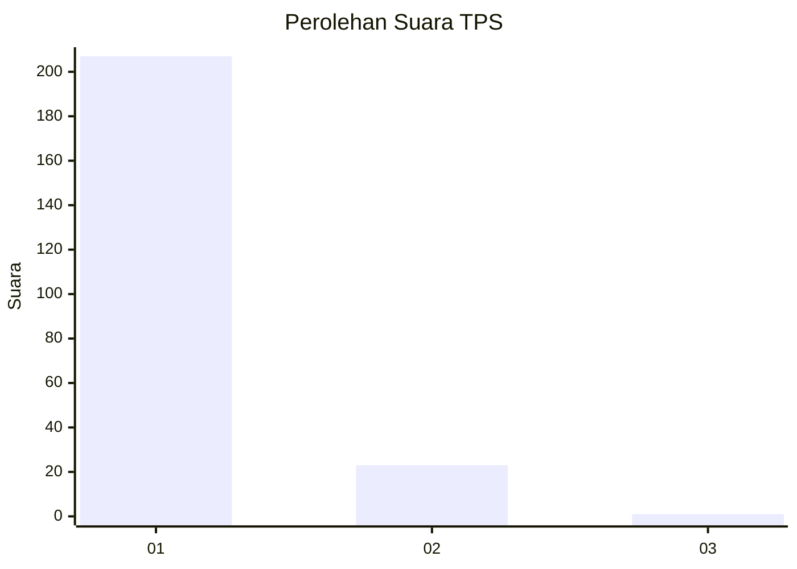
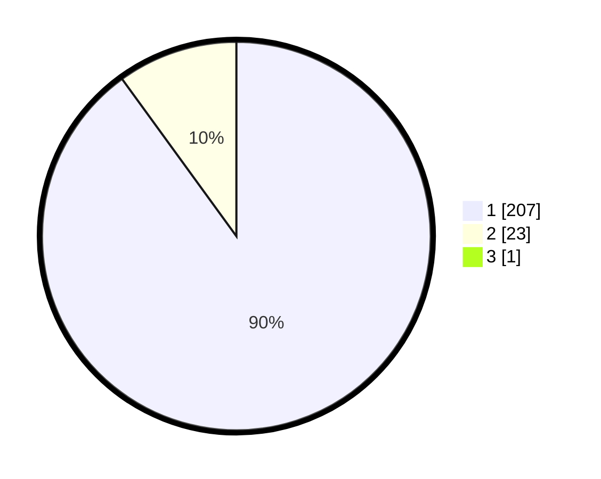

# Hasil

## Grafik

## Tabel

| No. | Nama Paslon    | Suara | Suara (raw) | Persentase |
|:--- |:-------------- | -----:| -----------:| ----------:|
| 1   | ANIES MUHAIMIN | 207   | [207][p-1]  | 89,61      |
| 2   | PRABOWO GIBRAN | 23    | [23][p-2]   | 9,96       |
| 3   | GANJAR MAHFUD  | 1     | [1][p-3]    | 0,43       |

[p-1]: https://github.com/gigit-pemilu/pemilu-2024-11-aceh/blob/main/pilpres/hitung-suara/sub/11-aceh/sub/06-aceh-besar/sub/02-lhoknga/sub/2002-nusa/sub/001-tps/sub/paslon-1.txt
[p-2]: https://github.com/gigit-pemilu/pemilu-2024-11-aceh/blob/main/pilpres/hitung-suara/sub/11-aceh/sub/06-aceh-besar/sub/02-lhoknga/sub/2002-nusa/sub/001-tps/sub/paslon-2.txt
[p-3]: https://github.com/gigit-pemilu/pemilu-2024-11-aceh/blob/main/pilpres/hitung-suara/sub/11-aceh/sub/06-aceh-besar/sub/02-lhoknga/sub/2002-nusa/sub/001-tps/sub/paslon-3.txt

## Foto C Plano

https://sirekap-obj-formc.kpu.go.id/7d0b/pemilu/ppwp/11/06/02/20/02/1106022002001-20240214-214227--70f943d8-798c-4603-a280-822b7d06f485.jpg

https://sirekap-obj-formc.kpu.go.id/7d0b/pemilu/ppwp/11/06/02/20/02/1106022002001-20240214-214340--425565a3-2455-4dee-8065-e81aa6eb7f45.jpg

https://sirekap-obj-formc.kpu.go.id/7d0b/pemilu/ppwp/11/06/02/20/02/1106022002001-20240214-214458--37599707-3dc3-4974-b8e2-d0c8ef464076.jpg

## Metadata

| Key        | Value               |
| ---------- | ------------------- |
| Time Stamp | 2024-02-20 12:00:00 |

