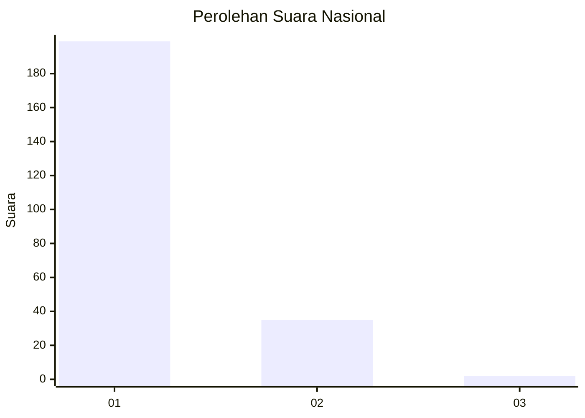
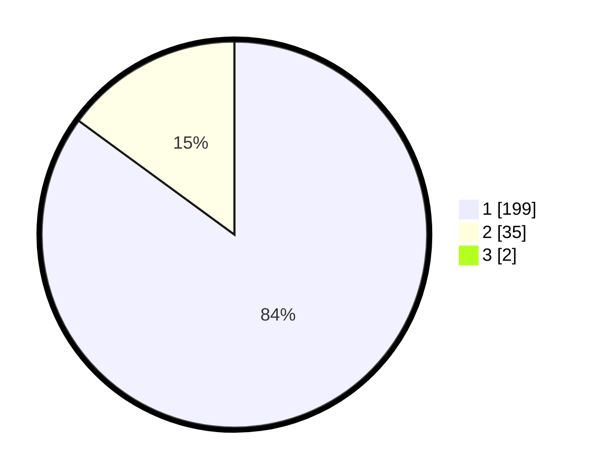

# Hasil

## Grafik

## Tabel

| No. | Nama Paslon    | Suara | Suara (raw) | Persentase |
|:--- |:-------------- | -----:| -----------:| ----------:|
| 1   | ANIES MUHAIMIN | 199   | [199][p-1]  | 84,32      |
| 2   | PRABOWO GIBRAN | 35    | [35][p-2]   | 14,83      |
| 3   | GANJAR MAHFUD  | 2     | [2][p-3]    | 0,85       |

[p-1]: https://github.com/gigit-pemilu/pemilu-2024/blob/main/pilpres/hitung-suara/sub/11-aceh/sub/06-aceh-besar/sub/02-lhoknga/sub/2002-nusa/sub/002-tps/sub/paslon-1.txt
[p-2]: https://github.com/gigit-pemilu/pemilu-2024/blob/main/pilpres/hitung-suara/sub/11-aceh/sub/06-aceh-besar/sub/02-lhoknga/sub/2002-nusa/sub/002-tps/sub/paslon-2.txt
[p-3]: https://github.com/gigit-pemilu/pemilu-2024/blob/main/pilpres/hitung-suara/sub/11-aceh/sub/06-aceh-besar/sub/02-lhoknga/sub/2002-nusa/sub/002-tps/sub/paslon-3.txt

## Foto C Plano

https://sirekap-obj-formc.kpu.go.id/61b5/pemilu/ppwp/11/06/02/20/02/1106022002002-20240222-115146--8503f215-e3a0-4580-8c17-0a2176c225ca.jpg

https://sirekap-obj-formc.kpu.go.id/61b5/pemilu/ppwp/11/06/02/20/02/1106022002002-20240214-195155--18b3b382-17d7-435f-bc29-f8e523f96741.jpg

https://sirekap-obj-formc.kpu.go.id/61b5/pemilu/ppwp/11/06/02/20/02/1106022002002-20240214-195211--25007c1d-148a-48ff-89a5-9ab058601dde.jpg

## Metadata

| Key        | Value               |
| ---------- | ------------------- |
| Time Stamp | 2024-02-22 12:00:00 |

