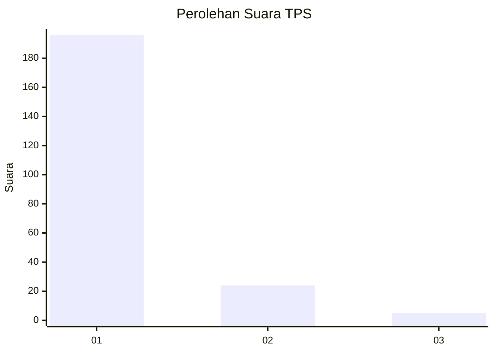
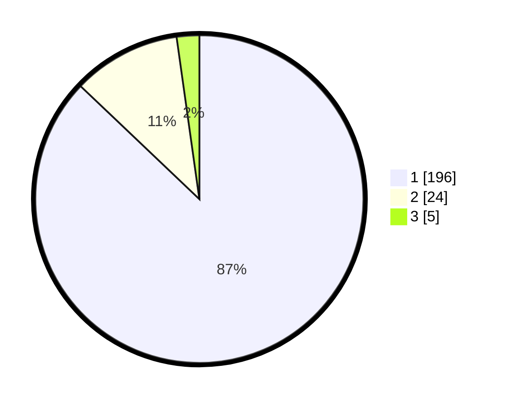

# Hasil

## Grafik

## Tabel

| No. | Nama Paslon    | Suara | Suara (raw) | Persentase |
|:--- |:-------------- | -----:| -----------:| ----------:|
| 1   | ANIES MUHAIMIN | 196   | [196][p-1]  | 87,11      |
| 2   | PRABOWO GIBRAN | 24    | [24][p-2]   | 10,67      |
| 3   | GANJAR MAHFUD  | 5     | [5][p-3]    | 2,22       |

[p-1]: https://github.com/gigit-pemilu/pemilu-2024-11-aceh/blob/main/pilpres/hitung-suara/sub/11-aceh/sub/06-aceh-besar/sub/02-lhoknga/sub/2002-nusa/sub/003-tps/sub/paslon-1.txt
[p-2]: https://github.com/gigit-pemilu/pemilu-2024-11-aceh/blob/main/pilpres/hitung-suara/sub/11-aceh/sub/06-aceh-besar/sub/02-lhoknga/sub/2002-nusa/sub/003-tps/sub/paslon-2.txt
[p-3]: https://github.com/gigit-pemilu/pemilu-2024-11-aceh/blob/main/pilpres/hitung-suara/sub/11-aceh/sub/06-aceh-besar/sub/02-lhoknga/sub/2002-nusa/sub/003-tps/sub/paslon-3.txt

## Foto C Plano

https://sirekap-obj-formc.kpu.go.id/422d/pemilu/ppwp/11/06/02/20/02/1106022002003-20240214-191228--34b7bf6e-e8aa-4bfe-9344-78af6b733c07.jpg

https://sirekap-obj-formc.kpu.go.id/422d/pemilu/ppwp/11/06/02/20/02/1106022002003-20240214-191246--6e9a1987-6e0a-45c2-a4da-21745e8a3f18.jpg

https://sirekap-obj-formc.kpu.go.id/422d/pemilu/ppwp/11/06/02/20/02/1106022002003-20240214-191301--85473c59-0dc4-4e23-ba11-1ebeecd0cf92.jpg

## Metadata

| Key        | Value               |
| ---------- | ------------------- |
| Time Stamp | 2024-02-14 21:46:01 |

