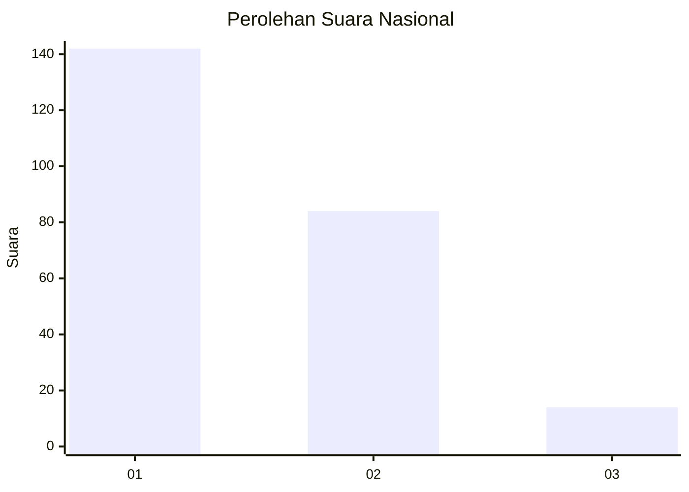
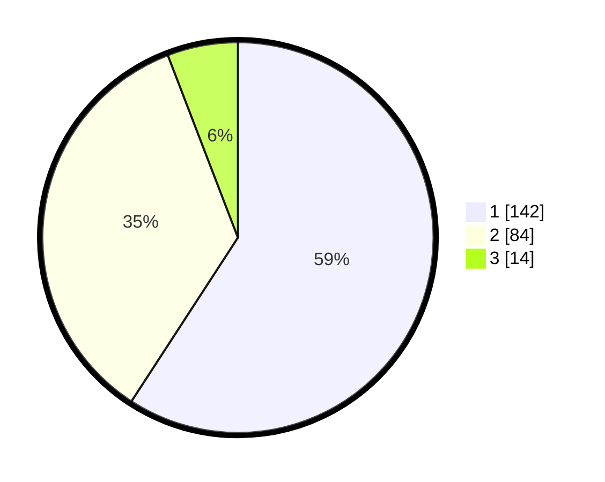

# Hasil

## Grafik

## Tabel

| No. | Nama Paslon    | Suara | Suara (raw) | Persentase |
|:--- |:-------------- | -----:| -----------:| ----------:|
| 1   | ANIES MUHAIMIN | 142   | [142][p-1]  | 59,17      |
| 2   | PRABOWO GIBRAN | 84    | [84][p-2]   | 35,00      |
| 3   | GANJAR MAHFUD  | 14    | [14][p-3]   | 5,83       |

[p-1]: https://github.com/gigit-pemilu/pemilu-2024/blob/main/pilpres/hitung-suara/sub/11-aceh/sub/06-aceh-besar/sub/02-lhoknga/sub/2002-nusa/sub/901-tps/sub/paslon-1.txt
[p-2]: https://github.com/gigit-pemilu/pemilu-2024/blob/main/pilpres/hitung-suara/sub/11-aceh/sub/06-aceh-besar/sub/02-lhoknga/sub/2002-nusa/sub/901-tps/sub/paslon-2.txt
[p-3]: https://github.com/gigit-pemilu/pemilu-2024/blob/main/pilpres/hitung-suara/sub/11-aceh/sub/06-aceh-besar/sub/02-lhoknga/sub/2002-nusa/sub/901-tps/sub/paslon-3.txt

## Foto C Plano

https://sirekap-obj-formc.kpu.go.id/da75/pemilu/ppwp/11/06/02/20/02/1106022002901-20240214-193449--7a9bd5e8-65e7-4ebe-887c-0fc990bae302.jpg

https://sirekap-obj-formc.kpu.go.id/da75/pemilu/ppwp/11/06/02/20/02/1106022002901-20240214-193509--05087cd5-31a8-4b27-9e65-c15dbba66421.jpg

https://sirekap-obj-formc.kpu.go.id/da75/pemilu/ppwp/11/06/02/20/02/1106022002901-20240214-193517--f9d1c0df-c5e4-472b-8f95-97cc8307e63d.jpg

## Metadata

| Key        | Value               |
| ---------- | ------------------- |
| Time Stamp | 2024-02-20 12:00:00 |

