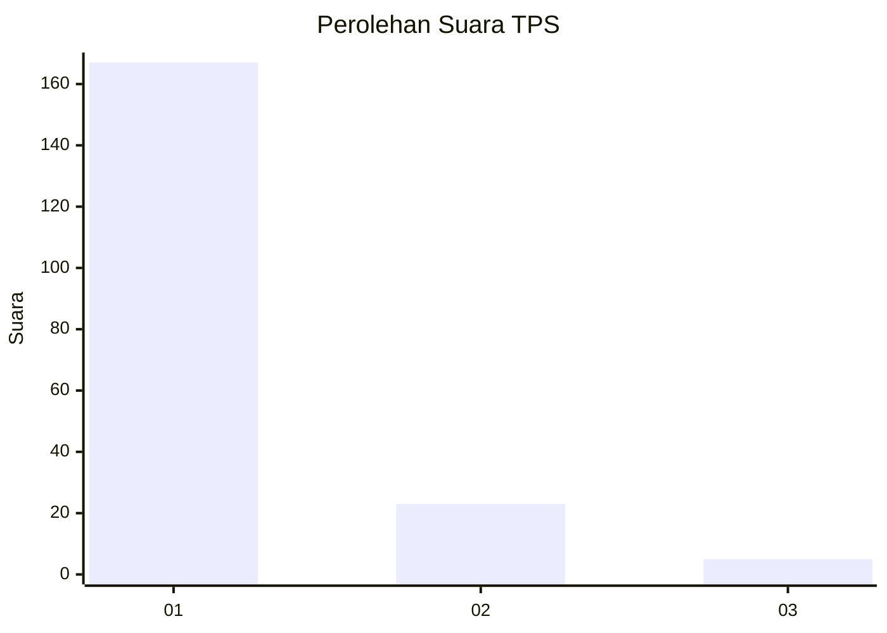
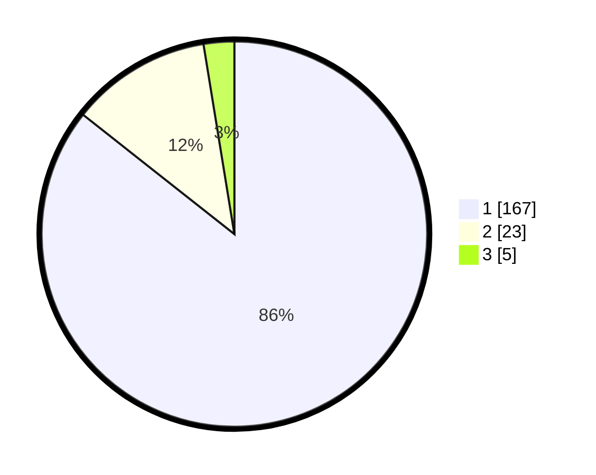

# Hasil

## Grafik

## Tabel

| No. | Nama Paslon    | Suara | Suara (raw) | Persentase |
|:--- |:-------------- | -----:| -----------:| ----------:|
| 1   | ANIES MUHAIMIN | 167   | [167][p-1]  | 85,64      |
| 2   | PRABOWO GIBRAN | 23    | [23][p-2]   | 11,79      |
| 3   | GANJAR MAHFUD  | 5     | [5][p-3]    | 2,56       |

[p-1]: https://github.com/gigit-pemilu/pemilu-2024-11-aceh/blob/main/pilpres/hitung-suara/sub/11-aceh/sub/06-aceh-besar/sub/02-lhoknga/sub/2003-weu-raya/sub/001-tps/sub/paslon-1.txt
[p-2]: https://github.com/gigit-pemilu/pemilu-2024-11-aceh/blob/main/pilpres/hitung-suara/sub/11-aceh/sub/06-aceh-besar/sub/02-lhoknga/sub/2003-weu-raya/sub/001-tps/sub/paslon-2.txt
[p-3]: https://github.com/gigit-pemilu/pemilu-2024-11-aceh/blob/main/pilpres/hitung-suara/sub/11-aceh/sub/06-aceh-besar/sub/02-lhoknga/sub/2003-weu-raya/sub/001-tps/sub/paslon-3.txt

## Foto C Plano

https://sirekap-obj-formc.kpu.go.id/7017/pemilu/ppwp/11/06/02/20/03/1106022003001-20240214-212933--3a7e1b79-30dd-4a62-a61a-bc9c00c273f4.jpg

https://sirekap-obj-formc.kpu.go.id/7017/pemilu/ppwp/11/06/02/20/03/1106022003001-20240214-211810--82554005-446b-4e23-a03e-7df98346ad9f.jpg

https://sirekap-obj-formc.kpu.go.id/7017/pemilu/ppwp/11/06/02/20/03/1106022003001-20240214-201012--bed413e0-28ed-4b18-a2f9-08ac10729d12.jpg

## Metadata

| Key        | Value               |
| ---------- | ------------------- |
| Time Stamp | 2024-02-20 12:00:00 |

## DATA PEMILIH TETAP

Jumlah pemilih dalam DPT: **217**.
 * L: **110**.
 * P: **107**.

## DATA PENGGUNA HAK PILIH

Jumlah pengguna hak pilih dalam DPT: **195**.
 * L: **95**.
 * P: **100**.

Jumlah pengguna hak pilih dalam DPTb: **0**.
 * L: **0**.
 * P: **0**.

Jumlah pengguna hak pilih dalam DPK: **0**.
 * L: **0**.
 * P: **0**.

Jumlah pengguna hak pilih: **195**.
 * L: **95**.
 * P: **100**.

## JUMLAH SUARA SAH DAN TIDAK SAH

JUMLAH SELURUH SUARA SAH: **195**.

JUMLAH SUARA TIDAK SAH: **27**.

JUMLAH SELURUH SUARA SAH DAN SUARA TIDAK SAH: **222**.

