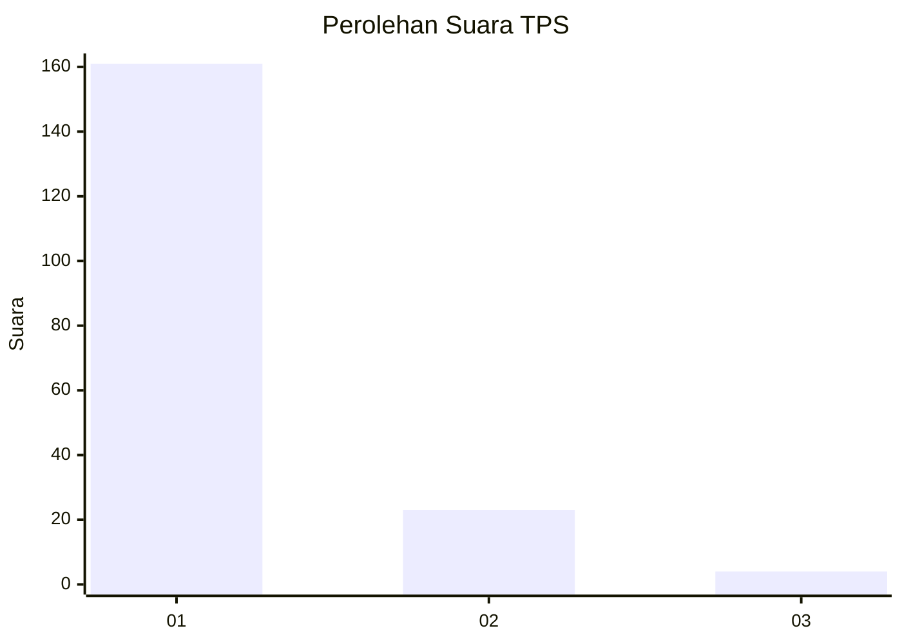
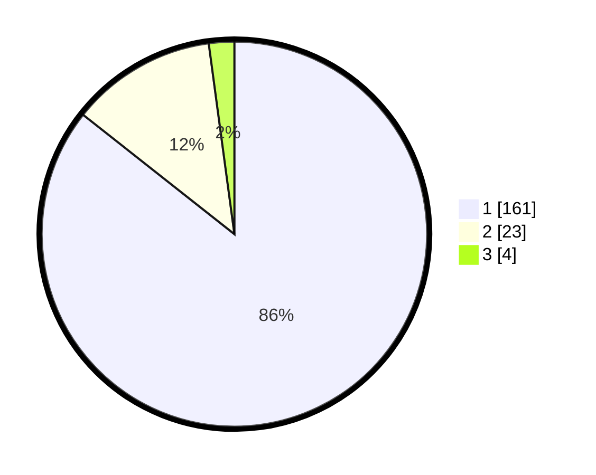

# Hasil

## Grafik

## Tabel

| No. | Nama Paslon    | Suara | Suara (raw) | Persentase |
|:--- |:-------------- | -----:| -----------:| ----------:|
| 1   | ANIES MUHAIMIN | 161   | [161][p-1]  | 85,64      |
| 2   | PRABOWO GIBRAN | 23    | [23][p-2]   | 12,23      |
| 3   | GANJAR MAHFUD  | 4     | [4][p-3]    | 2,13       |

[p-1]: https://github.com/gigit-pemilu/pemilu-2024-11-aceh/blob/main/pilpres/hitung-suara/sub/11-aceh/sub/06-aceh-besar/sub/02-lhoknga/sub/2003-weu-raya/sub/002-tps/sub/paslon-1.txt
[p-2]: https://github.com/gigit-pemilu/pemilu-2024-11-aceh/blob/main/pilpres/hitung-suara/sub/11-aceh/sub/06-aceh-besar/sub/02-lhoknga/sub/2003-weu-raya/sub/002-tps/sub/paslon-2.txt
[p-3]: https://github.com/gigit-pemilu/pemilu-2024-11-aceh/blob/main/pilpres/hitung-suara/sub/11-aceh/sub/06-aceh-besar/sub/02-lhoknga/sub/2003-weu-raya/sub/002-tps/sub/paslon-3.txt

## Foto C Plano

https://sirekap-obj-formc.kpu.go.id/3ba2/pemilu/ppwp/11/06/02/20/03/1106022003002-20240214-225449--ecf855df-0de2-4830-86a6-b3b7fad14d07.jpg

https://sirekap-obj-formc.kpu.go.id/3ba2/pemilu/ppwp/11/06/02/20/03/1106022003002-20240214-211251--c354361a-7025-4a02-9c1a-7c2c652dde29.jpg

https://sirekap-obj-formc.kpu.go.id/3ba2/pemilu/ppwp/11/06/02/20/03/1106022003002-20240214-211720--05ceb3d0-5209-4be0-ad70-a4b02ae41c67.jpg

## Metadata

| Key        | Value               |
| ---------- | ------------------- |
| Time Stamp | 2024-02-20 12:00:00 |

