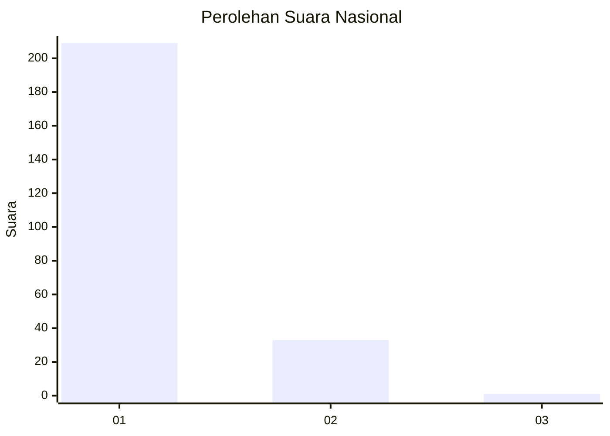
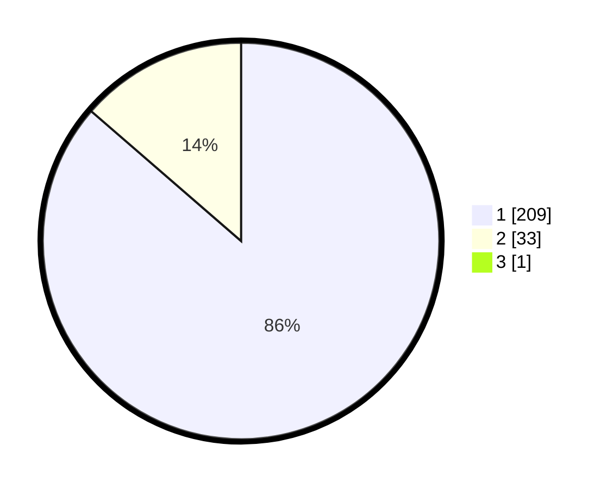

# Hasil

## Grafik

## Tabel

| No. | Nama Paslon    | Suara | Suara (raw) | Persentase |
|:--- |:-------------- | -----:| -----------:| ----------:|
| 1   | ANIES MUHAIMIN | 209   | [209][p-1]  | 86,01      |
| 2   | PRABOWO GIBRAN | 33    | [33][p-2]   | 13,58      |
| 3   | GANJAR MAHFUD  | 1     | [1][p-3]    | 0,41       |

[p-1]: https://github.com/gigit-pemilu/pemilu-2024/blob/main/pilpres/hitung-suara/sub/11-aceh/sub/06-aceh-besar/sub/02-lhoknga/sub/2005-lamgaboh/sub/002-tps/sub/paslon-1.txt
[p-2]: https://github.com/gigit-pemilu/pemilu-2024/blob/main/pilpres/hitung-suara/sub/11-aceh/sub/06-aceh-besar/sub/02-lhoknga/sub/2005-lamgaboh/sub/002-tps/sub/paslon-2.txt
[p-3]: https://github.com/gigit-pemilu/pemilu-2024/blob/main/pilpres/hitung-suara/sub/11-aceh/sub/06-aceh-besar/sub/02-lhoknga/sub/2005-lamgaboh/sub/002-tps/sub/paslon-3.txt

## Foto C Plano

https://sirekap-obj-formc.kpu.go.id/b12f/pemilu/ppwp/11/06/02/20/05/1106022005002-20240217-195135--a837780b-7324-4818-83fa-d64bb9301791.jpg

https://sirekap-obj-formc.kpu.go.id/b12f/pemilu/ppwp/11/06/02/20/05/1106022005002-20240217-175255--6ed2e542-1e66-4e35-95ea-b2346c8faf62.jpg

https://sirekap-obj-formc.kpu.go.id/b12f/pemilu/ppwp/11/06/02/20/05/1106022005002-20240217-175415--23f6bbf9-d94b-4642-910f-728d2f11d969.jpg

## Metadata

| Key        | Value               |
| ---------- | ------------------- |
| Time Stamp | 2024-02-19 19:00:00 |

