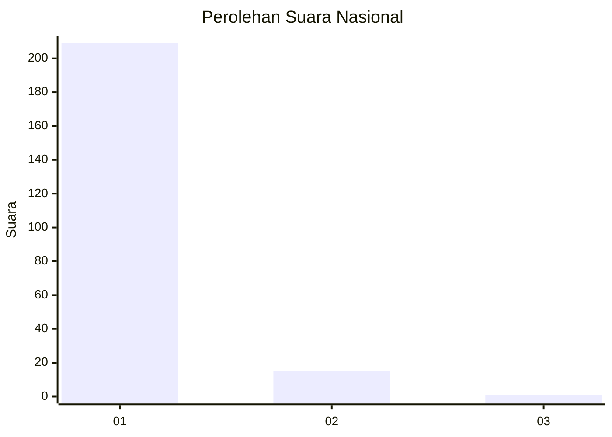
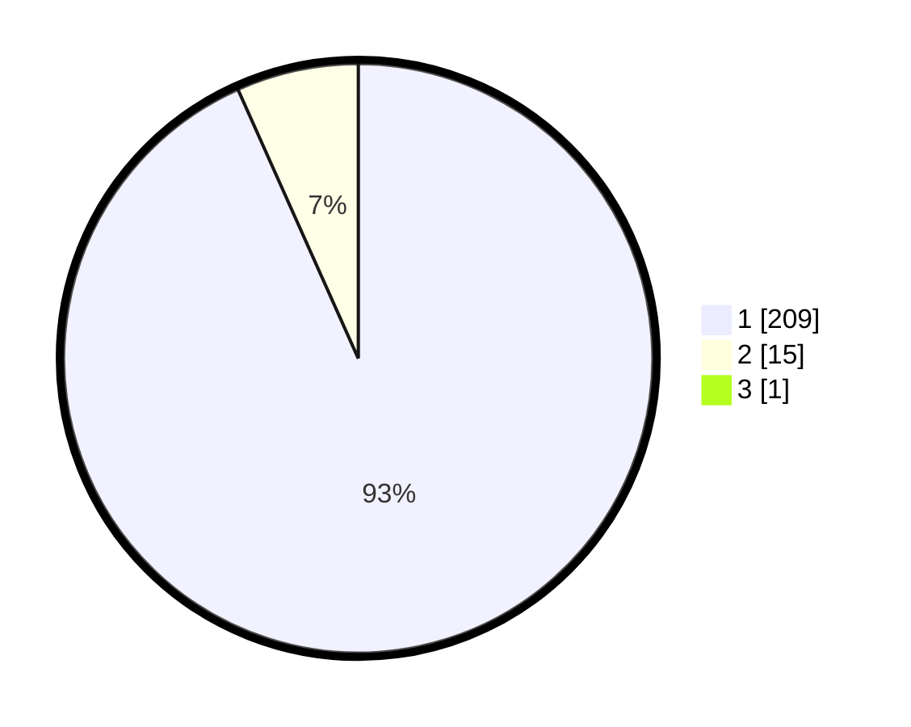

# Hasil

## Grafik

## Tabel

| No. | Nama Paslon    | Suara | Suara (raw) | Persentase |
|:--- |:-------------- | -----:| -----------:| ----------:|
| 1   | ANIES MUHAIMIN | 209   | [209][p-1]  | 92,89      |
| 2   | PRABOWO GIBRAN | 15    | [15][p-2]   | 6,67       |
| 3   | GANJAR MAHFUD  | 1     | [1][p-3]    | 0,44       |

[p-1]: https://github.com/gigit-pemilu/pemilu-2024/blob/main/pilpres/hitung-suara/sub/11-aceh/sub/06-aceh-besar/sub/02-lhoknga/sub/2010-aneuk-paya/sub/001-tps/sub/paslon-1.txt
[p-2]: https://github.com/gigit-pemilu/pemilu-2024/blob/main/pilpres/hitung-suara/sub/11-aceh/sub/06-aceh-besar/sub/02-lhoknga/sub/2010-aneuk-paya/sub/001-tps/sub/paslon-2.txt
[p-3]: https://github.com/gigit-pemilu/pemilu-2024/blob/main/pilpres/hitung-suara/sub/11-aceh/sub/06-aceh-besar/sub/02-lhoknga/sub/2010-aneuk-paya/sub/001-tps/sub/paslon-3.txt

## Foto C Plano

https://sirekap-obj-formc.kpu.go.id/db5d/pemilu/ppwp/11/06/02/20/10/1106022010001-20240215-043304--4777560e-22ea-49af-8e9f-c284e5c149a9.jpg

https://sirekap-obj-formc.kpu.go.id/db5d/pemilu/ppwp/11/06/02/20/10/1106022010001-20240215-031822--dd9b806f-810e-4244-b27a-ca5c998fdfc5.jpg

https://sirekap-obj-formc.kpu.go.id/db5d/pemilu/ppwp/11/06/02/20/10/1106022010001-20240215-031948--546acb2b-b5a6-49c5-a78f-a3d3b1c71b06.jpg

## Metadata

| Key        | Value               |
| ---------- | ------------------- |
| Time Stamp | 2024-02-15 17:30:25 |

