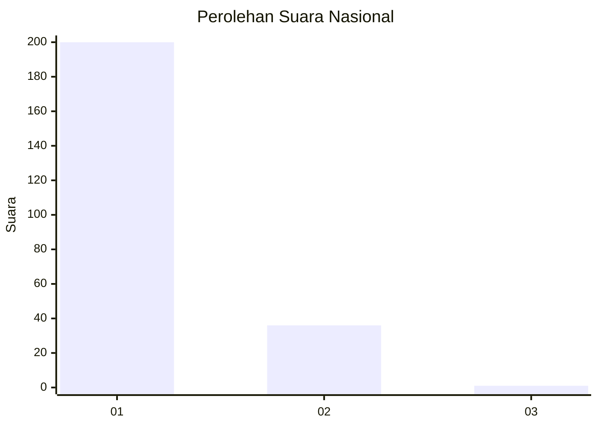
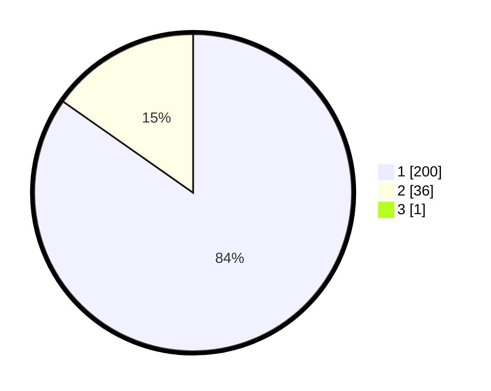

# Hasil

## Grafik

## Tabel

| No. | Nama Paslon    | Suara | Suara (raw) | Persentase |
|:--- |:-------------- | -----:| -----------:| ----------:|
| 1   | ANIES MUHAIMIN | 200   | [200][p-1]  | 84,39      |
| 2   | PRABOWO GIBRAN | 36    | [36][p-2]   | 15,19      |
| 3   | GANJAR MAHFUD  | 1     | [1][p-3]    | 0,42       |

[p-1]: https://github.com/gigit-pemilu/pemilu-2024/blob/main/pilpres/hitung-suara/sub/11-aceh/sub/06-aceh-besar/sub/02-lhoknga/sub/2012-seubun-ayon/sub/001-tps/sub/paslon-1.txt
[p-2]: https://github.com/gigit-pemilu/pemilu-2024/blob/main/pilpres/hitung-suara/sub/11-aceh/sub/06-aceh-besar/sub/02-lhoknga/sub/2012-seubun-ayon/sub/001-tps/sub/paslon-2.txt
[p-3]: https://github.com/gigit-pemilu/pemilu-2024/blob/main/pilpres/hitung-suara/sub/11-aceh/sub/06-aceh-besar/sub/02-lhoknga/sub/2012-seubun-ayon/sub/001-tps/sub/paslon-3.txt

## Foto C Plano

https://sirekap-obj-formc.kpu.go.id/c6a7/pemilu/ppwp/11/06/02/20/12/1106022012001-20240215-001159--6e79ec72-4bd5-41b1-a0b1-10e72be3dcd1.jpg

https://sirekap-obj-formc.kpu.go.id/c6a7/pemilu/ppwp/11/06/02/20/12/1106022012001-20240215-000441--80734c28-1e0f-47a3-b742-06f20251a3c3.jpg

https://sirekap-obj-formc.kpu.go.id/c6a7/pemilu/ppwp/11/06/02/20/12/1106022012001-20240215-014900--d1c766db-60d4-4a43-847c-1b5c4b3e0ecf.jpg

## Metadata

| Key        | Value               |
| ---------- | ------------------- |
| Time Stamp | 2024-02-15 15:30:25 |

