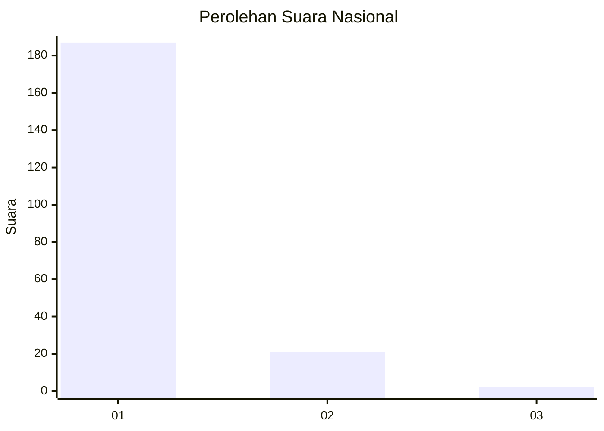
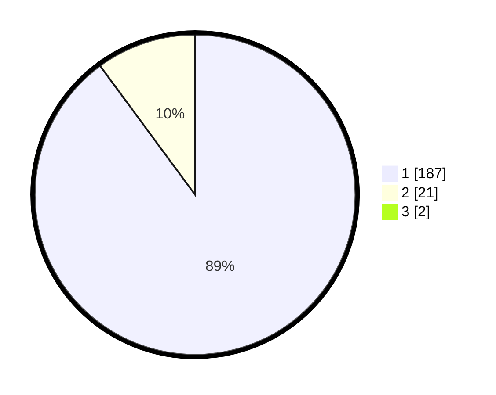

# Hasil

## Grafik

## Tabel

| No. | Nama Paslon    | Suara | Suara (raw) | Persentase |
|:--- |:-------------- | -----:| -----------:| ----------:|
| 1   | ANIES MUHAIMIN | 187   | [187][p-1]  | 89,05      |
| 2   | PRABOWO GIBRAN | 21    | [21][p-2]   | 10,00      |
| 3   | GANJAR MAHFUD  | 2     | [2][p-3]    | 0,95       |

[p-1]: https://github.com/gigit-pemilu/pemilu-2024/blob/main/pilpres/hitung-suara/sub/11-aceh/sub/06-aceh-besar/sub/02-lhoknga/sub/2015-lampaya/sub/003-tps/sub/paslon-1.txt
[p-2]: https://github.com/gigit-pemilu/pemilu-2024/blob/main/pilpres/hitung-suara/sub/11-aceh/sub/06-aceh-besar/sub/02-lhoknga/sub/2015-lampaya/sub/003-tps/sub/paslon-2.txt
[p-3]: https://github.com/gigit-pemilu/pemilu-2024/blob/main/pilpres/hitung-suara/sub/11-aceh/sub/06-aceh-besar/sub/02-lhoknga/sub/2015-lampaya/sub/003-tps/sub/paslon-3.txt

## Foto C Plano

https://sirekap-obj-formc.kpu.go.id/a061/pemilu/ppwp/11/06/02/20/15/1106022015003-20240222-214257--86ea6de5-d771-493d-a23b-3986db03706c.jpg

https://sirekap-obj-formc.kpu.go.id/a061/pemilu/ppwp/11/06/02/20/15/1106022015003-20240222-214638--b7ceef5f-0bd7-4687-9406-6ea363ed1c0e.jpg

https://sirekap-obj-formc.kpu.go.id/a061/pemilu/ppwp/11/06/02/20/15/1106022015003-20240222-214728--8c94ae3d-2107-4969-8c7b-ad671e08ec6e.jpg

## Metadata

| Key        | Value               |
| ---------- | ------------------- |
| Time Stamp | 2024-02-24 22:31:28 |

