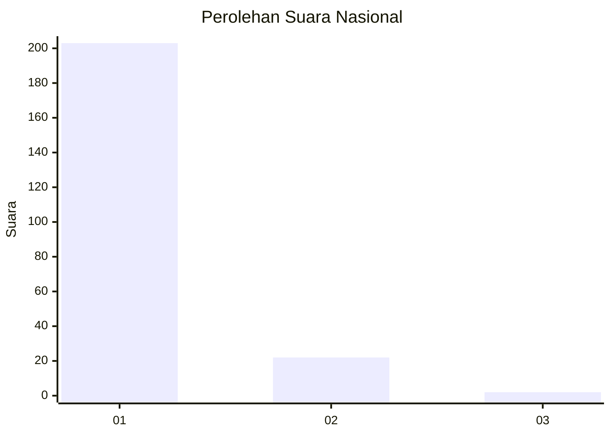
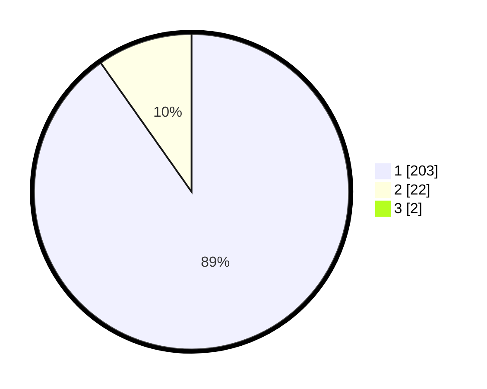

# Hasil

## Grafik

## Tabel

| No. | Nama Paslon    | Suara | Suara (raw) | Persentase |
|:--- |:-------------- | -----:| -----------:| ----------:|
| 1   | ANIES MUHAIMIN | 203   | [203][p-1]  | 89,43      |
| 2   | PRABOWO GIBRAN | 22    | [22][p-2]   | 9,69       |
| 3   | GANJAR MAHFUD  | 2     | [2][p-3]    | 0,88       |

[p-1]: https://github.com/gigit-pemilu/pemilu-2024/blob/main/pilpres/hitung-suara/sub/11-aceh/sub/06-aceh-besar/sub/02-lhoknga/sub/2015-lampaya/sub/004-tps/sub/paslon-1.txt
[p-2]: https://github.com/gigit-pemilu/pemilu-2024/blob/main/pilpres/hitung-suara/sub/11-aceh/sub/06-aceh-besar/sub/02-lhoknga/sub/2015-lampaya/sub/004-tps/sub/paslon-2.txt
[p-3]: https://github.com/gigit-pemilu/pemilu-2024/blob/main/pilpres/hitung-suara/sub/11-aceh/sub/06-aceh-besar/sub/02-lhoknga/sub/2015-lampaya/sub/004-tps/sub/paslon-3.txt

## Foto C Plano

https://sirekap-obj-formc.kpu.go.id/f07a/pemilu/ppwp/11/06/02/20/15/1106022015004-20240222-223709--8174a8fe-b79b-4323-b7b5-334d8a9110b2.jpg

https://sirekap-obj-formc.kpu.go.id/f07a/pemilu/ppwp/11/06/02/20/15/1106022015004-20240222-223917--a31a2216-2b2a-446f-a20f-6d902b3f225c.jpg

https://sirekap-obj-formc.kpu.go.id/f07a/pemilu/ppwp/11/06/02/20/15/1106022015004-20240222-224002--f8d8026e-de42-4ca9-86d9-a3a746418a9f.jpg

## Metadata

| Key        | Value               |
| ---------- | ------------------- |
| Time Stamp | 2024-02-24 22:31:28 |

