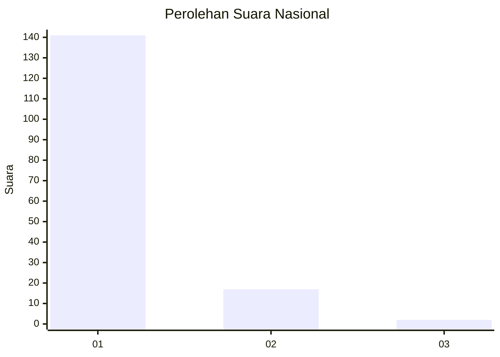
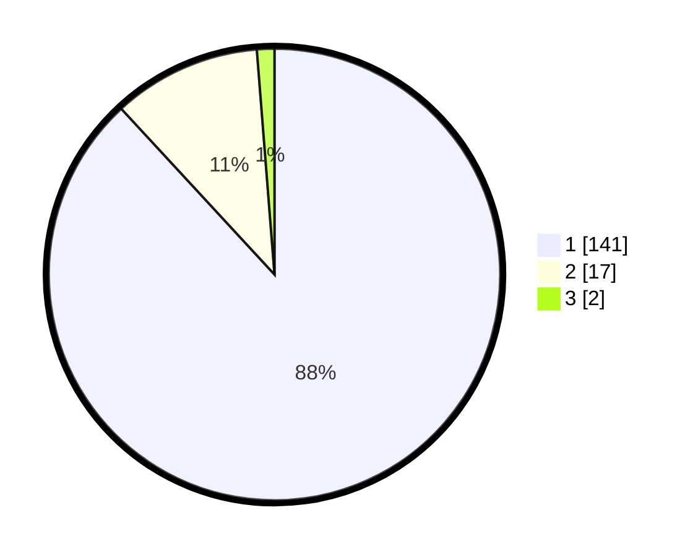

# Hasil

## Grafik

## Tabel

| No. | Nama Paslon    | Suara | Suara (raw) | Persentase |
|:--- |:-------------- | -----:| -----------:| ----------:|
| 1   | ANIES MUHAIMIN | 141   | [141][p-1]  | 88,13      |
| 2   | PRABOWO GIBRAN | 17    | [17][p-2]   | 10,63      |
| 3   | GANJAR MAHFUD  | 2     | [2][p-3]    | 1,25       |

[p-1]: https://github.com/gigit-pemilu/pemilu-2024/blob/main/pilpres/hitung-suara/sub/11-aceh/sub/06-aceh-besar/sub/02-lhoknga/sub/2016-meunasah-mesjid-lamlhom/sub/001-tps/sub/paslon-1.txt
[p-2]: https://github.com/gigit-pemilu/pemilu-2024/blob/main/pilpres/hitung-suara/sub/11-aceh/sub/06-aceh-besar/sub/02-lhoknga/sub/2016-meunasah-mesjid-lamlhom/sub/001-tps/sub/paslon-2.txt
[p-3]: https://github.com/gigit-pemilu/pemilu-2024/blob/main/pilpres/hitung-suara/sub/11-aceh/sub/06-aceh-besar/sub/02-lhoknga/sub/2016-meunasah-mesjid-lamlhom/sub/001-tps/sub/paslon-3.txt

## Foto C Plano

https://sirekap-obj-formc.kpu.go.id/e7f0/pemilu/ppwp/11/06/02/20/16/1106022016001-20240222-094637--c292c24e-2542-489d-b4e6-f7a8ef188d83.jpg

https://sirekap-obj-formc.kpu.go.id/e7f0/pemilu/ppwp/11/06/02/20/16/1106022016001-20240222-094735--5e54a3ba-8648-4bb2-8782-6ee470b2ed78.jpg

https://sirekap-obj-formc.kpu.go.id/e7f0/pemilu/ppwp/11/06/02/20/16/1106022016001-20240222-094938--41b584f7-ff2d-436d-837e-a6e7edd39015.jpg

## Metadata

| Key        | Value               |
| ---------- | ------------------- |
| Time Stamp | 2024-02-24 22:31:28 |

