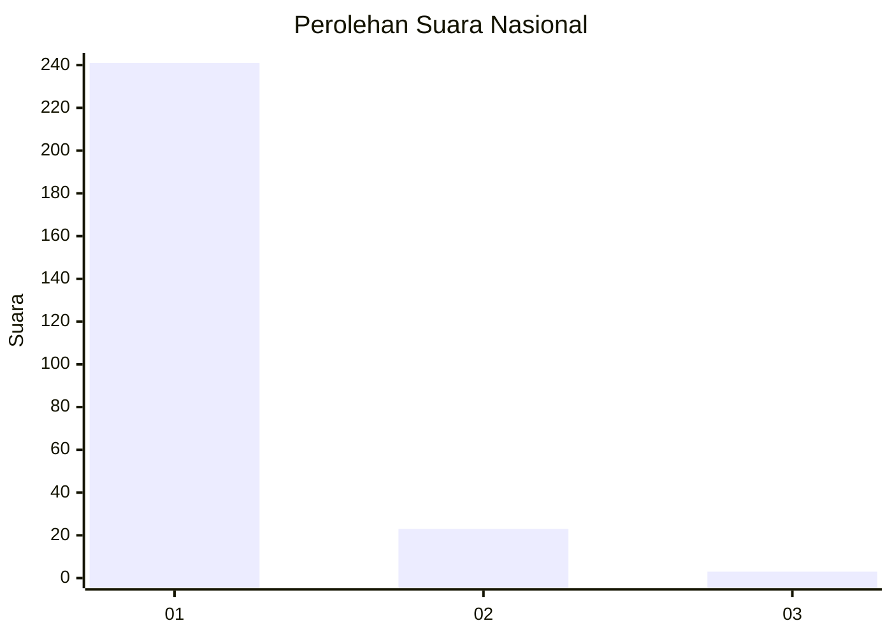
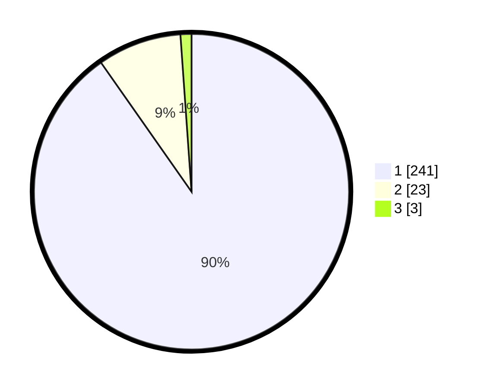

# Hasil

## Grafik

## Tabel

| No. | Nama Paslon    | Suara | Suara (raw) | Persentase |
|:--- |:-------------- | -----:| -----------:| ----------:|
| 1   | ANIES MUHAIMIN | 241   | [241][p-1]  | 90,26      |
| 2   | PRABOWO GIBRAN | 23    | [23][p-2]   | 8,61       |
| 3   | GANJAR MAHFUD  | 3     | [3][p-3]    | 1,12       |

[p-1]: https://github.com/gigit-pemilu/pemilu-2024/blob/main/pilpres/hitung-suara/sub/11-aceh/sub/06-aceh-besar/sub/02-lhoknga/sub/2017-meunasah-mon-cut/sub/001-tps/sub/paslon-1.txt
[p-2]: https://github.com/gigit-pemilu/pemilu-2024/blob/main/pilpres/hitung-suara/sub/11-aceh/sub/06-aceh-besar/sub/02-lhoknga/sub/2017-meunasah-mon-cut/sub/001-tps/sub/paslon-2.txt
[p-3]: https://github.com/gigit-pemilu/pemilu-2024/blob/main/pilpres/hitung-suara/sub/11-aceh/sub/06-aceh-besar/sub/02-lhoknga/sub/2017-meunasah-mon-cut/sub/001-tps/sub/paslon-3.txt

## Foto C Plano

https://sirekap-obj-formc.kpu.go.id/3c76/pemilu/ppwp/11/06/02/20/17/1106022017001-20240214-191325--b0ec75eb-ee05-470a-af7e-8eb9fa7e398d.jpg

https://sirekap-obj-formc.kpu.go.id/3c76/pemilu/ppwp/11/06/02/20/17/1106022017001-20240214-191545--3fe566c1-ef4a-460e-a1c3-4dea50a35f20.jpg

https://sirekap-obj-formc.kpu.go.id/3c76/pemilu/ppwp/11/06/02/20/17/1106022017001-20240214-192245--c093519e-e72b-45f6-9581-87b872295897.jpg

## Metadata

| Key        | Value               |
| ---------- | ------------------- |
| Time Stamp | 2024-02-15 00:41:44 |

## DATA PEMILIH TETAP

Jumlah pemilih dalam DPT: **273**.
 * L: **118**.
 * P: **155**.

## DATA PENGGUNA HAK PILIH

Jumlah pengguna hak pilih dalam DPT: **269**.
 * L: **116**.
 * P: **153**.

Jumlah pengguna hak pilih dalam DPTb: **0**.
 * L: **0**.
 * P: **0**.

Jumlah pengguna hak pilih dalam DPK: **0**.
 * L: **0**.
 * P: **0**.

Jumlah pengguna hak pilih: **269**.
 * L: **116**.
 * P: **153**.

## JUMLAH SUARA SAH DAN TIDAK SAH

JUMLAH SELURUH SUARA SAH: **267**.

JUMLAH SUARA TIDAK SAH: **2**.

JUMLAH SELURUH SUARA SAH DAN SUARA TIDAK SAH: **269**.

