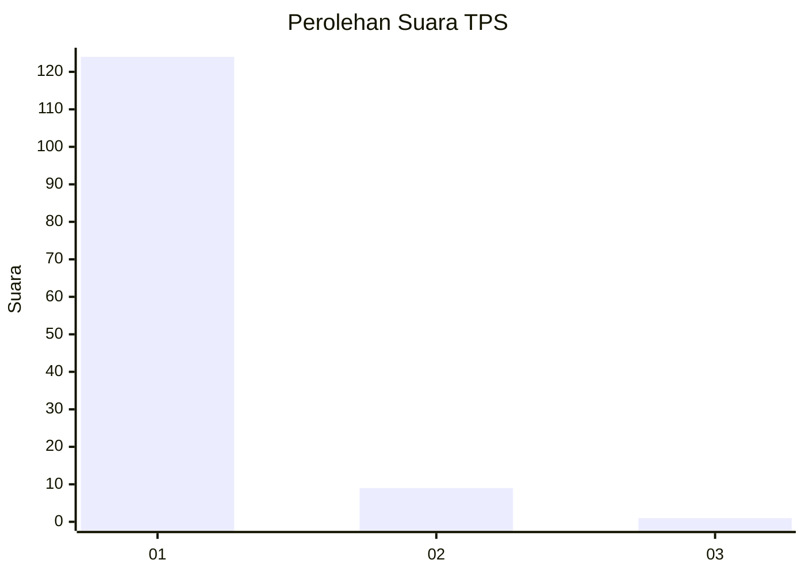
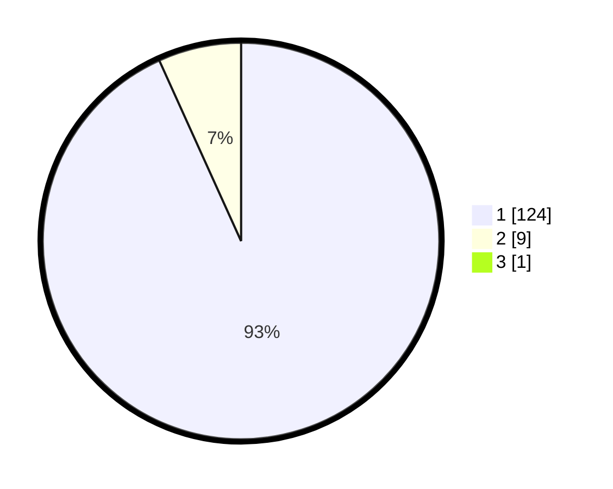

# Hasil

## Grafik

## Tabel

| No. | Nama Paslon    | Suara | Suara (raw) | Persentase |
|:--- |:-------------- | -----:| -----------:| ----------:|
| 1   | ANIES MUHAIMIN | 124   | [124][p-1]  | 92,54      |
| 2   | PRABOWO GIBRAN | 9     | [9][p-2]    | 6,72       |
| 3   | GANJAR MAHFUD  | 1     | [1][p-3]    | 0,75       |

[p-1]: https://github.com/gigit-pemilu/pemilu-2024-11-aceh/blob/main/pilpres/hitung-suara/sub/11-aceh/sub/06-aceh-besar/sub/02-lhoknga/sub/2019-meunasah-lam-girek/sub/001-tps/sub/paslon-1.txt
[p-2]: https://github.com/gigit-pemilu/pemilu-2024-11-aceh/blob/main/pilpres/hitung-suara/sub/11-aceh/sub/06-aceh-besar/sub/02-lhoknga/sub/2019-meunasah-lam-girek/sub/001-tps/sub/paslon-2.txt
[p-3]: https://github.com/gigit-pemilu/pemilu-2024-11-aceh/blob/main/pilpres/hitung-suara/sub/11-aceh/sub/06-aceh-besar/sub/02-lhoknga/sub/2019-meunasah-lam-girek/sub/001-tps/sub/paslon-3.txt

## Foto C Plano

https://sirekap-obj-formc.kpu.go.id/2742/pemilu/ppwp/11/06/02/20/19/1106022019001-20240215-015748--15adc49a-dcb0-4706-b071-a921dfb66f10.jpg

https://sirekap-obj-formc.kpu.go.id/2742/pemilu/ppwp/11/06/02/20/19/1106022019001-20240215-015947--4afd0df2-0792-4f4d-9ca6-e8aa9be7ae0d.jpg

https://sirekap-obj-formc.kpu.go.id/2742/pemilu/ppwp/11/06/02/20/19/1106022019001-20240215-020118--28189df6-fccf-470f-b05d-4619b287bacd.jpg

## Metadata

| Key        | Value               |
| ---------- | ------------------- |
| Time Stamp | 2024-02-20 12:00:00 |

## DATA PEMILIH TETAP

Jumlah pemilih dalam DPT: **144**.
 * L: **74**.
 * P: **70**.

## DATA PENGGUNA HAK PILIH

Jumlah pengguna hak pilih dalam DPT: **137**.
 * L: **68**.
 * P: **69**.

Jumlah pengguna hak pilih dalam DPTb: **1**.
 * L: **0**.
 * P: **1**.

Jumlah pengguna hak pilih dalam DPK: **0**.
 * L: **0**.
 * P: **0**.

Jumlah pengguna hak pilih: **138**.
 * L: **68**.
 * P: **70**.

## JUMLAH SUARA SAH DAN TIDAK SAH

JUMLAH SELURUH SUARA SAH: **134**.

JUMLAH SUARA TIDAK SAH: **4**.

JUMLAH SELURUH SUARA SAH DAN SUARA TIDAK SAH: **138**.

