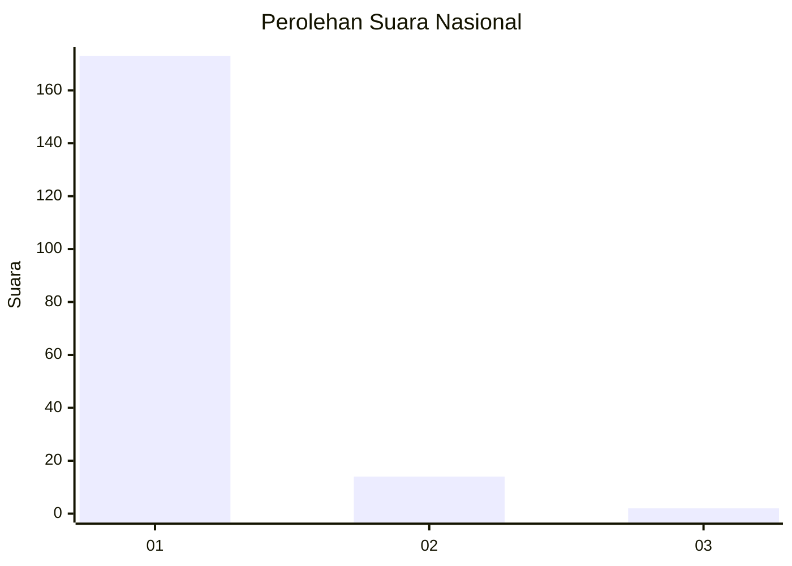
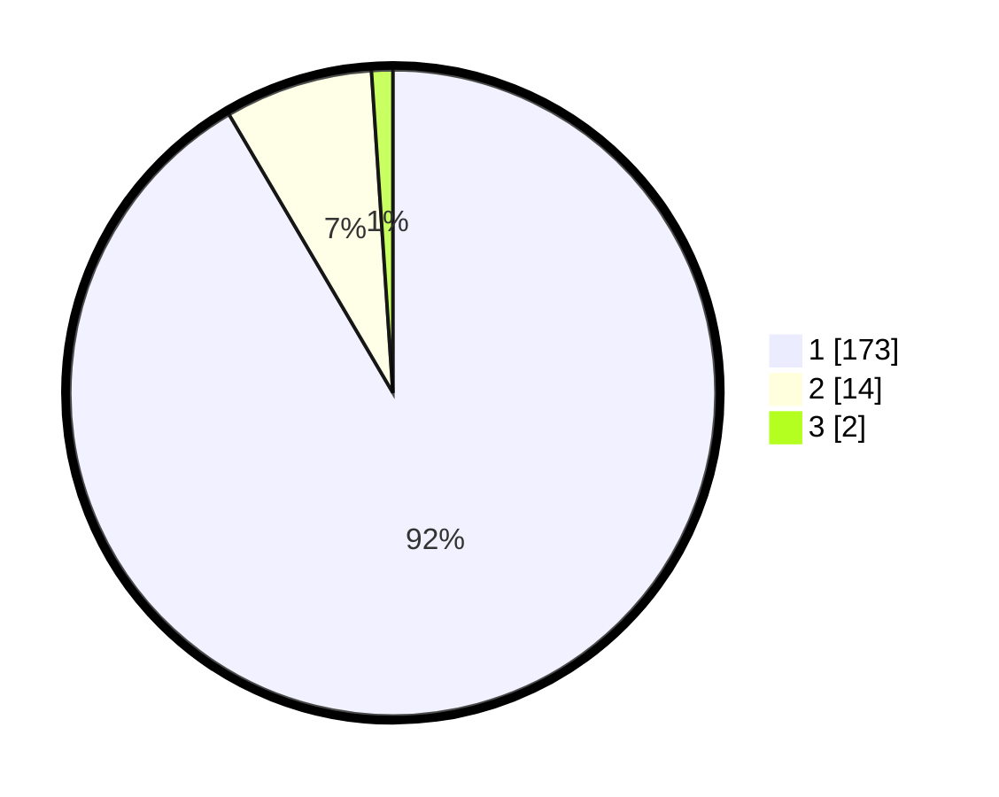

# Hasil

## Grafik

## Tabel

| No. | Nama Paslon    | Suara | Suara (raw) | Persentase |
|:--- |:-------------- | -----:| -----------:| ----------:|
| 1   | ANIES MUHAIMIN | 173   | [173][p-1]  | 91,53      |
| 2   | PRABOWO GIBRAN | 14    | [14][p-2]   | 7,41       |
| 3   | GANJAR MAHFUD  | 2     | [2][p-3]    | 1,06       |

[p-1]: https://github.com/gigit-pemilu/pemilu-2024/blob/main/pilpres/hitung-suara/sub/11-aceh/sub/06-aceh-besar/sub/02-lhoknga/sub/2024-meunasah-balee/sub/002-tps/sub/paslon-1.txt
[p-2]: https://github.com/gigit-pemilu/pemilu-2024/blob/main/pilpres/hitung-suara/sub/11-aceh/sub/06-aceh-besar/sub/02-lhoknga/sub/2024-meunasah-balee/sub/002-tps/sub/paslon-2.txt
[p-3]: https://github.com/gigit-pemilu/pemilu-2024/blob/main/pilpres/hitung-suara/sub/11-aceh/sub/06-aceh-besar/sub/02-lhoknga/sub/2024-meunasah-balee/sub/002-tps/sub/paslon-3.txt

## Foto C Plano

https://sirekap-obj-formc.kpu.go.id/4bb2/pemilu/ppwp/11/06/02/20/24/1106022024002-20240215-064835--6dbe5c22-d722-4de5-aa40-a5dcde3b4c8f.jpg

https://sirekap-obj-formc.kpu.go.id/4bb2/pemilu/ppwp/11/06/02/20/24/1106022024002-20240215-065133--0d021705-d568-4893-9f54-1062ae072677.jpg

https://sirekap-obj-formc.kpu.go.id/4bb2/pemilu/ppwp/11/06/02/20/24/1106022024002-20240214-234319--05260322-fc05-4456-9a36-9d0f64ec60e3.jpg

## Metadata

| Key        | Value               |
| ---------- | ------------------- |
| Time Stamp | 2024-02-20 21:00:00 |

