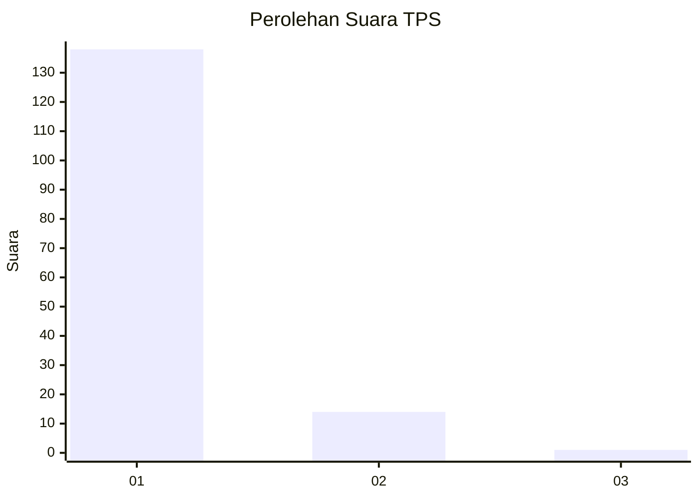
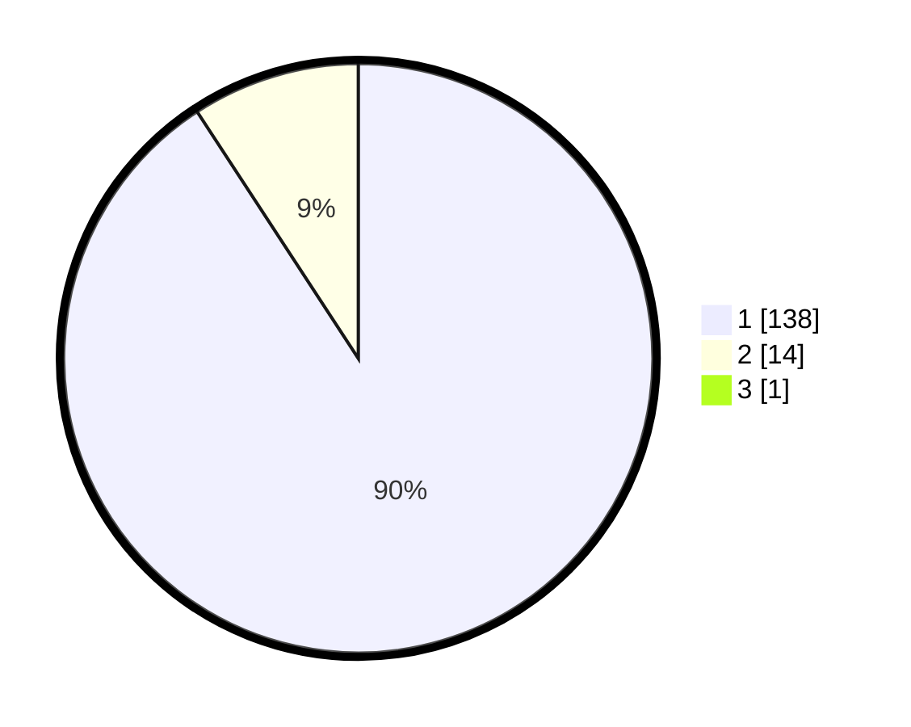

# Hasil

## Grafik

## Tabel

| No. | Nama Paslon    | Suara | Suara (raw) | Persentase |
|:--- |:-------------- | -----:| -----------:| ----------:|
| 1   | ANIES MUHAIMIN | 138   | [138][p-1]  | 90,20      |
| 2   | PRABOWO GIBRAN | 14    | [14][p-2]   | 9,15       |
| 3   | GANJAR MAHFUD  | 1     | [1][p-3]    | 0,65       |

[p-1]: https://github.com/gigit-pemilu/pemilu-2024-11-aceh/blob/main/pilpres/hitung-suara/sub/11-aceh/sub/06-aceh-besar/sub/03-indrapuri/sub/2005-limo-blang/sub/002-tps/sub/paslon-1.txt
[p-2]: https://github.com/gigit-pemilu/pemilu-2024-11-aceh/blob/main/pilpres/hitung-suara/sub/11-aceh/sub/06-aceh-besar/sub/03-indrapuri/sub/2005-limo-blang/sub/002-tps/sub/paslon-2.txt
[p-3]: https://github.com/gigit-pemilu/pemilu-2024-11-aceh/blob/main/pilpres/hitung-suara/sub/11-aceh/sub/06-aceh-besar/sub/03-indrapuri/sub/2005-limo-blang/sub/002-tps/sub/paslon-3.txt

## Foto C Plano

https://sirekap-obj-formc.kpu.go.id/889f/pemilu/ppwp/11/06/03/20/05/1106032005002-20240215-002916--06534f31-0d46-42f0-96a7-c78ad8d3cf58.jpg

https://sirekap-obj-formc.kpu.go.id/889f/pemilu/ppwp/11/06/03/20/05/1106032005002-20240215-003742--76c05479-3f12-4ebc-935e-18b1ccd50de9.jpg

https://sirekap-obj-formc.kpu.go.id/889f/pemilu/ppwp/11/06/03/20/05/1106032005002-20240215-003911--3c7073be-b56d-4773-9cbf-7a7d3115a5fc.jpg

## Metadata

| Key        | Value               |
| ---------- | ------------------- |
| Time Stamp | 2024-02-15 17:30:25 |

## DATA PEMILIH TETAP

Jumlah pemilih dalam DPT: **162**.
 * L: **41**.
 * P: **41**.

## DATA PENGGUNA HAK PILIH

Jumlah pengguna hak pilih dalam DPT: **658**.
 * L: **77**.
 * P: **81**.

Jumlah pengguna hak pilih dalam DPTb: **0**.
 * L: **0**.
 * P: **0**.

Jumlah pengguna hak pilih dalam DPK: **0**.
 * L: **0**.
 * P: **0**.

Jumlah pengguna hak pilih: **158**.
 * L: **77**.
 * P: **81**.

## JUMLAH SUARA SAH DAN TIDAK SAH

JUMLAH SELURUH SUARA SAH: **153**.

JUMLAH SUARA TIDAK SAH: **5**.

JUMLAH SELURUH SUARA SAH DAN SUARA TIDAK SAH: **158**.

