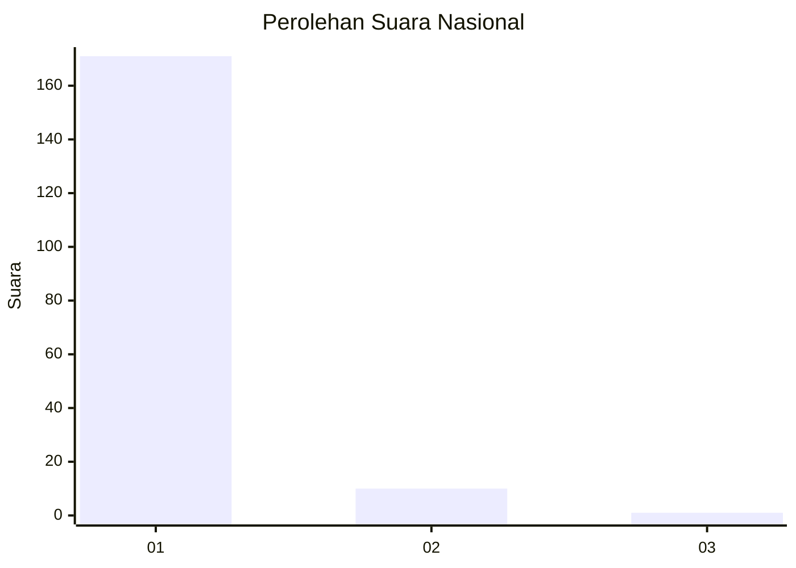
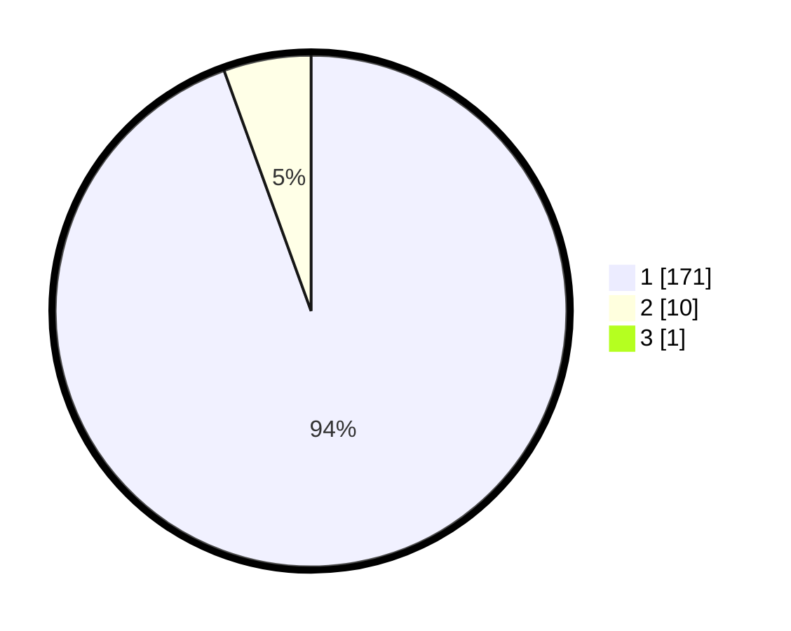

# Hasil

## Grafik

## Tabel

| No. | Nama Paslon    | Suara | Suara (raw) | Persentase |
|:--- |:-------------- | -----:| -----------:| ----------:|
| 1   | ANIES MUHAIMIN | 171   | [171][p-1]  | 93,96      |
| 2   | PRABOWO GIBRAN | 10    | [10][p-2]   | 5,49       |
| 3   | GANJAR MAHFUD  | 1     | [1][p-3]    | 0,55       |

[p-1]: https://github.com/gigit-pemilu/pemilu-2024/blob/main/pilpres/hitung-suara/sub/11-aceh/sub/06-aceh-besar/sub/03-indrapuri/sub/2008-lheue/sub/001-tps/sub/paslon-1.txt
[p-2]: https://github.com/gigit-pemilu/pemilu-2024/blob/main/pilpres/hitung-suara/sub/11-aceh/sub/06-aceh-besar/sub/03-indrapuri/sub/2008-lheue/sub/001-tps/sub/paslon-2.txt
[p-3]: https://github.com/gigit-pemilu/pemilu-2024/blob/main/pilpres/hitung-suara/sub/11-aceh/sub/06-aceh-besar/sub/03-indrapuri/sub/2008-lheue/sub/001-tps/sub/paslon-3.txt

## Foto C Plano

https://sirekap-obj-formc.kpu.go.id/bf37/pemilu/ppwp/11/06/03/20/08/1106032008001-20240215-030208--5106df6a-0890-4f1b-b712-5bbbdc031d25.jpg

https://sirekap-obj-formc.kpu.go.id/bf37/pemilu/ppwp/11/06/03/20/08/1106032008001-20240215-011547--a54dc309-ba3f-44de-8e50-939ad7333b7b.jpg

https://sirekap-obj-formc.kpu.go.id/bf37/pemilu/ppwp/11/06/03/20/08/1106032008001-20240214-202654--72f6d691-ff94-42f3-adac-cc02c88ec8b4.jpg

## Metadata

| Key        | Value               |
| ---------- | ------------------- |
| Time Stamp | 2024-02-15 19:30:26 |

